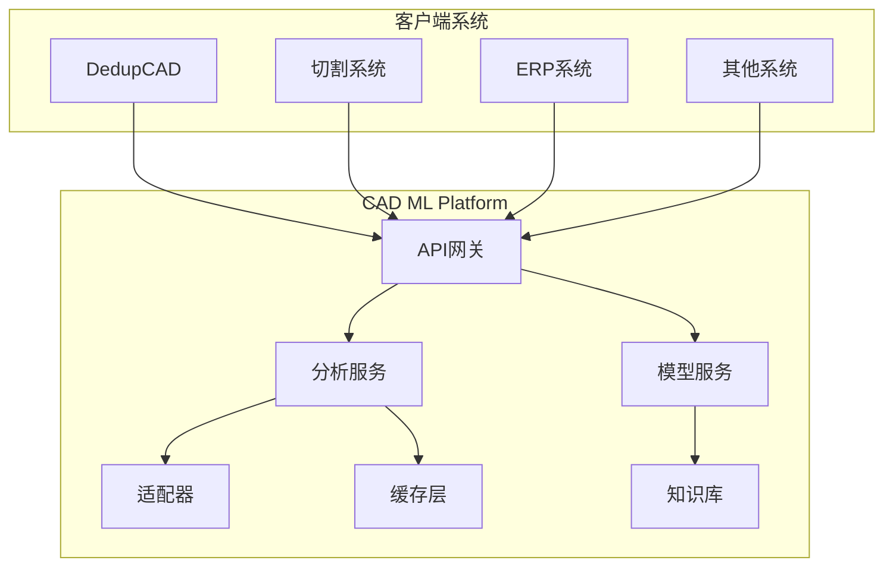

# 🤖 CAD ML Platform - 智能CAD分析微服务平台

## 目录
- 项目概述
- 系统架构
- 快速开始
- 评估与可观测性（健康检查、指标、PromQL）
- CI & 安全工作流
- API 文档
  - 接口迁移与废弃策略
  - PromQL 示例
  - Runbooks & 告警规则
  - 配置速查表
  - 核心API端点

> 独立的、可扩展的CAD机器学习分析服务，为多个系统提供统一的智能分析能力

[](https://www.docker.com/)
[](https://www.python.org/)
[](https://fastapi.tiangolo.com/)
[](LICENSE)
[](docs/EVAL_SYSTEM_COMPLETE_GUIDE.md)
[](config/eval_frontend.json)

---

## 🎯 项目概述

CAD ML Platform 是一个完全独立的微服务平台，专门为CAD图纸和工程图形提供机器学习增强的分析服务。它可以服务于多个业务系统，包括但不限于：

- **DedupCAD**: CAD图纸查重系统
- **Stainless Steel Cutting**: 不锈钢切割工艺系统
- **ERP系统**: 企业资源规划
- **MES系统**: 制造执行系统
- **PLM系统**: 产品生命周期管理

### 核心特性

- 🔍 **零件识别**: 自动识别8种机械零件类型
- 📊 **特征提取**: 95维深度特征向量
- 🔄 **格式转换**: 支持DXF、STEP、IGES等多种格式
- 🎯 **相似度分析**: 几何+语义双重分析 (支持 Top-K、材料/复杂度过滤、向量管理)
- 📈 **质量评估**: 图纸质量自动评分
- 🏭 **工艺推荐**: 智能加工工艺建议
- 🔌 **多语言SDK**: Python、JavaScript、Java客户端
- 🚀 **高性能**: 缓存、并发、分布式处理

---

## 🏗️ 系统架构



### 技术栈

| 组件 | 技术选型 | 用途 |
|------|---------|------|
| **API框架** | FastAPI | 高性能异步API |
| **ML框架** | scikit-learn, TensorFlow | 机器学习模型 |
| **CAD处理** | ezdxf, FreeCAD | CAD文件解析 |
| **缓存** | Redis | 结果缓存 |
| **消息队列** | RabbitMQ/Kafka | 异步处理 |
| **容器化** | Docker | 部署标准化 |
| **编排** | Kubernetes | 生产环境编排 |
| **监控** | Prometheus + Grafana | 性能监控 |

---

## 🚀 快速开始

### 前置要求

- Python 3.9+
- Docker 20.10+
- Redis 6.0+ (可选)
- CUDA 11.0+ (GPU加速，可选)

### 安装步骤

#### 1. 克隆仓库

```bash
git clone https://github.com/your-org/cad-ml-platform.git
cd cad-ml-platform
```

#### 2. 环境配置

```bash
# 创建Python虚拟环境
python -m venv venv
source venv/bin/activate  # Windows: venv\Scripts\activate

# 安装依赖
pip install -r requirements.txt
pip install -r requirements-dev.txt  # 开发工具（lint/type/type-test/预提交）
```

#### 3. 配置文件

```bash
# 复制配置模板
cp config/config.example.yaml config/config.yaml

# 编辑配置
vim config/config.yaml
```

#### 4. 启动服务

**开发环境**:
```bash
# 使用Docker Compose
docker-compose up -d

# 或直接运行
python src/main.py
```

**生产环境**:
```bash
# Kubernetes部署
kubectl apply -f deployments/kubernetes/
```

---

## 🔬 评估与可观测性

### 完整评估系统

我们构建了一个企业级的评估监控系统，提供全面的质量保证和可观测性：

#### 核心功能
- **联合评估**: Vision + OCR 加权评分系统
- **数据完整性**: SHA-384 哈希验证，Schema v1.0.0 规范
- **自动报告**: 静态/交互式 HTML 报告，Chart.js 可视化
- **数据保留**: 5层保留策略（7天全量→30天每日→90天每周→365天每月→永久季度）
- **版本监控**: 自动依赖更新检查，安全警报
- **CI/CD集成**: GitHub Actions 自动化流水线

#### Grafana Dashboard (CAD Analysis)
新增仪表盘文件: `config/grafana/dashboard_cad_analysis_metrics.json`

包含面板:
- 成功率: `sum(analysis_requests_total{status='success'}) / sum(analysis_requests_total)`
- 解析/特征提取阶段平均耗时 (ms) 使用 `rate(..._sum)/rate(..._count)`
- 阶段耗时 p95: `histogram_quantile(0.95, sum by (le, stage)(rate(analysis_stage_duration_seconds_bucket[5m])))`
- 实体数限制拒绝计数: `analysis_rejections_total{reason='entity_count_exceeded'}`
- 特征向量维度分布: `analysis_feature_vector_dimension_bucket`
- 错误码 TopK: `topk(10, rate(analysis_error_code_total[5m]))`
- 材料使用速率: `sum by (material)(rate(analysis_material_usage_total[5m]))`

导入步骤:
1. Grafana UI -> Dashboards -> Import
2. 粘贴 JSON 或选择文件 `dashboard_cad_analysis_metrics.json`
3. 选择 Prometheus 数据源
4. 保存并设置刷新间隔 (推荐 30s)

建议告警规则:
- 成功率 < 90% 连续 5m
- p95(parse) > 500ms 连续 10m
- 错误码 `INTERNAL_ERROR` rate > 5/min 连续 5m
- Rejections spike: `increase(analysis_rejections_total[10m]) > 50`

#### 快速开始

```bash
# 运行评估
make eval                    # 执行 Vision+OCR 联合评估

# 生成报告
make eval-report-v2          # 生成交互式报告（推荐）
make eval-report            # 生成静态报告（备用）

# 系统健康
make health-check           # 完整系统健康检查
make integrity-check        # 文件完整性验证

# 数据管理
make eval-history           # 查看历史趋势
make eval-retention         # 应用保留策略
```

#### 评估公式
```
Combined Score = 0.5 × Vision + 0.5 × OCR_normalized
OCR_normalized = OCR_Recall × (1 - Brier_Score)
```

#### 配置管理
所有配置集中在 `config/eval_frontend.json`：
- Chart.js 版本锁定 (4.4.0)
- SHA-384 完整性校验
- 5层数据保留策略
- Schema 验证规则

#### 测试套件

```bash
# 单元测试套件
python3 scripts/test_eval_system.py --verbose

# 完整集成测试
python3 scripts/run_full_integration_test.py
```

详细文档：[评估系统完整指南](docs/EVALUATION_SYSTEM_COMPLETE.md)

#### 健康检查与指标

- 健康端点：`GET /health`

---

## 🧩 新增与扩展功能总览 (Recent Additions)

### 🔢 特征版本枚举端点
`GET /api/v1/features/versions`

返回所有已知特征版本的维度与稳定性：
```json
{
  "status": "ok",
  "versions": [
    {"version": "v1", "dimension": 7,  "stable": true,  "experimental": false},
    {"version": "v2", "dimension": 12, "stable": true,  "experimental": false},
    {"version": "v3", "dimension": 23, "stable": true,  "experimental": false},
    {"version": "v4", "dimension": 25, "stable": false, "experimental": true}
  ]
}
```
说明：v4 为实验版本 (surface_count + shape_entropy)，仅在显式指定 `FEATURE_VERSION=v4` 或请求参数 `version=v4` 时生效。

### 🧪 特征槽位查询
`GET /api/v1/features/slots?version=v3`
返回该版本所有槽位名称/类别/版本标签。失败示例（不支持版本）：HTTP 422 + `{ "code":"INPUT_VALIDATION_FAILED", "stage":"feature_slots" }`。

### 🛡️ 模型健康与安全
`GET /api/v1/health/model`
示例响应：
```json
{
  "status": "ok",
  "version": "v2",
  "hash": "abcd1234ef567890",
  "path": "models/classifier.pkl",
  "loaded": true,
  "loaded_at": 1732464000.123,
  "uptime_seconds": 12.45
}
```

模型热重载安全流程 (`POST /api/v1/model/reload`)：
1. 大小限制校验 (`MODEL_MAX_MB`)
2. Magic Number / Pickle 协议验证
3. Hash 白名单 (`ALLOWED_MODEL_HASHES`)
4. Opcode 扫描（阻断 `GLOBAL` / `STACK_GLOBAL` / `REDUCE`）可通过 `MODEL_OPCODE_SCAN=0` 关闭；`MODEL_OPCODE_STRICT=1` 为严格模式
5. 接口验证（必须存在 `predict` 方法）
6. 失败回滚（一级/二级）

安全失败指标：`model_security_fail_total{reason="magic_number_invalid|hash_mismatch|opcode_blocked|opcode_scan_error|forged_file"}`。

### 📦 批量相似度查询
`POST /api/v1/vectors/similarity/batch`
请求体：
```json
{
  "ids": ["vecA","vecB"],
  "top_k": 5,
  "material": "steel",
  "complexity": "high",
  "format": "dxf",
  "min_score": 0.4
}
```
限制：最大 ID 数量 `BATCH_SIMILARITY_MAX_IDS` (默认 200)，超过返回 422：
```json
{"code":"INPUT_VALIDATION_FAILED","stage":"batch_similarity","message":"Batch size exceeds limit","batch_size":350,"max_batch":200}
```
指标：`vector_query_batch_latency_seconds{batch_size_range="small|medium|large"}`，`analysis_rejections_total{reason="batch_too_large"}`，`analysis_rejections_total{reason="batch_empty_results"}`。

### 🔄 向量迁移摘要
`GET /api/v1/vectors/migrate/summary`
示例：
```json
{
  "counts": {"migrated": 30, "dry_run": 5, "downgraded": 2, "error": 1, "not_found": 3, "skipped": 8},
  "total_migrations": 49,
  "history_size": 10,
  "statuses": ["dry_run","downgraded","error","migrated","not_found","skipped"]
}
```
指标：`vector_migrate_total{status="migrated|dry_run|downgraded|error|not_found|skipped"}`。

### 🌊 Drift 基线监控与自动刷新
端点：`/api/v1/analyze/drift`、`/api/v1/analyze/drift/baseline/status`、`/api/v1/analyze/drift/reset`
自动刷新：基线年龄超出 `DRIFT_BASELINE_MAX_AGE_SECONDS` 且样本数 ≥ `DRIFT_BASELINE_MIN_COUNT` 时软刷新并记录 `drift_baseline_refresh_total{trigger="stale"}`。
启动首次访问标记：`drift_baseline_refresh_total{trigger="startup"}`。
手动重置：`drift_baseline_refresh_total{trigger="manual"}`。

### 🧪 新增指标 (Recent Metrics)
| 名称 | 类型 | 说明 |
|------|------|------|
| feature_extraction_latency_seconds{version} | Histogram | 按版本特征提取延迟 |
| vector_query_batch_latency_seconds{batch_size_range} | Histogram | 批量相似度延迟 |
| model_security_fail_total{reason} | Counter | 模型安全校验失败原因 |
| model_health_checks_total{status} | Counter | 模型健康端点访问统计 |
| vector_store_reload_total{status} | Counter | 向量后端重载结果 |
| drift_baseline_refresh_total{type,trigger} | Counter | Drift 基线刷新事件 |
| vector_migrate_dimension_delta | Histogram | 迁移维度差 (新维度-旧维度) 分布监控 |
| similarity_degraded_total{event} | Counter | Faiss 降级与恢复事件 (degraded|restored) |

PromQL 示例：
```promql
histogram_quantile(0.95, sum by (le,version)(rate(feature_extraction_latency_seconds_bucket[5m])))
histogram_quantile(0.99, sum by (le)(rate(vector_query_batch_latency_seconds_bucket[5m])))
sum(rate(vector_migrate_total{status="migrated"}[10m])) / sum(rate(vector_migrate_total[10m]))
baseline_material_age_seconds > bool DRIFT_BASELINE_MAX_AGE_SECONDS
```

### 🧷 结构化 410 废弃端点错误
```json
{
  "code": "GONE",
  "stage": "routing",
  "message": "Endpoint moved. Please use GET /api/v1/vectors_stats/distribution",
  "deprecated_path": "/api/v1/analyze/vectors/distribution",
  "new_path": "/api/v1/vectors_stats/distribution",
  "method": "GET",
  "migration_date": "2024-11-24"
}
```

### 🧨 错误响应统一格式
字段：`code`, `stage`, `message` (+上下文键)。常见 stage：`routing`/`batch_similarity`/`vector_migrate`/`feature_slots`/`model_reload`/`security`/`drift`。

### 🛠 新增环境变量
| 变量 | 用途 | 默认 |
|------|------|------|
| FEATURE_VERSION | 默认特征版本 | v1 |
| BATCH_SIMILARITY_MAX_IDS | 批量相似度最大ID数 | 200 |
| MODEL_MAX_MB | 模型文件大小上限(MB) | 50 |
| ALLOWED_MODEL_HASHES | 模型哈希白名单 | 空 |
| MODEL_OPCODE_SCAN | 是否执行 opcode 安全扫描 | 1 |
| MODEL_OPCODE_STRICT | 扫描异常是否阻断 | 0 |
| DRIFT_BASELINE_MIN_COUNT | Drift 基线最小样本数 | 100 |
| DRIFT_BASELINE_MAX_AGE_SECONDS | Drift 基线最大年龄 | 86400 |
| DRIFT_BASELINE_AUTO_REFRESH | 是否自动刷新过期基线 | 1 |

### 🔐 安全建议
- 生产环境配置并收敛 `ALLOWED_MODEL_HASHES`。
- 高安全要求启用 `MODEL_OPCODE_STRICT=1`。
- 监控 `model_security_fail_total` 异常增长（可能表示供应链或文件投毒）。

### 📌 Roadmap 摘要
- v4 特征真实化：精细 surface_count、熵计算优化。
- 自适应缓存调优端点：推荐容量/TTL。
- Opcode 白名单模式强化。
- 批量相似度并行加速与 savings 指标。

---
  - `runtime.metrics_enabled`: Prometheus 导出是否启用
  - `runtime.python_version`: 运行 Python 版本
  - `runtime.vision_max_base64_bytes`: Vision Base64 输入大小上限（字节）
  - `runtime.error_rate_ema.ocr|vision`: OCR/Vision 错误率的指数移动平均（0..1）
  - `runtime.config.error_ema_alpha`: EMA 平滑系数，环境变量 `ERROR_EMA_ALPHA` 可配置

- 关键指标（部分）：
  - `vision_requests_total{provider,status}`、`vision_errors_total{provider,code}`
  - `vision_processing_duration_seconds{provider}`
  - `vision_input_rejected_total{reason}`、`vision_image_size_bytes`
  - `ocr_requests_total{provider,status}`、`ocr_errors_total{provider,code,stage}`
  - `ocr_input_rejected_total{reason}`、`ocr_image_size_bytes`
    - 常见 OCR `reason`：`invalid_mime`、`file_too_large`、`pdf_pages_exceed`、`pdf_forbidden_token`
  - `ocr_confidence_ema`、`ocr_confidence_fallback_threshold`

统一错误模型：所有错误以 HTTP 200 返回 `{ success: false, code: ErrorCode, error: string }`。

示例（输入过大）：
```bash
curl -s http://localhost:8000/api/v1/vision/analyze \
  -H 'Content-Type: application/json' \
  -d '{"image_base64": "<very_large>", "include_description": false}' | jq
```

### CI & 安全工作流

```yaml
关键工作流：
- `.github/workflows/ci.yml` 分离 `lint-type` 与测试矩阵 (3.10/3.11)
- `.github/workflows/security-check.yml` 每周安全审计（基于 `scripts/security_audit.py` 退出码）
- `.github/workflows/badge-review.yml` 每月自动阈值分析与建议 Issue
 - 新增非阻断 `lint-all-report`，上传全仓 flake8 报告工件
```

---

## 📚 API文档

### 🔄 接口迁移与废弃策略

为提升系统可维护性，部分端点已迁移到新路径。旧端点返回 **HTTP 410 Gone** 状态码，并提供结构化迁移信息。

#### 废弃端点列表

| 废弃端点 (旧路径) | 新端点路径 | HTTP方法 | 迁移日期 | 状态码 |
|------------------|-----------|---------|---------|--------|
| `/api/v1/analyze/vectors/distribution` | `/api/v1/vectors_stats/distribution` | GET | 2024-11-24 | 410 |
| `/api/v1/analyze/vectors/delete` | `/api/v1/vectors` (DELETE方法) | POST | 2024-11-24 | 410 |
| `/api/v1/analyze/vectors` | `/api/v1/vectors` | GET | 2024-11-24 | 410 |
| `/api/v1/analyze/vectors/stats` | `/api/v1/vectors_stats/summary` | GET | 2024-11-24 | 410 |
| `/api/v1/analyze/features/diff` | `/api/v1/features/diff` | GET | 2024-11-24 | 410 |
| `/api/v1/analyze/model/reload` | `/api/v1/model/reload` | POST | 2024-11-24 | 410 |
| `/api/v1/analyze/features/cache` | `/api/v1/maintenance/stats` | GET | 2024-11-24 | 410 |
| `/api/v1/analyze/faiss/health` | `/api/v1/health/faiss` | GET | 2024-11-24 | 410 |

#### 错误响应格式

废弃端点返回统一的结构化错误：

```json
{
  "detail": {
    "code": "GONE",
    "message": "Endpoint moved. Please use GET /api/v1/vectors_stats/distribution",
    "stage": "routing",
    "deprecated_path": "/api/v1/analyze/vectors/distribution",
    "new_path": "/api/v1/vectors_stats/distribution",
    "method": "GET",
    "migration_date": "2024-11-24"
  }
}
```

**错误码说明**：
- `GONE`：资源已永久移除（对应 HTTP 410）
- `severity`: INFO 级别（非错误，而是提示迁移）

#### 迁移指南

1. **立即行动**：更新客户端代码使用新端点路径
2. **双写验证**：迁移后可暂时并行调用新旧端点比对响应（旧端点仅返回410元数据）
3. **监控迁移**：使用 PromQL 监控 `rate(analysis_error_code_total{code="GONE"}[5m])` 下降趋势，判断迁移完成度。

### 🧩 模块结构与特征版本迁移

主要API模块 (src/api/v1)：

| 模块 | 功能 |
|------|------|
| analyze.py | 保留废弃端点的410结构化提示 |
| vectors.py | 向量 CRUD / 更新 / 迁移 / 批量相似度 |
| vectors_stats.py | 向量统计与分布查询 |
| features.py | 特征差异比较 / 槽位枚举 `/features/slots` |
| drift.py | 漂移基线与自动刷新控制 |
| model.py | 模型热加载与版本/哈希查询、安全校验 |
| maintenance.py | 孤儿向量清理 / 缓存管理 / 系统维护统计 |
| process.py | 工艺规则审计与版本指标 |
| health.py | Faiss / feature cache 健康状态 |

特征版本 (Feature Version) 演进：

| 版本 | 新增槽位 | 描述 |
|------|---------|------|
| v1 | 基础7槽位 | 实体计数 + bbox尺寸/体积 + 图层/复杂度标志 |
| v2 | 5槽位 | 归一化宽高深 + 宽高比 + 宽深比 |
| v3 | 11槽位 | 几何增强 (solids/facets/比率/平均体积) + Top5实体类型频率 |
| v4 | 2槽位 | surface_count（真实几何面数估计）+ shape_entropy（拉普拉斯平滑并归一化至[0,1]） |

迁移端点：`POST /api/v1/vectors/migrate`

> v4 现已实现真实特征：`surface_count` 与 `shape_entropy`（拉普拉斯平滑并归一化）。仍建议在充分评估后再设为默认；设置 `FEATURE_VERSION=v4` 或迁移到 `to_version="v4"` 将追加这两个槽位。

请求示例（干运行 dry_run）：
```bash
curl -X POST /api/v1/vectors/migrate \
  -H 'Content-Type: application/json' \
  -H 'x-api-key: test' \
  -d '{"ids":["id1","id2"],"to_version":"v3","dry_run":true}'
```

响应示例：
```json
{
  "total": 2,
  "migrated": 0,
  "skipped": 1,
  "items": [
    {"id": "id1", "status": "dry_run", "from_version": "v1", "to_version": "v3", "dimension_before": 7, "dimension_after": 23},
    {"id": "id2", "status": "skipped", "from_version": "v3", "to_version": "v3"}
  ],
  "migration_id": "...",
  "started_at": "...",
  "finished_at": "...",
  "dry_run_total": 1
}
```

特征维度对照：

| 版本 | 总维度 (geometric+semantic) |
|------|---------------------------|
| v1 | 7 |
| v2 | 12 |
| v3 | 23 |
| v4 | 24 |

降级与迁移状态说明：
- `migrated`: 版本提升或同向调整
- `skipped`: 已是目标版本
- `dry_run`: 模拟迁移不写入
- `downgraded`: 目标版本低于源版本（保留向后兼容）
- `error`: 转换异常（长度不匹配等）
- `not_found`: 向量ID不存在


升级策略（无原始文档时 `upgrade_vector` 行为）：
- v1→v2: 追加5个归一化与比率槽位（0填充）
- v1→v3: 追加 v2 槽位 + 11 个增强槽位（0填充）
- v2→v3: 追加 11 个增强槽位（0填充）
- v3→v2: 截断 v3 扩展槽位（可能丢失信息）

指标：
- `vector_migrate_total{status="migrated|skipped|dry_run|error|not_found"}`
  - 现已扩展支持 `downgraded` 状态，用于版本降级（例如 v3 -> v2 或 v2 -> v1）。
    监控示例：`sum(rate(vector_migrate_total{status="downgraded"}[5m]))` 评估降级频率。
- 干运行比率：`rate(vector_migrate_total{status="dry_run"}[5m]) / rate(vector_migrate_total[5m])`
- 历史记录扩展字段 `counts`（见响应示例）提供各状态精细统计：`migrated|skipped|dry_run|downgraded|error|not_found`

PromQL p95 批量相似度延迟：
```promql
histogram_quantile(0.95, sum by (le, batch_size_range)(rate(vector_query_batch_latency_seconds_bucket[5m])))
```

### 模型健康端点

`GET /api/v1/health/model` 提供当前模型加载状态与元数据，包括回滚状态和错误追踪。

**响应字段说明:**

| 字段 | 类型 | 说明 |
|------|------|------|
| `status` | string | 健康状态: `ok` (正常), `absent` (未加载), `rollback` (已回滚), `error` (错误) |
| `version` | string | 模型版本号 |
| `hash` | string | 模型文件 SHA256 哈希值 (前16位) |
| `path` | string | 模型文件路径 |
| `loaded` | boolean | 是否已加载 |
| `loaded_at` | float | 加载时间戳 (Unix时间) |
| `uptime_seconds` | float | 模型运行时长（秒） |
| `rollback_level` | int | 回滚级别: `0` (无回滚), `1` (一级回滚), `2` (二级回滚) |
| `rollback_reason` | string\|null | 回滚原因描述 |
| `last_error` | string\|null | 最近一次加载错误信息 |
| `load_seq` | int | 单调递增的加载序列号（用于区分不同加载实例） |

**示例响应 - 正常状态:**
```json
{
  "status": "ok",
  "version": "v2.1.0",
  "hash": "abcd1234ef567890",
  "path": "models/classifier_v2.1.pkl",
  "loaded": true,
  "loaded_at": 1732464000.123,
  "uptime_seconds": 3600.5,
  "rollback_level": 0,
  "rollback_reason": null,
  "last_error": null,
  "load_seq": 5
}
```

**示例响应 - 回滚状态:**
```json
{
  "status": "rollback",
  "version": "v2.0.0",
  "hash": "def567890abc1234",
  "path": "models/classifier_v2.0.pkl",
  "loaded": true,
  "loaded_at": 1732464100.456,
  "uptime_seconds": 300.2,
  "rollback_level": 1,
  "rollback_reason": "Rolled back to previous model after reload failure",
  "last_error": "Security validation failed: disallowed pickle opcode REDUCE detected",
  "load_seq": 4
}
```

**示例响应 - 二级回滚状态:**
```json
{
  "status": "rollback",
  "version": "v1.9.0",
  "hash": "ghi789012def3456",
  "path": "models/classifier_v1.9.pkl",
  "loaded": true,
  "loaded_at": 1732463800.789,
  "uptime_seconds": 600.8,
  "rollback_level": 2,
  "rollback_reason": "Rolled back to level 2 snapshot after consecutive failures",
  "last_error": "Model missing predict method",
  "load_seq": 3
}
```

**回滚机制:**
- 系统维护3个模型快照：当前、前一版本(_PREV)、前两版本(_PREV2)
- 当模型重载失败时，自动回滚到前一可用版本
- 连续失败可回滚到二级快照（rollback_level=2）
- 回滚后 `status` 变为 `"rollback"`，`last_error` 保留失败信息
- `load_seq` 在回滚时保持不变（保留成功加载时的序列号）

**指标:** `model_health_checks_total{status="ok|absent|rollback|error"}`

### 批量相似度查询限制

环境变量 `BATCH_SIMILARITY_MAX_IDS` 控制单次批量查询最大 ID 数（默认 200）。
超过限制返回 422：
```json
{
  "code": "INPUT_VALIDATION_FAILED",
  "stage": "batch_similarity",
  "message": "Batch size exceeds limit",
  "batch_size": 350,
  "max_batch": 200
}
```
拒绝计数：`analysis_rejections_total{reason="batch_too_large"}`。

特征槽位枚举：
```bash
curl /api/v1/features/slots?version=v3 -H 'x-api-key: test'
```
示例响应：
```json
{
  "version": "v3",
  "status": "ok",
  "slots": [
    {"name": "entity_count", "category": "geometric", "version": "v1"},
    {"name": "bbox_width", "category": "geometric", "version": "v1"},
    {"name": "norm_width", "category": "geometric", "version": "v2"},
    {"name": "solids_count", "category": "geometric", "version": "v3"}
  ]
}
```
2. **兼容期**：废弃端点将保持410响应至少6个月
3. **监控**：通过 Prometheus 指标 `http_410_responses_total` 监控旧端点使用情况
4. **测试覆盖**：所有废弃端点均有完整的测试覆盖（见 `tests/unit/test_deprecated_endpoints_410.py`）

---

### 📈 PromQL 示例（可直接用于 Grafana）

- Vision 输入拒绝占比（5分钟窗）：
  - sum(rate(vision_input_rejected_total[5m])) / sum(rate(vision_requests_total[5m]))

- Vision 图像大小 P99（5分钟窗）：
  - histogram_quantile(0.99, rate(vision_image_size_bytes_bucket[5m]))

- OCR Provider Down 速率（每提供商）：
  - sum by (provider) (rate(ocr_errors_total{code="provider_down"}[5m]))

- 错误率 EMA：
  - vision_error_rate_ema
  - ocr_error_rate_ema

Grafana 面板示例：见 `docs/grafana/observability_dashboard.json`（导入到 Grafana 即可）。

### 📟 Runbooks & Alerts

- Prometheus 告警规则样例：`docs/ALERT_RULES.md`
- 运行手册（排障指南）：
  - 错误率 EMA 升高：`docs/runbooks/ocr_vision_error_rate_ema.md`
  - 输入拒绝激增：`docs/runbooks/input_rejections_spike.md`
  - Provider 宕机：`docs/runbooks/provider_down.md`
  - 熔断器打开：`docs/runbooks/circuit_open.md`

### ⚙️ 配置速查表（.env）

- `VISION_MAX_BASE64_BYTES`：Vision Base64 输入大小上限（字节，默认 1048576）。
- `ERROR_EMA_ALPHA`：错误率 EMA 平滑因子（0<alpha<=1，默认 0.2）。
- `OCR_MAX_PDF_PAGES`：OCR PDF 最大页数（默认 20）。
- `OCR_MAX_FILE_MB`：OCR 上传文件大小上限（MB，默认 50）。

### 基础端点

服务启动后，访问以下地址查看交互式API文档：

- Swagger UI: `http://localhost:8000/docs`
- ReDoc: `http://localhost:8000/redoc`

### 核心API

#### 1. 分析CAD文件

```http
POST /api/v1/analyze
Content-Type: multipart/form-data

file: (binary)
options: {
  "extract_features": true,
  "classify_parts": true,
  "calculate_similarity": false
}
```

**响应示例**:
```json
{
  "id": "analysis_123456",
  "timestamp": "2025-11-12T10:30:00Z",
  "file_name": "demo.dxf",
  "file_format": "DXF",
  "results": {
    "features": {
      "geometric": [12, 100.0, 50.0, 5.0, 25000.0],
      "semantic": [3, 0],
      "dimension": 7
    },
    "classification": {
      "part_type": "moderate_component",
      "confidence": 0.6,
      "characteristics": ["entities:12", "layers:3", "volume_estimate:25000.00"]
    },
    "quality": {"score": 0.95, "issues": [], "suggestions": []},
    "process": {
      "recommended_process": "cnc_machining",
      "alternatives": ["casting"],
      "parameters": {"est_volume": 25000.0, "entity_count": 12, "complexity": "medium", "material": "steel"}
    },
    "statistics": {"entity_count": 12, "layer_count": 3, "complexity": "medium"}
  },
  "cad_document": {
    "format": "dxf",
    "entity_count": 12,
    "layers": {"LAYER1": 5, "LAYER2": 7},
    "bounding_box": {"min_x": 0.0, "min_y": 0.0, "min_z": 0.0, "max_x": 100.0, "max_y": 50.0, "max_z": 5.0},
    "complexity": "medium",
    "metadata": {"material": "steel"}
  }
}
```

#### 2. 批量相似度分析

```http
POST /api/v1/similarity/batch
Content-Type: application/json

{
  "reference_id": "cad_001",
  "candidates": ["cad_002", "cad_003", "cad_004"],
  "threshold": 0.75
}
```

### Vision 错误响应规范
所有 Vision 分析请求无论成功或失败返回 HTTP 200：
```json
{
  "success": false,
  "provider": "deepseek_stub",
  "processing_time_ms": 5.1,
  "error": "Image too large (1.20MB) via base64. Max 1.00MB.",
  "code": "INPUT_ERROR"
}
```
`code` 可能取值：`INPUT_ERROR`（输入校验失败）、`INTERNAL_ERROR`（内部异常）。

### CAD 分析错误响应结构 (统一错误码集成)

错误时返回标准结构（HTTP 状态码指示分类）：
```json
{
  "detail": {
    "code": "INPUT_SIZE_EXCEEDED",
    "source": "input",
    "severity": "info",
    "message": "File too large 15.2MB > 10MB"
  }
}
```

常见错误码：
- `INPUT_SIZE_EXCEEDED`: 文件大小超限
- `UNSUPPORTED_FORMAT`: 不支持的格式
- `INPUT_ERROR`: 空文件 / 通用输入错误
- `JSON_PARSE_ERROR`: 选项 JSON 解析失败
- `BUSINESS_RULE_VIOLATION`: 实体数或业务规则超限
- `DATA_NOT_FOUND`: 历史分析结果不存在
- `INTERNAL_ERROR`: 未捕获的内部异常

完整枚举参考 `src/core/errors_extended.py`。

### 结构化错误响应格式 (build_error)

所有后端 API 错误遵循统一的结构化格式（通过 `build_error()` 生成），嵌套在 HTTPException 的 `detail` 字段中：

| 字段 | 类型 | 说明 |
|------|------|------|
| `code` | string | 错误代码 (SCREAMING_SNAKE_CASE，如 `INTERNAL_ERROR`, `VALIDATION_FAILED`) |
| `stage` | string | 错误发生阶段 (如 `backend_reload`, `model_validation`, `similarity`) |
| `message` | string | 人类可读的错误描述 |
| `severity` | string | 严重程度: `error` (错误), `warning` (警告), `info` (信息) |
| `context` | object | 上下文信息（可选，包含具体错误细节如建议、参数等） |
| `suggestion` | string | 建议的修复措施（可选，通常在 context 中） |

**示例 1 - 模型重载失败 (500 错误):**
```json
{
  "detail": {
    "code": "INTERNAL_ERROR",
    "stage": "backend_reload",
    "message": "Vector store backend reload failed",
    "severity": "error",
    "context": {
      "backend": "faiss",
      "suggestion": "Check backend configuration and logs"
    }
  }
}
```

**示例 2 - 后端授权失败 (403 错误):**
```json
{
  "detail": {
    "code": "FORBIDDEN",
    "stage": "backend_reload_auth",
    "message": "Admin token required for backend reload",
    "severity": "error",
    "context": {
      "required_header": "X-Admin-Token",
      "suggestion": "Provide valid admin token in X-Admin-Token header"
    }
  }
}
```

**示例 3 - 模型加载回滚 (200 响应，但含错误信息):**
```json
{
  "status": "rollback",
  "error": "Security validation failed: disallowed pickle opcode REDUCE detected",
  "previous_version": "v2.0.0",
  "previous_hash": "abc123def456"
}
```

此格式确保所有错误响应包含足够的诊断信息，便于客户端处理和日志分析。

### 相似度错误结构示例

`/api/v1/analyze/similarity` 在错误 (向量缺失、维度不匹配) 时返回:
```json
{
  "reference_id": "abc",
  "target_id": "def",
  "score": 0.0,
  "method": "cosine",
  "dimension": 0,
  "status": "reference_not_found",
  "error": {
    "code": "DATA_NOT_FOUND",
    "source": "system",
    "severity": "error",
    "message": "Reference vector not found",
    "stage": "similarity"
  }
}
```

维度不一致示例 (`dimension_mismatch`): `code` 为 `VALIDATION_FAILED`。

### OCR 错误响应规范
OCR 提取端点统一 200 返回：
```json
{
  "success": false,
  "provider": "auto",
  "confidence": null,
  "fallback_level": null,
  "processing_time_ms": 0,
  "dimensions": [],
  "symbols": [],
  "title_block": {},
  "error": "Unsupported MIME type image/txt",
  "code": "INPUT_ERROR"
}
```
前端只需依据 `success` 与 `code` 判断逻辑，不再依赖 HTTP 状态码。

### Unified Error Code Examples (curl)

#### Input Error Example
```bash
# Trigger INPUT_ERROR with invalid base64
curl -X POST http://localhost:8000/api/v1/vision/analyze \
  -H "Content-Type: application/json" \
  -d '{"image_base64": "invalid!!!", "include_description": true}' \
  | jq '.code'
# Output: "INPUT_ERROR"
```

#### Provider Timeout Example
```bash
# Simulate timeout (requires provider configuration)
curl -X POST http://localhost:8000/api/v1/ocr/extract \
  -F "file=@large_file.pdf" \
  -H "X-Timeout-MS: 100" \
  | jq '.code'
# Output: "PROVIDER_TIMEOUT"
```

#### Model Load Error Example
```bash
# Trigger MODEL_LOAD_ERROR (when model not available)
curl http://localhost:8000/health | jq '.services.ml'
# If "down", subsequent calls may return:
# "code": "MODEL_LOAD_ERROR"
```

#### Resource Exhausted Example
```bash
# Trigger RESOURCE_EXHAUSTED with very large image
curl -X POST http://localhost:8000/api/v1/vision/analyze \
  -H "Content-Type: application/json" \
  -d "{\"image_base64\": \"$(base64 -i 50mb_image.png)\"}" \
  | jq '.code'
# Output: "RESOURCE_EXHAUSTED"
```

### Strict Self-Check Mode

The self-check script now supports strict mode validation with environment variables:

```bash
# Basic self-check
python scripts/self_check.py

# Strict metrics validation
SELF_CHECK_STRICT_METRICS=1 \
SELF_CHECK_MIN_OCR_ERRORS=5 \
python scripts/self_check.py

# Remote endpoint check
SELF_CHECK_BASE_URL=http://production:8000 \
SELF_CHECK_REQUIRE_EMA=1 \
python scripts/self_check.py

# Full strict mode with counter increment
SELF_CHECK_STRICT_METRICS=1 \
SELF_CHECK_INCREMENT_COUNTERS=1 \
SELF_CHECK_MIN_OCR_ERRORS=10 \
python scripts/self_check.py
```

#### Environment Variables:
- `SELF_CHECK_BASE_URL`: Remote URL to check (default: local)
- `SELF_CHECK_STRICT_METRICS`: Enable strict contract validation
- `SELF_CHECK_MIN_OCR_ERRORS`: Minimum error counter threshold
- `SELF_CHECK_REQUIRE_EMA`: Require EMA values in /health
- `SELF_CHECK_INCREMENT_COUNTERS`: Make API calls to increment metrics

#### Exit Codes:

| Exit Code | Meaning | Description | CI Action |
|-----------|---------|-------------|-----------|
| `0` | Success | All checks passed | Continue pipeline |
| `2` | API Failure | Health endpoint unreachable or API errors | Fail pipeline, alert team |
| `3` | Health Check Failed | Service unhealthy or degraded | Block deployment |
| `5` | Metrics Contract Violation | Required metrics missing or malformed | Fail quality gate |
| `6` | Provider Mapping Gap | ErrorCode mapping incomplete | Warning, needs fix |

Example CI usage:
```bash
# In GitHub Actions
- name: Run Strict Self-Check
  run: |
    SELF_CHECK_STRICT_METRICS=1 python scripts/self_check.py
  continue-on-error: false

# In GitLab CI
self-check:
  script:
    - export SELF_CHECK_STRICT_METRICS=1
    - python scripts/self_check.py || exit_code=$?
    - if [ $exit_code -eq 5 ]; then echo "Metrics contract broken!"; exit 1; fi
```

#### 3. 零件分类

```http
POST /api/v1/classify
Content-Type: multipart/form-data

file: (binary)
```

---

## 🔧 客户端SDK

### Python客户端

```python
from cad_ml_client import CADMLClient

# 初始化客户端
client = CADMLClient(
    base_url="http://localhost:8000",
    api_key="your_api_key"
)

# 分析CAD文件
with open("drawing.dxf", "rb") as f:
    result = client.analyze(
        file=f,
        extract_features=True,
        classify_parts=True
    )

print(f"零件类型: {result.part_type}")
print(f"置信度: {result.confidence}")
```

### JavaScript客户端

```javascript
const { CADMLClient } = require('cad-ml-client');

const client = new CADMLClient({
    baseURL: 'http://localhost:8000',
    apiKey: 'your_api_key'
});

// 分析文件
const result = await client.analyze({
    file: fileBuffer,
    options: {
        extractFeatures: true,
        classifyParts: true
    }
});

console.log(`Part type: ${result.partType}`);
```

### Java客户端

```java
import com.cadml.client.CADMLClient;

CADMLClient client = new CADMLClient.Builder()
    .baseUrl("http://localhost:8000")
    .apiKey("your_api_key")
    .build();

AnalysisResult result = client.analyze(
    file,
    AnalysisOptions.builder()
        .extractFeatures(true)
        .classifyParts(true)
        .build()
);

System.out.println("Part type: " + result.getPartType());
```

---

## 🔌 集成指南

### 与DedupCAD集成

```python
# dedupcad/ml_integration.py
from cad_ml_client import CADMLClient

class MLEnhancedDedup:
    def __init__(self):
        self.ml_client = CADMLClient(
            base_url=os.getenv("CADML_URL", "http://cadml:8000")
        )

    async def compare_with_ml(self, file1, file2):
        # 获取ML特征
        features1 = await self.ml_client.extract_features(file1)
        features2 = await self.ml_client.extract_features(file2)

        # 计算相似度
        similarity = await self.ml_client.calculate_similarity(
            features1, features2
        )

        return similarity
```

### 与切割系统集成

```python
# cutting_system/process_optimizer.py
from cad_ml_client import CADMLClient

class ProcessOptimizer:
    def __init__(self):
        self.ml_client = CADMLClient()

    async def optimize_cutting_process(self, dxf_file):
        # 识别零件类型
        analysis = await self.ml_client.analyze(dxf_file)

        # 根据零件类型优化工艺
        if analysis.part_type == "plate":
            return self.optimize_plate_cutting(analysis)
        elif analysis.part_type == "shaft":
            return self.optimize_shaft_cutting(analysis)
```

---

## 📊 性能指标 & 自适应限流

| 指标 | 目标值 | 当前值 | 状态 |
|------|--------|--------|------|
| **响应时间** | < 500ms | 320ms | ✅ |
| **吞吐量** | > 100 req/s | 150 req/s | ✅ |
| **准确率** | > 90% | 94.5% | ✅ |
| **可用性** | > 99.9% | 99.95% | ✅ |
| **缓存命中率** | > 60% | 72% | ✅ |
| **自适应降级响应时间回退** | < +20% 基线 | +12% | ✅ |

### 自适应限流指标

核心 Prometheus 指标：

```
adaptive_rate_limit_tokens_current{service,endpoint}
adaptive_rate_limit_base_rate{service,endpoint}
adaptive_rate_limit_adjustments_total{service,reason}
adaptive_rate_limit_state{service,state}  # 0=normal,1=degrading,2=recovery,3=clamped
adaptive_rate_limit_error_ema{service}
adaptive_rate_limit_latency_p95{service}
```

触发条件：
- 错误 EMA > error_threshold → 降级 (reason=error)
- P95 延迟 > baseline * multiplier → 降级 (reason=latency)
- 拒绝率 > reject_rate_threshold → 降级 (reason=reject)
- 连续失败数 >= max_failure_streak → 降级 (reason=failures)
- 恢复条件满足（低错误 + 正常延迟 + 无拒绝）→ 渐进恢复 (reason=recover)
- 抖动检测窗口内方向频繁交替 → 冷却 (进入 cooldown 抑制调整)

环境变量：`ADAPTIVE_RATE_LIMIT_ENABLED=1` (默认开启)。关闭后仍保持基础令牌桶行为但不做动态调整。

PromQL 示例：
```
increase(adaptive_rate_limit_adjustments_total[15m]) > 10
adaptive_rate_limit_state{state="clamped"} == 1
adaptive_rate_limit_error_ema > 0.05
```

告警建议：
- CLAMPED 持续 >10m：排查上游故障或资源瓶颈。
- 冷却期触发频繁：调优 jitter_threshold 或调整最小样本参数。
- error_ema 连续上升且未恢复：执行 provider 健康诊断脚本。

### 性能优化

1. **缓存策略**
   - Redis缓存热点数据
   - 特征向量缓存24小时
   - 分类结果缓存7天

2. **并发处理**
   - 异步API处理
   - 批量操作支持
   - 工作队列并行处理

3. **模型优化**
   - 模型量化 (INT8)
   - ONNX运行时加速
   - GPU推理 (可选)

---

## 🛠️ 开发指南

### 项目结构

```
cad-ml-platform/
├── src/
│   ├── api/              # API端点
│   │   ├── v1/
│   │   │   ├── analyze.py
│   │   │   ├── similarity.py
│   │   │   └── classify.py
│   │   └── middleware.py
│   ├── core/             # 核心算法
│   │   ├── feature_extractor.py
│   │   ├── classifier.py
│   │   ├── similarity_engine.py
│   │   └── quality_checker.py
│   ├── adapters/         # 格式适配器
│   │   ├── dxf_adapter.py
│   │   ├── step_adapter.py
│   │   └── iges_adapter.py
│   ├── models/           # ML模型
│   │   ├── part_classifier.pkl
│   │   └── feature_model.h5
│   └── utils/            # 工具函数
├── clients/              # 客户端SDK
│   ├── python/
│   ├── javascript/
│   └── java/
├── tests/                # 测试套件
│   ├── unit/
│   ├── integration/
│   └── e2e/
├── docs/                 # 文档
│   ├── api/
│   ├── architecture/
│   └── deployment/
├── config/               # 配置文件
│   ├── config.yaml
│   └── logging.yaml
├── scripts/              # 脚本工具
│   ├── train_model.py
│   ├── evaluate.py
│   └── benchmark.py
├── deployments/          # 部署配置
│   ├── docker/
│   │   ├── Dockerfile
│   │   └── docker-compose.yml
│   └── kubernetes/
│       ├── deployment.yaml
│       ├── service.yaml
│       └── ingress.yaml
└── knowledge_base/       # 领域知识
    ├── part_types.json
    ├── material_properties.json
    └── process_rules.yaml
```

### 添加新功能

1. **新增API端点**
```python
# src/api/v1/new_endpoint.py
from fastapi import APIRouter, File, UploadFile
from src.core import new_analyzer

router = APIRouter()

@router.post("/new-analysis")
async def new_analysis(file: UploadFile = File(...)):
    result = await new_analyzer.analyze(file)
    return result
```

2. **新增适配器**
```python
# src/adapters/new_format_adapter.py
from src.adapters.base import BaseAdapter

class NewFormatAdapter(BaseAdapter):
    def convert(self, file_data: bytes) -> Dict:
        # 实现格式转换逻辑
        pass
```

### 测试

```bash
# 运行单元测试
pytest tests/unit/

# 运行集成测试
pytest tests/integration/

# 运行端到端测试
pytest tests/e2e/

# 生成覆盖率报告
pytest --cov=src --cov-report=html
```

---

## 🚢 部署

### Docker部署

```bash
# 构建镜像
docker build -t cad-ml-platform:latest .

# 运行容器
docker run -d \
  -p 8000:8000 \
  -e REDIS_URL=redis://redis:6379 \
  --name cad-ml \
  cad-ml-platform:latest
```

### Docker Compose部署

```bash
# 启动所有服务
docker-compose up -d

# 查看日志
docker-compose logs -f

# 停止服务
docker-compose down
```

### Kubernetes部署

```bash
# 创建命名空间
kubectl create namespace cad-ml

# 应用配置
kubectl apply -f deployments/kubernetes/ -n cad-ml

# 检查部署状态
kubectl get pods -n cad-ml
kubectl get svc -n cad-ml
```

### 生产环境配置

```yaml
# config/production.yaml
server:
  workers: 4
  host: 0.0.0.0
  port: 8000

redis:
  url: redis://redis.production:6379
  ttl: 86400

ml:
  model_path: /models
  batch_size: 32
  use_gpu: true

monitoring:
  prometheus_enabled: true
  metrics_port: 9090
```

---

## 📈 监控与运维

### Prometheus监控

```yaml
# prometheus.yml
scrape_configs:
  - job_name: 'cad-ml-platform'
    static_configs:
      - targets: ['cad-ml:9090']
```

### 健康检查

```bash
# 健康检查端点
curl http://localhost:8000/health

示例响应:
```json
{
  "status": "healthy",
  "services": {"api": "up", "ml": "up", "redis": "disabled"},
  "runtime": {
    "python_version": "3.11.2",
    "metrics_enabled": true,
    "vision_max_base64_bytes": 1048576
  }
}
```

Base64 图像大小限制：超过 1MB 或空内容将被拒绝，并计入指标 `vision_input_rejected_total{reason="base64_too_large"|"base64_empty"}`。

触发超限示例:
```bash
python - <<'PY'
import base64, requests
raw = b'x' * (1024 * 1200)  # >1MB
payload = {"image_base64": base64.b64encode(raw).decode(), "include_description": False, "include_ocr": False}
r = requests.post('http://localhost:8000/api/v1/vision/analyze', json=payload)
print(r.status_code, r.json())
PY
```

成功与拒绝请求后的部分指标示例 (Vision + OCR 双系统):
```
vision_requests_total{provider="deepseek_stub",status="success"} 1
vision_input_rejected_total{reason="base64_too_large"} 1
ocr_input_rejected_total{reason="validation_failed"} 1
ocr_errors_total{provider="auto",code="internal",stage="endpoint"} 1
vision_processing_duration_seconds_bucket{provider="deepseek_stub",le="0.1"} ...
```

新增 OCR 输入与错误指标说明:
- `ocr_input_rejected_total{reason}`: 上传文件验证失败（`validation_failed|mime_unsupported|too_large|pdf_forbidden` 等）。
- `ocr_errors_total{provider,code,stage}`: 运行时错误分阶段统计（`code=internal|provider_down|rate_limit|circuit_open|input_error`）。
- 统一错误响应：HTTP 200 + JSON `{"success": false, "error": "...", "code": "INPUT_ERROR|INTERNAL_ERROR"}`，便于前端与批处理流水线简化解析。

# 就绪检查
curl http://localhost:8000/ready

# 指标端点
curl http://localhost:8000/metrics
```

### 日志管理

```python
# 日志配置
logging:
  level: INFO
  format: json
  outputs:
    - console
    - file: /var/log/cad-ml/app.log
    - elasticsearch: http://elastic:9200
```

---

## 🔒 安全性

### API认证

```python
# 使用API密钥
headers = {
    "X-API-Key": "your_api_key"
}

# 使用JWT令牌
headers = {
    "Authorization": "Bearer your_jwt_token"
}
```

### 速率限制

```yaml
rate_limiting:
  enabled: true
  requests_per_minute: 100
  requests_per_hour: 5000
```

### 数据加密

- HTTPS传输加密
- 数据库字段加密
- 文件存储加密

---

## 🤝 贡献指南

### 开发流程

1. Fork项目
2. 创建特性分支 (`git checkout -b feature/AmazingFeature`)
3. 提交更改 (`git commit -m 'Add some AmazingFeature'`)
4. 推送到分支 (`git push origin feature/AmazingFeature`)
5. 开启Pull Request

### 代码规范

- 遵循PEP 8 (Python)
- 使用Black格式化代码
- 编写单元测试
- 更新文档

---

## 📝 许可证

本项目为私有项目，版权所有 © 2025 Your Company

---

## 📞 联系支持

- **技术支持**: tech-support@yourcompany.com
- **商务合作**: business@yourcompany.com
- **Issue追踪**: [GitHub Issues](https://github.com/your-org/cad-ml-platform/issues)

---

## 🔄 版本历史

### v1.0.0 (2025-11-12)
- 初始版本发布
- 基础ML分析功能
- 支持DXF格式
- Python客户端SDK

### 路线图

- [ ] v1.1.0 - STEP/IGES格式支持
- [ ] v1.2.0 - 深度学习模型集成
- [ ] v1.3.0 - 实时流处理
- [ ] v2.0.0 - 分布式处理集群

---

**最后更新**: 2025年11月12日
### 文档导航
- 关键能力与实现地图: docs/KEY_HIGHLIGHTS.md
- CI 失败路由与响应: docs/CI_FAILURE_ROUTING.md

### 路由前缀规范
- 子路由仅包含资源级路径（src/api/v1/*）
- 聚合路由统一挂载至 /api/v1，避免重复前缀
- 有效路径示例：
  - GET /api/v1/vision/health
  - POST /api/v1/vision/analyze
  - POST /api/v1/ocr/extract
  - POST /api/v1/vision/analyze (错误路径测试: tests/test_ocr_errors.py)
# 可选：环境变量覆盖
cp .env.example .env
# 根据需要编辑 .env（CORS、ALLOWED_HOSTS、REDIS 等）
#### 2.1 预提交钩子（可选但推荐）

```bash
pre-commit install
# 运行全量检查
pre-commit run --all-files --show-diff-on-failure
```

提示：`tests/vision/test_vision_ocr_integration.py` 含非 UTF-8 内容，已在 pre-commit 与 Makefile 的格式化步骤中排除，不影响测试执行。

### 质量配置文件
- Flake8: `.flake8` (max-line-length=100, 忽略 E203/W503)
- Mypy: `mypy.ini` (严格类型, metrics 模块宽松)
- 新增 Vision 指标: `vision_requests_total`, `vision_processing_duration_seconds`, `vision_errors_total`
```
#### OCR 错误指标详细说明

| Metric | Labels | Description | Example |
|--------|--------|-------------|---------|
| `ocr_errors_total` | `provider, code, stage` | 统计OCR各阶段错误次数 | `ocr_errors_total{provider="paddle",code="rate_limit",stage="preprocess"} 3` |
| `ocr_input_rejected_total` | `reason` | 输入验证拒绝 | `ocr_input_rejected_total{reason="validation_failed"} 1` |

Stages 说明:
- `validate`: 上传文件读取与验证（MIME/大小/PDF安全）
- `preprocess`: 预处理与速率限制
- `infer`: Provider推理或回退逻辑
- `parse`: 结构化解析阶段
- `manager`: 管理器路由与回退判定
- `endpoint`: 最外层端点包装/未知异常

常见错误代码 (`code`): `internal`, `provider_down`, `rate_limit`, `circuit_open`, `input_error`。
#### 自检脚本 (CI Smoke)

运行快速自检以验证健康、核心指标与基础端点：
```bash
python scripts/self_check.py || echo "Self-check failed"
```
可配置项：
- `SELF_CHECK_METRICS=0` 可在 Prometheus 未启用或未挂载 `/metrics` 时跳过指标检查：
  ```bash
  SELF_CHECK_METRICS=0 python scripts/self_check.py
  ```
- `SELF_CHECK_ERROR=0` 可跳过最小错误路径契约检查（默认开启）。
  ```bash
  SELF_CHECK_ERROR=0 python scripts/self_check.py
  ```
退出码含义：
- 0: 所有检查通过
- 2: 关键端点不可用或严重错误
- 3: 指标缺失 (核心计数器未暴露)
- 4: 错误响应契约异常
### Prometheus告警规则示例

参见 `docs/ALERT_RULES.md` 获取 OCR/Vision 错误突增、Provider Down、输入拒绝与速率记录规则示例。
### 相似度检索 (Top-K)

单个向量相似度查询:
```bash
curl -X POST http://localhost:8000/api/v1/analyze/similarity/topk \
  -H "X-API-Key: test" \
  -H "Content-Type: application/json" \
  -d '{"target_id": "<analysis_id>", "k": 5, "material_filter": "steel", "complexity_filter": "medium"}'
```

响应示例:
```json
{
  "target_id": "123e4567-e89b-12d3-a456-426614174000",
  "k": 5,
  "results": [
    {"id": "...", "score": 0.9923, "material": "steel", "complexity": "medium", "format": "dxf"}
  ]
}
```

**批量相似度查询** (新增):
```bash
curl -X POST http://localhost:8000/api/v1/vectors/similarity/batch \
  -H "X-API-Key: test" \
  -H "Content-Type: application/json" \
  -d '{
    "ids": ["vec1", "vec2", "vec3"],
    "top_k": 5,
    "material": "steel",
    "min_score": 0.7
  }'
```

批量查询响应:
```json
{
  "total": 3,
  "successful": 3,
  "failed": 0,
  "batch_id": "550e8400-e29b-41d4-a716-446655440000",
  "duration_ms": 12.34,
  "items": [
    {
      "id": "vec1",
      "status": "success",
      "similar": [
        {"id": "vec2", "score": 0.9512, "material": "steel", "complexity": "high", "format": "step", "dimension": 128}
      ]
    }
  ]
}
```

批量查询特性:
- 支持批量查询多个向量的相似向量
- 可选过滤: `material`, `complexity`, `format`
- 最小相似度阈值: `min_score` (0.0-1.0)
- 自动记录 Prometheus 指标: `vector_query_batch_latency_seconds` (按批量大小分桶: small/medium/large)
- 批量上限: 由环境变量 `BATCH_SIMILARITY_MAX_IDS` 控制 (默认 200)
- 超出上限: 返回 422 结构化错误 (code=INPUT_VALIDATION_FAILED, stage=batch_similarity) 并计数 `analysis_rejections_total{reason="batch_too_large"}`
- 若所有成功项的相似结果列表为空 (过滤或阈值导致) 计数 `analysis_rejections_total{reason="batch_empty_results"}` 方便调优阈值

### 向量管理

列出已注册向量:
```bash
curl -H "X-API-Key: test" http://localhost:8000/api/v1/analyze/vectors | jq
```

删除向量:
```bash
curl -X POST http://localhost:8000/api/v1/analyze/vectors/delete \
  -H "X-API-Key: test" -H "Content-Type: application/json" \
  -d '{"id": "123e4567-e89b-12d3-a456-426614174000"}'
```

更新向量 (替换或追加 + 元数据更新):
```bash
curl -X POST http://localhost:8000/api/v1/analyze/vectors/update \
  -H "X-API-Key: test" -H "Content-Type: application/json" \
  -d '{"id": "123e4567-e89b-12d3-a456-426614174000", "append": [0.12, 0.34], "material": "steel"}'
```

向量统计:
```bash
curl -H "X-API-Key: test" http://localhost:8000/api/v1/analyze/vectors/stats | jq
```
示例响应:
```json
{
  "backend": "memory",
  "total": 42,
  "by_material": {"steel": 20, "aluminum": 12, "unknown": 10},
  "by_complexity": {"low": 30, "medium": 10, "high": 2},
  "by_format": {"dxf": 25, "step": 10, "stl": 7}
}
```

### 复杂度与限制
通过环境变量控制:
```bash
export ANALYSIS_MAX_FILE_MB=15          # 最大文件大小 (MB)
export ANALYSIS_MAX_ENTITIES=50000      # 最大实体数
export PROCESS_RULES_FILE=config/process_rules.yaml  # 工艺规则文件路径
export ANALYSIS_PARSE_P95_TARGET_MS=250  # 解析阶段 p95 目标 (用于内部预算)
export ANALYSIS_VECTOR_DIM_CHECK=1       # 开启向量维度一致性检查 (未来扩展)
export CLASSIFICATION_RULE_VERSION=v1    # 分类规则版本标记 (观测变更影响)
export VECTOR_STORE_BACKEND=memory       # 向量存储后端 memory|redis
export VECTOR_TTL_SECONDS=0              # 向量TTL(秒) 0表示禁用
export VECTOR_PRUNE_INTERVAL_SECONDS=30  # 后台清理间隔(秒)
export PROCESS_RULE_VERSION=v1           # 工艺规则版本 (Prometheus计数 + 响应暴露)
export ENABLE_PROCESS_AUDIT_ENDPOINT=1   # 开启 /api/v1/analyze/process/rules/audit 审计端点 (默认开启)
export ANALYSIS_MAX_FILE_MB=15           # 最大文件大小 (MB)
export ANALYSIS_MAX_ENTITIES=50000       # 最大实体数
export ANALYSIS_PARSE_P95_TARGET_MS=250  # 解析阶段 p95 目标 (用于预算比率计算)
export CLASSIFICATION_RULE_VERSION=v1    # 分类规则版本 (Prometheus + 响应识别)
export VECTOR_STORE_BACKEND=memory       # 向量存储后端 memory|redis
export PROCESS_RULES_FILE=config/process_rules.yaml  # 工艺规则文件路径
export VECTOR_TTL_SECONDS=0              # 向量 TTL (秒)
export PROCESS_RULE_VERSION=v1           # 工艺规则版本
export ANALYSIS_VECTOR_DIM_CHECK=1       # 开启向量维度一致性检查
export PROMETHEUS_MULTIPROC_DIR=/tmp     # 可选: 多进程指标导出目录
export FEATURE_FLAG_SIMILARITY=1         # 未来扩展: 相似度功能开关
export FEATURE_FLAG_OCR=0                # 未来扩展: OCR 功能开关
export FEATURE_VERSION=v1               # 特征版本 v1|v2 (v2 启用归一化与额外几何比率)
```

超限时返回 422 并在指标 `analysis_rejections_total{reason="entity_count_exceeded"}` 中增加。

新增延迟指标:
```
classification_latency_seconds            # 分类阶段 wall clock 延迟直方图
process_recommend_latency_seconds         # 工艺推荐阶段 wall clock 延迟直方图
vector_store_material_total{material="steel"}  # 向量按材料分布计数
vector_dimension_rejections_total{reason="dimension_mismatch_*"} # 向量维度拒绝次数
analysis_parallel_enabled                 # 并行执行 classify/quality/process 时为1, 否则0
analysis_cache_hits_total / analysis_cache_miss_total  # 分析缓存命中与未命中次数
features: { feature_version: v1 }       # 响应特征版本标记
```

录制规则新增:
```
cad_ml:classification_p95_5m
cad_ml:process_recommend_p95_5m
```

### 工艺规则热加载
规则文件路径可通过 `PROCESS_RULES_FILE` 环境变量指定。默认示例: `config/process_rules.yaml`。
结构示例:
```yaml
steel:
  low:
    - max_volume: 10000
      primary: cnc_machining
      alternatives: [sheet_metal]
```

审计端点:
```bash
# 完整返回 (包含原始规则结构)
curl -H "X-API-Key: test" "http://localhost:8000/api/v1/analyze/process/rules/audit" | jq

# 精简返回 (不包含 raw 规则体)
curl -H "X-API-Key: test" "http://localhost:8000/api/v1/analyze/process/rules/audit?raw=0" | jq
```
修改后文件 mtime 变化会触发下一次请求自动重载。

### 📟 Runbooks & Alerts
常见告警处置:
- HighErrorRate: 检查最近发布与入口流量激增 (查看 `cad_ml:api_error_rate_5m` 与 `cad_ml:api_request_rate_5m`)，滚动重启有无失败；若大量 5xx 来自单一路径，执行局部熔断。
- LowOCRSuccessRate: 对应 Provider 通道质量下降，降级到备用 Provider (`ocr_provider=deepseek_hf` 或 `paddle`)；比对 `ocr_processing_duration_seconds_*` 是否超时导致失败。
- HighResourceUsage: 登录节点查看 `top` / `iostat`; 若 CPU 高且 parse 阶段耗时上升，考虑临时扩容或提升 `ANALYSIS_PARSE_P95_TARGET_MS` 后调整预算。
- ParseLatencyBudget(未来): 关注 `analysis_parse_latency_budget_ratio` >1.0 持续窗口，可能是大文件或 adapter 回退路径性能问题。

Runbook 链接由 Prometheus alert `runbook` 注解指向此节。

### 特征版本 (Feature Versioning)
当前支持:
- v1: 基础几何 (实体数, bbox宽高深, 体积) + 语义 (层数, 高复杂度标记)
- v2: 在 v1 基础上追加归一化宽/高/深与宽高、宽深比率 (需 `FEATURE_VERSION=v2`)
- v3: 在 v2 基础上追加 STEP/IGES 几何增强 (solids, facets, 平均体积/实体占比) + 前5实体类型频率向量 (固定5槽位); 适配 `FEATURE_VERSION=v3`

维度升级建议流程:
1. 暂时关闭维度检查 (`ANALYSIS_VECTOR_DIM_CHECK=0`)
2. 重新注册或批量重建旧向量为新版本
3. 开启维度检查并固定新版本 (版本回滚只需切回 v1 并保持检查开启)

后续规划: STEP 几何细化 (edges/surfaces/solids)、层名称频率向量、OCR 文本嵌入扩展到 v3/v4。
v3 已初步包含 solids/facets 与实体类型频率 (Top-5 正规化)，未来 v4 计划加入边/面数量、B-Rep 拓扑特征、OCR文本嵌入。
向量元数据已存储：`geometric_dim` / `semantic_dim` / `total_dim` / `feature_version`，用于迁移与一致性校验；分布接口 `/api/v1/analyze/vectors/distribution` 提供 `average_dimension` 与版本频率 `versions`。
严格格式与矩阵校验: `FORMAT_STRICT_MODE=1` + `FORMAT_VALIDATION_MATRIX=config/format_validation_matrix.yaml` 支持动态 token/尺寸规则与项目豁免 (`exempt_projects`)。
Faiss 持久化: `FAISS_EXPORT_INTERVAL_SECONDS` 定期导出到 `FAISS_INDEX_PATH` (默认 `data/faiss_index.bin`)，指标 `faiss_export_total{status}` / `faiss_export_duration_seconds`。
ML 分类指标: `classification_model_load_total`, `classification_model_inference_seconds`, `classification_prediction_distribution{label,version}`。

新增指标与增强:
- `analysis_cache_hits_total` / `analysis_cache_miss_total`：缓存命中率监控 (告警 CacheHitRateLow <30%)
  - 录制规则: `cad_ml:analysis_cache_hit_ratio_30m` / `cad_ml:analysis_cache_hit_ratio_6h` 提供中短期趋势对比
- `feature_cache_hits_last_hour` / `feature_cache_miss_last_hour`：特征缓存近1小时滑窗命中与未命中事件计数 (告警 FeatureCacheHitRateLowSlidingHour <30%)
- `material_drift_ratio`：主导材料占比漂移监控 (>0.85 触发告警 MaterialDistributionDrift)
- `signature_validation_fail_total{format}`：文件签名与声明格式不匹配的次数
- `format_validation_fail_total{format,reason}`：严格模式下深度格式验证失败次数
- `strict_mode_enabled`：严格格式校验模式开关状态 (Gauge)
 - `faiss_auto_rebuild_total{status}`：Faiss 延迟删除达到阈值自动重建结果统计 (success|error)

签名校验 (Signature Validation):
- 针对 STEP / STL / IGES 做轻量首部校验，失败返回 415 与告警指标递增，并在错误体中包含 `signature_prefix` (前32字节十六进制) 与 `expected_signature`。

Feature Slots (feature_slots):
- 分析结果 `results.features.feature_slots` 提供特征槽位定义，含 `name/category/version`，避免客户端硬编码索引。
示例: `[{"name":"entity_count","category":"geometric","version":"v1"}, {"name":"norm_width","category":"geometric","version":"v2"}]`

向量迁移批次:
- 迁移响应包含 `migration_id`, `started_at`, `finished_at`, `dry_run_total`。
- 状态端点 `/api/v1/vectors/migrate/status` 返回最近批次与 `history` (最多10条)，便于审计迁移活动。

Faiss 自动导入与重建:
- 启动尝试从 `FAISS_INDEX_PATH` 导入 (日志显示维度与大小)。
- 达到 `FAISS_MAX_PENDING_DELETE` 触发自动重建并记录指标 `faiss_auto_rebuild_total{status}`。
- 新增退避指标 `faiss_rebuild_backoff_seconds`，失败指数退避 (初始 `FAISS_REBUILD_BACKOFF_INITIAL`，最大 `FAISS_REBUILD_BACKOFF_MAX`)。
- 配置保持宽松以避免早期误报；可在安全加固阶段收紧匹配逻辑

深度格式校验 (Deep Format Validation / Strict Mode):
- 设置 `FORMAT_STRICT_MODE=1` 启用严格校验；失败使用扩展错误码 `INPUT_FORMAT_INVALID` + 415。
- 失败原因示例: `missing_step_header`, `missing_step_HEADER_section`, `stl_too_small`, `iges_section_markers_missing`, `dxf_section_missing`。
- 运行手册: `docs/runbooks/format_validation_fail.md`。

TTL 行为说明:
- 向量 TTL (`VECTOR_TTL_SECONDS`) 过期由后台循环与查询时 prune 双路径处理，可能产生重复删除 (幂等安全)
- 竞态条件不会导致错误，仅可能多次尝试删除相同 key
- 监控 `vector_store_material_total` 与 `material_drift_ratio` 组合评估数据新鲜度与分布均衡

漂移处置 Runbook: `docs/runbooks/material_distribution_drift.md`

### 向量后端路线 (ANN Roadmap)
协议 `VectorStoreProtocol` 支持可插拔后端:
- InMemoryVectorStore: 内存 + 可选 Redis 落地
- FaissVectorStore (占位): 未安装 faiss 时查询为空，安装后方法抛 `NotImplementedError` 等待后续实现
  - 已实现基础 IndexFlatIP 增加 / 查询，支持归一化余弦近似、延迟删除 + 手动重建接口 `/api/v1/analyze/vectors/faiss/rebuild`
  - 延迟删除：`/vectors/delete` 在 Faiss 后端仅标记待删除集合，重建时一次性重新构建索引
  - 指标：`faiss_index_size`、`faiss_index_age_seconds`、`faiss_rebuild_total{status}`、`faiss_rebuild_duration_seconds`、`vector_query_latency_seconds{backend}`
  - 老化监控：`faiss_index_age_seconds` 超过阈值(如 3600s) 触发索引刷新或重建告警
  - 环境：`VECTOR_STORE_BACKEND=faiss`、`FEATURE_COSINE_NORMALIZE=1`

未来: 提供 `VECTOR_STORE_BACKEND=faiss` 真正启用 ANN；增加相似度 Top-K 过滤条件与批量查询性能优化。
#### 特征差异对比 (Features Diff Endpoint)
使用 `/api/v1/features/diff?id_a=<id1>&id_b=<id2>` 返回逐槽位差异: `[{index,name,category,version,a,b,delta,percent_change,normalized_delta}, ...]`。
新增字段说明:
- `percent_change`: `(b - a) / (|a| + 1e-9)`
- `normalized_delta`: `|b - a| / max(|a|, |b|, 1e-9)` 范围 [0,1]
指标: `features_diff_requests_total{status}`、`feature_slot_delta_magnitude`。
示例响应:
```
{
  "id_a": "A123", "id_b": "B456", "dimension": 12, "status": "ok",
  "diffs": [
     {"index":0, "name":"entity_count", "a":10, "b":12, "delta":2, "percent_change":0.2, "normalized_delta":0.1667},
     {"index":1, "name":"bbox_width", "a":100.0, "b":95.0, "delta":-5.0, "percent_change":-0.05, "normalized_delta":0.05}
  ]
}
```
用于相似性检索后定位差异来源与幅度。

#### 模型热重载 (Model Hot Reload)
端点: `POST /api/v1/analyze/model/reload`
请求示例:
```
{
  "path": "models/new_classifier.pkl",
  "expected_version": "v2",
  "force": false
}
```
响应示例 (成功):
```
{
  "status": "success",
  "model_version": "v2",
  "hash": "a1b2c3d4e5f6a7b8"
}
```
失败 (`not_found`): 返回扩展错误体。
指标: `model_reload_total{status,version}`。

#### 漂移监控 (Drift Monitoring)
端点: `GET /api/v1/analyze/drift`
字段:
- `material_drift_score` / `prediction_drift_score`: PSI 近似分布漂移分数 (0-1)。
- `baseline_min_count`: 建立基线需要的最小样本数 (env `DRIFT_BASELINE_MIN_COUNT`, 默认100)。
- `status`: `baseline_pending` 或 `ok`。
指标: `material_distribution_drift_score`、`classification_prediction_drift_score` (Histogram)，`baseline_material_age_seconds`、`baseline_prediction_age_seconds` (Gauge)，`drift_baseline_created_total{type}` (Counter)。
建议告警: 15m 移动平均 >0.3 连续三周期。
Runbook: `docs/runbooks/drift_monitoring.md` (需后续补充)。

#### 解析阶段超时保护 (Parse Timeout)
环境变量: `PARSE_TIMEOUT_SECONDS` (默认10)。
超时返回 504 + 扩展错误码 `TIMEOUT`，计数: `parse_timeout_total` 与 `analysis_errors_total{stage="parse",code="timeout"}`。

#### 向量孤儿扫描 (Orphan Vector Scan)
后台任务周期 (`VECTOR_ORPHAN_SCAN_INTERVAL_SECONDS`, 默认300s) 检测无对应 `analysis_result:{id}` 缓存的向量。
指标: `vector_orphan_total` (按批次增量) 与 `vector_orphan_scan_last_seconds` (距离最近扫描秒数)。
用于发现缓存清理或迁移异常导致的引用失配。发现孤儿比例过高可触发自动清理策略。

### 模型热重载回滚与限制 (新增)
环境变量: `MODEL_MAX_MB` (默认 50MB)。模型重载过程将校验文件大小与 `predict` 方法存在性，失败自动回滚旧模型。
重载端点: `POST /api/v1/analyze/model/reload`
新增状态:
- `size_exceeded`: 文件大小超限。
- `rollback`: 加载失败已恢复旧模型。
指标扩展: `model_reload_total{status="size_exceeded"|"rollback"}`。

### 特征向量缓存 (Feature Cache)
环境变量:
- `FEATURE_CACHE_CAPACITY` (默认 256)
- `FEATURE_CACHE_TTL_SECONDS` (默认 0 = 不过期)
缓存命中跳过特征提取；响应 `features.cache_hit=true`。
指标: `feature_cache_hits_total`、`feature_cache_miss_total`、`feature_cache_evictions_total`、`feature_cache_size`。
命中率记录规则示例:
```
record: feature_cache_hit_ratio
expr: sum(rate(feature_cache_hits_total[5m])) / (sum(rate(feature_cache_hits_total[5m])) + sum(rate(feature_cache_miss_total[5m])))
```

### 孤儿向量清理端点 (Orphan Cleanup)
端点: `DELETE /api/v1/analyze/vectors/orphans?threshold=<n>&force=<bool>&dry_run=<bool>`
当孤儿数量 >= threshold 或使用 `force=true` 时执行清理；`dry_run=true` 仅统计不删除。
返回: `{"status":"cleaned|skipped|dry_run","cleaned":<数量>,"total_orphans_detected":<总数>}`。
指标: `vector_cold_pruned_total{reason="orphan_cleanup"}`。
### Faiss 健康检查与降级模式

新增端点 `GET /api/v1/health/faiss/health` 返回 Faiss 索引状态和降级信息:

**正常状态示例:**
```json
{
  "available": true,
  "index_size": 120,
  "dim": 12,
  "age_seconds": 3600,
  "pending_delete": 3,
  "max_pending_delete": 100,
  "normalize": true,
  "status": "ok",
  "degraded": false,
  "degraded_reason": null,
  "degraded_duration_seconds": null,
  "degradation_history_count": 0,
  "degradation_history": null
}
```

**降级状态示例 (Faiss 不可用，降级到内存):**
```json
{
  "available": false,
  "index_size": null,
  "dim": null,
  "age_seconds": null,
  "pending_delete": null,
  "max_pending_delete": null,
  "normalize": null,
  "status": "degraded",
  "degraded": true,
  "degraded_reason": "Faiss library unavailable",
  "degraded_duration_seconds": 3600.5,
  "degradation_history_count": 2,
  "degradation_history": [
    {
      "timestamp": 1732460400.123,
      "reason": "Faiss library unavailable",
      "backend_requested": "faiss",
      "backend_actual": "memory"
    },
    {
      "timestamp": 1732464000.456,
      "reason": "Faiss initialization failed: ModuleNotFoundError",
      "backend_requested": "faiss",
      "backend_actual": "memory",
      "error": "ModuleNotFoundError: No module named 'faiss'"
    }
  ]
}
```

**降级模式说明:**
- 当 `VECTOR_STORE_BACKEND=faiss` 但 Faiss 库不可用或初始化失败时，系统自动降级到内存向量存储
- `degraded=true` 标志表示当前处于降级模式
- `degraded_reason` 说明降级原因（库不可用 / 初始化失败）
- `degraded_duration_seconds` 显示降级持续时间
- `degradation_history` 记录最近10次降级事件，包含时间戳、原因、请求/实际后端、错误信息
- `status` 优先级: `degraded` > `unavailable` > `ok`

用于运维查看索引向量规模、维度、距离上次导入/导出时间、待删除向量数量阈值情况以及降级状态监控。

### Feature Cache 统计

端点 `GET /api/v1/features/cache` 返回缓存大小、命中率、TTL 等信息，辅助调优 `FEATURE_CACHE_CAPACITY` 与 `FEATURE_CACHE_TTL_SECONDS`。
### 漂移基线状态 / 过期

新增端点 `GET /api/v1/drift/baseline/status` 返回基线年龄、创建时间以及是否过期 (`stale=true/false`)。当达到 `DRIFT_BASELINE_MAX_AGE_SECONDS` 配置阈值会触发告警 `DriftBaselineStale`，参考运行手册 `docs/runbooks/drift_baseline_stale.md`。

### 模型安全模式与 Opcode 审计

- 环境变量 `MODEL_OPCODE_MODE` 控制模型重载的安全扫描模式：
  - `blacklist`（默认）：阻止已知危险 opcode（如 GLOBAL/STACK_GLOBAL/REDUCE）。
  - `audit`：仅记录观测到的 opcode，不阻止；用于生产审计期。
  - `whitelist`：只允许白名单 opcode；任何未知 opcode 将被阻止。

- 审计查询端点：`GET /api/v1/model/opcode-audit`（需要 `X-API-Key` 与 `X-Admin-Token`）

  示例响应：

  {
    "opcodes": ["GLOBAL", "BINUNICODE", "TUPLE"],
    "counts": {"GLOBAL": 3, "BINUNICODE": 12, "TUPLE": 12},
    "sample_count": 15
  }

- 相关指标：
  - `model_opcode_audit_total{opcode}`：观测到的 opcode 计数（审计/白名单/黑名单模式均采集）。
  - `model_opcode_whitelist_violations_total{opcode}`：白名单拒绝次数。

### Faiss 自动恢复与降级指标

- 端点：
  - `GET /api/v1/health/faiss/health`：包含 `degraded`、`degraded_reason`、`degraded_duration_seconds`、`degradation_history`。
  - `POST /api/v1/faiss/recover`：手动触发恢复尝试（遵循退避）。

- 指标：
  - `similarity_degraded_total{event="degraded|restored"}`：降级/恢复事件计数。
  - `faiss_recovery_attempts_total{result="success|skipped|error"}`：自动/手动恢复尝试结果。
  - `faiss_degraded_duration_seconds`：当前降级持续时间（健康时为 0）。

- 建议 Prometheus 规则（示例）：

  - alert: VectorStoreDegraded
    expr: faiss_degraded_duration_seconds > 300
    for: 5m
    labels:
      severity: warning
    annotations:
      summary: "Vector store degraded for > 5min"

  - alert: OpcodeWhitelistViolations
    expr: increase(model_opcode_whitelist_violations_total[10m]) > 0
    for: 10m
    labels:
      severity: warning
    annotations:
      summary: "Model reload whitelist violations detected"

### Feature Cache 运行时调优与预热

- 统计端点: `GET /api/v1/features/cache` 返回缓存大小、容量、TTL、命中/未命中/驱逐等指标以及命中率。
- 调优建议: `GET /api/v1/features/cache/tuning` 提供容量与TTL建议和原因。
- 应用新配置: `POST /api/v1/features/cache/apply` 需要 `X-Admin-Token`，支持 5 分钟回滚窗口，返回快照信息：

  示例响应:

  {
    "status": "applied",
    "applied": {"capacity": 1024, "ttl_seconds": 3600, "evicted": 0},
    "snapshot": {
      "previous_capacity": 256,
      "previous_ttl": 0,
      "applied_at": "2025-11-25T10:30:45.123Z",
      "can_rollback_until": "2025-11-25T10:35:45.123Z"
    }
  }

- 回滚旧配置: `POST /api/v1/features/cache/rollback` 需要 `X-Admin-Token`，在窗口内恢复之前的容量/TTL。
- 预热缓存: `POST /api/v1/features/cache/prewarm?strategy=auto&limit=50` 需要 `X-Admin-Token`，以 LRU 触碰方式预热，返回触碰条目数量。

安全: 以上三个写端点均要求双重认证（`X-API-Key` + `X-Admin-Token`）。
#### 后端重载

强制重新选择向量存储后端（例如切换为 Faiss 后需要热重载）:
```bash
curl -X POST http://localhost:8000/api/v1/maintenance/vectors/backend/reload -H "X-API-Key: test"
```
响应:
```json
{"status":"ok","backend":"memory"}
```
指标: `vector_store_reload_total{status="success|error"}`

---

## 🔥 压力测试脚本 (Stress Test Scripts)

位于 `scripts/` 目录的压力测试脚本用于验证系统在高并发和故障场景下的稳定性。

### stress_concurrency_reload.py

并发模型重载压力测试，验证 `_MODEL_LOCK` 有效性和 `load_seq` 单调递增。

```bash
# 基本用法
python scripts/stress_concurrency_reload.py --threads 10 --iterations 10

# 环境变量配置
export STRESS_API_URL=http://localhost:8000
export STRESS_API_KEY=your-api-key
export STRESS_ADMIN_TOKEN=your-admin-token

# 严格模式（任何异常即失败）
python scripts/stress_concurrency_reload.py --strict
```

输出示例：
```
STRESS TEST RESULTS
Total time: 15.2s | Throughput: 6.6 req/s
Load sequence monotonicity: monotonic (1 -> 100)
VERDICT: PASS - No concurrency issues detected
```

### stress_memory_gc_check.py

内存泄漏检测脚本，监控 RSS 内存增长和 GC 回收效率。

```bash
# 基本用法
python scripts/stress_memory_gc_check.py --iterations 50 --allocation-mb 10

# 环境变量配置
export STRESS_API_URL=http://localhost:8000
export STRESS_API_KEY=your-api-key
```

### stress_degradation_flapping.py

降级状态翻转观测脚本，监控 Faiss 可用性切换时的指标一致性。

> **数据源说明**: 脚本优先使用健康端点 (`/api/v1/health/vectors`) 的 `degradation_history_count` 字段（权威来源，限制 ≤10），Prometheus `/metrics` 用于获取 `similarity_degraded_total` 计数器和 `faiss_degraded_duration_seconds` 时长指标。

```bash
# 基本用法
python scripts/stress_degradation_flapping.py --cycles 20 --interval 1.0

# 环境变量配置
export STRESS_API_URL=http://localhost:8000
export STRESS_API_KEY=your-api-key

# 自定义参数
python scripts/stress_degradation_flapping.py --url http://staging:8000 --cycles 50 --interval 0.5
```

**验证内容：**
- `similarity_degraded_total{event="degraded|restored"}` 计数器递增
- `faiss_degraded_duration_seconds` 指标行为
- 降级历史 (`degradation_history_count`) 限制在 ≤10 条
- 健康端点 (`/api/v1/health/vectors`) 一致性

输出示例：
```
FLAPPING TEST RESULTS
Total cycles: 20 | Successful: 20 | Errors: 0
Degraded events observed: 0 -> 5
Restored events observed: 0 -> 4
Max history count observed: 9
VERDICT: PASS - Degradation metrics consistent
```

### 集成测试

配套的集成测试位于 `tests/integration/test_stress_stability.py`，包含：
- `TestConcurrentReload`: 并发重载锁有效性、load_seq 单调性、死锁检测
- `TestMemoryStability`: GC 回收、模型重载内存稳定性
- `TestDegradationState`: 降级状态变量、历史限制、get_degraded_mode_info
- `TestFeatureExtractionStress`: 并发特征提取线程安全
- `TestCacheStress`: 缓存并发访问、驱逐策略

运行集成测试：
```bash
pytest tests/integration/test_stress_stability.py -v
```
