# 🤖 CAD ML Platform - 智能CAD分析微服务平台

## 目录
- 项目概述
- 系统架构
- 快速开始
- 评估与可观测性（健康检查、指标、PromQL）
- CI & 安全工作流
- API 文档
- Runbooks & 告警规则
- 配置速查表

> 独立的、可扩展的CAD机器学习分析服务，为多个系统提供统一的智能分析能力

[](https://www.docker.com/)
[](https://www.python.org/)
[](https://fastapi.tiangolo.com/)
[](LICENSE)
[](docs/EVAL_SYSTEM_COMPLETE_GUIDE.md)
[](config/eval_frontend.json)

---

## 🎯 项目概述

CAD ML Platform 是一个完全独立的微服务平台，专门为CAD图纸和工程图形提供机器学习增强的分析服务。它可以服务于多个业务系统，包括但不限于：

- **DedupCAD**: CAD图纸查重系统
- **Stainless Steel Cutting**: 不锈钢切割工艺系统
- **ERP系统**: 企业资源规划
- **MES系统**: 制造执行系统
- **PLM系统**: 产品生命周期管理

### 核心特性

- 🔍 **零件识别**: 自动识别8种机械零件类型
- 📊 **特征提取**: 95维深度特征向量
- 🔄 **格式转换**: 支持DXF、STEP、IGES等多种格式
- 🎯 **相似度分析**: 几何+语义双重分析
- 📈 **质量评估**: 图纸质量自动评分
- 🏭 **工艺推荐**: 智能加工工艺建议
- 🔌 **多语言SDK**: Python、JavaScript、Java客户端
- 🚀 **高性能**: 缓存、并发、分布式处理

---

## 🏗️ 系统架构

```mermaid
graph TB
    subgraph "客户端系统"
        A[DedupCAD]
        B[切割系统]
        C[ERP系统]
        D[其他系统]
    end

    subgraph "CAD ML Platform"
        E[API网关]
        F[分析服务]
        G[模型服务]
        H[适配器]
        I[缓存层]
        J[知识库]
    end

    A --> E
    B --> E
    C --> E
    D --> E

    E --> F
    E --> G
    F --> H
    F --> I
    G --> J
```



### 技术栈

| 组件 | 技术选型 | 用途 |
|------|---------|------|
| **API框架** | FastAPI | 高性能异步API |
| **ML框架** | scikit-learn, TensorFlow | 机器学习模型 |
| **CAD处理** | ezdxf, FreeCAD | CAD文件解析 |
| **缓存** | Redis | 结果缓存 |
| **消息队列** | RabbitMQ/Kafka | 异步处理 |
| **容器化** | Docker | 部署标准化 |
| **编排** | Kubernetes | 生产环境编排 |
| **监控** | Prometheus + Grafana | 性能监控 |

---

## 🚀 快速开始

### 前置要求

- Python 3.9+
- Docker 20.10+
- Redis 6.0+ (可选)
- CUDA 11.0+ (GPU加速，可选)

### 安装步骤

#### 1. 克隆仓库

```bash
git clone https://github.com/your-org/cad-ml-platform.git
cd cad-ml-platform
```

#### 2. 环境配置

```bash
# 创建Python虚拟环境
python -m venv venv
source venv/bin/activate  # Windows: venv\Scripts\activate

# 安装依赖
pip install -r requirements.txt
pip install -r requirements-dev.txt  # 开发工具（lint/type/type-test/预提交）
```

#### 3. 配置文件

```bash
# 复制配置模板
cp config/config.example.yaml config/config.yaml

# 编辑配置
vim config/config.yaml
```

#### 4. 启动服务

**开发环境**:
```bash
# 使用Docker Compose
docker-compose up -d

# 或直接运行
python src/main.py
```

**生产环境**:
```bash
# Kubernetes部署
kubectl apply -f deployments/kubernetes/
```

---

## 🔬 评估与可观测性

### 完整评估系统

我们构建了一个企业级的评估监控系统，提供全面的质量保证和可观测性：

#### 核心功能
- **联合评估**: Vision + OCR 加权评分系统
- **数据完整性**: SHA-384 哈希验证，Schema v1.0.0 规范
- **自动报告**: 静态/交互式 HTML 报告，Chart.js 可视化
- **数据保留**: 5层保留策略（7天全量→30天每日→90天每周→365天每月→永久季度）
- **版本监控**: 自动依赖更新检查，安全警报
- **CI/CD集成**: GitHub Actions 自动化流水线

#### 快速开始

```bash
# 运行评估
make eval                    # 执行 Vision+OCR 联合评估

# 生成报告
make eval-report-v2          # 生成交互式报告（推荐）
make eval-report            # 生成静态报告（备用）

# 系统健康
make health-check           # 完整系统健康检查
make integrity-check        # 文件完整性验证

# 数据管理
make eval-history           # 查看历史趋势
make eval-retention         # 应用保留策略
```

#### 评估公式
```
Combined Score = 0.5 × Vision + 0.5 × OCR_normalized
OCR_normalized = OCR_Recall × (1 - Brier_Score)
```

#### 配置管理
所有配置集中在 `config/eval_frontend.json`：
- Chart.js 版本锁定 (4.4.0)
- SHA-384 完整性校验
- 5层数据保留策略
- Schema 验证规则

#### 测试套件

```bash
# 单元测试套件
python3 scripts/test_eval_system.py --verbose

# 完整集成测试
python3 scripts/run_full_integration_test.py
```

详细文档：[评估系统完整指南](docs/EVALUATION_SYSTEM_COMPLETE.md)

#### 健康检查与指标

- 健康端点：`GET /health`
  - `runtime.metrics_enabled`: Prometheus 导出是否启用
  - `runtime.python_version`: 运行 Python 版本
  - `runtime.vision_max_base64_bytes`: Vision Base64 输入大小上限（字节）
  - `runtime.error_rate_ema.ocr|vision`: OCR/Vision 错误率的指数移动平均（0..1）
  - `runtime.config.error_ema_alpha`: EMA 平滑系数，环境变量 `ERROR_EMA_ALPHA` 可配置

- 关键指标（部分）：
  - `vision_requests_total{provider,status}`、`vision_errors_total{provider,code}`
  - `vision_processing_duration_seconds{provider}`
  - `vision_input_rejected_total{reason}`、`vision_image_size_bytes`
  - `ocr_requests_total{provider,status}`、`ocr_errors_total{provider,code,stage}`
  - `ocr_input_rejected_total{reason}`、`ocr_image_size_bytes`
    - 常见 OCR `reason`：`invalid_mime`、`file_too_large`、`pdf_pages_exceed`、`pdf_forbidden_token`
  - `ocr_confidence_ema`、`ocr_confidence_fallback_threshold`

统一错误模型：所有错误以 HTTP 200 返回 `{ success: false, code: ErrorCode, error: string }`。

示例（输入过大）：
```bash
curl -s http://localhost:8000/api/v1/vision/analyze \
  -H 'Content-Type: application/json' \
  -d '{"image_base64": "<very_large>", "include_description": false}' | jq
```

### CI & 安全工作流

```yaml
关键工作流：
- `.github/workflows/ci.yml` 分离 `lint-type` 与测试矩阵 (3.10/3.11)
- `.github/workflows/security-check.yml` 每周安全审计（基于 `scripts/security_audit.py` 退出码）
- `.github/workflows/badge-review.yml` 每月自动阈值分析与建议 Issue
 - 新增非阻断 `lint-all-report`，上传全仓 flake8 报告工件
```

---

## 📚 API文档

### 📈 PromQL 示例（可直接用于 Grafana）

- Vision 输入拒绝占比（5分钟窗）：
  - sum(rate(vision_input_rejected_total[5m])) / sum(rate(vision_requests_total[5m]))

- Vision 图像大小 P99（5分钟窗）：
  - histogram_quantile(0.99, rate(vision_image_size_bytes_bucket[5m]))

- OCR Provider Down 速率（每提供商）：
  - sum by (provider) (rate(ocr_errors_total{code="provider_down"}[5m]))

- 错误率 EMA：
  - vision_error_rate_ema
  - ocr_error_rate_ema

Grafana 面板示例：见 `docs/grafana/observability_dashboard.json`（导入到 Grafana 即可）。

### 📟 Runbooks & Alerts

- Prometheus 告警规则样例：`docs/ALERT_RULES.md`
- 运行手册（排障指南）：
  - 错误率 EMA 升高：`docs/runbooks/ocr_vision_error_rate_ema.md`
  - 输入拒绝激增：`docs/runbooks/input_rejections_spike.md`
  - Provider 宕机：`docs/runbooks/provider_down.md`
  - 熔断器打开：`docs/runbooks/circuit_open.md`

### ⚙️ 配置速查表（.env）

- `VISION_MAX_BASE64_BYTES`：Vision Base64 输入大小上限（字节，默认 1048576）。
- `ERROR_EMA_ALPHA`：错误率 EMA 平滑因子（0<alpha<=1，默认 0.2）。
- `OCR_MAX_PDF_PAGES`：OCR PDF 最大页数（默认 20）。
- `OCR_MAX_FILE_MB`：OCR 上传文件大小上限（MB，默认 50）。

### 基础端点

服务启动后，访问以下地址查看交互式API文档：

- Swagger UI: `http://localhost:8000/docs`
- ReDoc: `http://localhost:8000/redoc`

### 核心API

#### 1. 分析CAD文件

```http
POST /api/v1/analyze
Content-Type: multipart/form-data

file: (binary)
options: {
  "extract_features": true,
  "classify_parts": true,
  "calculate_similarity": false
}
```

**响应示例**:
```json
{
  "id": "analysis_123456",
  "timestamp": "2025-11-12T10:30:00Z",
  "results": {
    "part_type": "shaft",
    "confidence": 0.92,
    "features": {
      "geometric": [...],
      "semantic": [...]
    },
    "quality_score": 0.85,
    "recommendations": [...]
  }
}
```

#### 2. 批量相似度分析

```http
POST /api/v1/similarity/batch
Content-Type: application/json

{
  "reference_id": "cad_001",
  "candidates": ["cad_002", "cad_003", "cad_004"],
  "threshold": 0.75
}
```

### Vision 错误响应规范
所有 Vision 分析请求无论成功或失败返回 HTTP 200：
```json
{
  "success": false,
  "provider": "deepseek_stub",
  "processing_time_ms": 5.1,
  "error": "Image too large (1.20MB) via base64. Max 1.00MB.",
  "code": "INPUT_ERROR"
}
```
`code` 可能取值：`INPUT_ERROR`（输入校验失败）、`INTERNAL_ERROR`（内部异常）。

### OCR 错误响应规范
OCR 提取端点统一 200 返回：
```json
{
  "success": false,
  "provider": "auto",
  "confidence": null,
  "fallback_level": null,
  "processing_time_ms": 0,
  "dimensions": [],
  "symbols": [],
  "title_block": {},
  "error": "Unsupported MIME type image/txt",
  "code": "INPUT_ERROR"
}
```
前端只需依据 `success` 与 `code` 判断逻辑，不再依赖 HTTP 状态码。

#### 3. 零件分类

```http
POST /api/v1/classify
Content-Type: multipart/form-data

file: (binary)
```

---

## 🔧 客户端SDK

### Python客户端

```python
from cad_ml_client import CADMLClient

# 初始化客户端
client = CADMLClient(
    base_url="http://localhost:8000",
    api_key="your_api_key"
)

# 分析CAD文件
with open("drawing.dxf", "rb") as f:
    result = client.analyze(
        file=f,
        extract_features=True,
        classify_parts=True
    )

print(f"零件类型: {result.part_type}")
print(f"置信度: {result.confidence}")
```

### JavaScript客户端

```javascript
const { CADMLClient } = require('cad-ml-client');

const client = new CADMLClient({
    baseURL: 'http://localhost:8000',
    apiKey: 'your_api_key'
});

// 分析文件
const result = await client.analyze({
    file: fileBuffer,
    options: {
        extractFeatures: true,
        classifyParts: true
    }
});

console.log(`Part type: ${result.partType}`);
```

### Java客户端

```java
import com.cadml.client.CADMLClient;

CADMLClient client = new CADMLClient.Builder()
    .baseUrl("http://localhost:8000")
    .apiKey("your_api_key")
    .build();

AnalysisResult result = client.analyze(
    file,
    AnalysisOptions.builder()
        .extractFeatures(true)
        .classifyParts(true)
        .build()
);

System.out.println("Part type: " + result.getPartType());
```

---

## 🔌 集成指南

### 与DedupCAD集成

```python
# dedupcad/ml_integration.py
from cad_ml_client import CADMLClient

class MLEnhancedDedup:
    def __init__(self):
        self.ml_client = CADMLClient(
            base_url=os.getenv("CADML_URL", "http://cadml:8000")
        )

    async def compare_with_ml(self, file1, file2):
        # 获取ML特征
        features1 = await self.ml_client.extract_features(file1)
        features2 = await self.ml_client.extract_features(file2)

        # 计算相似度
        similarity = await self.ml_client.calculate_similarity(
            features1, features2
        )

        return similarity
```

### 与切割系统集成

```python
# cutting_system/process_optimizer.py
from cad_ml_client import CADMLClient

class ProcessOptimizer:
    def __init__(self):
        self.ml_client = CADMLClient()

    async def optimize_cutting_process(self, dxf_file):
        # 识别零件类型
        analysis = await self.ml_client.analyze(dxf_file)

        # 根据零件类型优化工艺
        if analysis.part_type == "plate":
            return self.optimize_plate_cutting(analysis)
        elif analysis.part_type == "shaft":
            return self.optimize_shaft_cutting(analysis)
```

---

## 📊 性能指标

| 指标 | 目标值 | 当前值 | 状态 |
|------|--------|--------|------|
| **响应时间** | < 500ms | 320ms | ✅ |
| **吞吐量** | > 100 req/s | 150 req/s | ✅ |
| **准确率** | > 90% | 94.5% | ✅ |
| **可用性** | > 99.9% | 99.95% | ✅ |
| **缓存命中率** | > 60% | 72% | ✅ |

### 性能优化

1. **缓存策略**
   - Redis缓存热点数据
   - 特征向量缓存24小时
   - 分类结果缓存7天

2. **并发处理**
   - 异步API处理
   - 批量操作支持
   - 工作队列并行处理

3. **模型优化**
   - 模型量化 (INT8)
   - ONNX运行时加速
   - GPU推理 (可选)

---

## 🛠️ 开发指南

### 项目结构

```
cad-ml-platform/
├── src/
│   ├── api/              # API端点
│   │   ├── v1/
│   │   │   ├── analyze.py
│   │   │   ├── similarity.py
│   │   │   └── classify.py
│   │   └── middleware.py
│   ├── core/             # 核心算法
│   │   ├── feature_extractor.py
│   │   ├── classifier.py
│   │   ├── similarity_engine.py
│   │   └── quality_checker.py
│   ├── adapters/         # 格式适配器
│   │   ├── dxf_adapter.py
│   │   ├── step_adapter.py
│   │   └── iges_adapter.py
│   ├── models/           # ML模型
│   │   ├── part_classifier.pkl
│   │   └── feature_model.h5
│   └── utils/            # 工具函数
├── clients/              # 客户端SDK
│   ├── python/
│   ├── javascript/
│   └── java/
├── tests/                # 测试套件
│   ├── unit/
│   ├── integration/
│   └── e2e/
├── docs/                 # 文档
│   ├── api/
│   ├── architecture/
│   └── deployment/
├── config/               # 配置文件
│   ├── config.yaml
│   └── logging.yaml
├── scripts/              # 脚本工具
│   ├── train_model.py
│   ├── evaluate.py
│   └── benchmark.py
├── deployments/          # 部署配置
│   ├── docker/
│   │   ├── Dockerfile
│   │   └── docker-compose.yml
│   └── kubernetes/
│       ├── deployment.yaml
│       ├── service.yaml
│       └── ingress.yaml
└── knowledge_base/       # 领域知识
    ├── part_types.json
    ├── material_properties.json
    └── process_rules.yaml
```

### 添加新功能

1. **新增API端点**
```python
# src/api/v1/new_endpoint.py
from fastapi import APIRouter, File, UploadFile
from src.core import new_analyzer

router = APIRouter()

@router.post("/new-analysis")
async def new_analysis(file: UploadFile = File(...)):
    result = await new_analyzer.analyze(file)
    return result
```

2. **新增适配器**
```python
# src/adapters/new_format_adapter.py
from src.adapters.base import BaseAdapter

class NewFormatAdapter(BaseAdapter):
    def convert(self, file_data: bytes) -> Dict:
        # 实现格式转换逻辑
        pass
```

### 测试

```bash
# 运行单元测试
pytest tests/unit/

# 运行集成测试
pytest tests/integration/

# 运行端到端测试
pytest tests/e2e/

# 生成覆盖率报告
pytest --cov=src --cov-report=html
```

---

## 🚢 部署

### Docker部署

```bash
# 构建镜像
docker build -t cad-ml-platform:latest .

# 运行容器
docker run -d \
  -p 8000:8000 \
  -e REDIS_URL=redis://redis:6379 \
  --name cad-ml \
  cad-ml-platform:latest
```

### Docker Compose部署

```bash
# 启动所有服务
docker-compose up -d

# 查看日志
docker-compose logs -f

# 停止服务
docker-compose down
```

### Kubernetes部署

```bash
# 创建命名空间
kubectl create namespace cad-ml

# 应用配置
kubectl apply -f deployments/kubernetes/ -n cad-ml

# 检查部署状态
kubectl get pods -n cad-ml
kubectl get svc -n cad-ml
```

### 生产环境配置

```yaml
# config/production.yaml
server:
  workers: 4
  host: 0.0.0.0
  port: 8000

redis:
  url: redis://redis.production:6379
  ttl: 86400

ml:
  model_path: /models
  batch_size: 32
  use_gpu: true

monitoring:
  prometheus_enabled: true
  metrics_port: 9090
```

---

## 📈 监控与运维

### Prometheus监控

```yaml
# prometheus.yml
scrape_configs:
  - job_name: 'cad-ml-platform'
    static_configs:
      - targets: ['cad-ml:9090']
```

### 健康检查

```bash
# 健康检查端点
curl http://localhost:8000/health

示例响应:
```json
{
  "status": "healthy",
  "services": {"api": "up", "ml": "up", "redis": "disabled"},
  "runtime": {
    "python_version": "3.11.2",
    "metrics_enabled": true,
    "vision_max_base64_bytes": 1048576
  }
}
```

Base64 图像大小限制：超过 1MB 或空内容将被拒绝，并计入指标 `vision_input_rejected_total{reason="base64_too_large"|"base64_empty"}`。

触发超限示例:
```bash
python - <<'PY'
import base64, requests
raw = b'x' * (1024 * 1200)  # >1MB
payload = {"image_base64": base64.b64encode(raw).decode(), "include_description": False, "include_ocr": False}
r = requests.post('http://localhost:8000/api/v1/vision/analyze', json=payload)
print(r.status_code, r.json())
PY
```

成功与拒绝请求后的部分指标示例 (Vision + OCR 双系统):
```
vision_requests_total{provider="deepseek_stub",status="success"} 1
vision_input_rejected_total{reason="base64_too_large"} 1
ocr_input_rejected_total{reason="validation_failed"} 1
ocr_errors_total{provider="auto",code="internal",stage="endpoint"} 1
vision_processing_duration_seconds_bucket{provider="deepseek_stub",le="0.1"} ...
```

新增 OCR 输入与错误指标说明:
- `ocr_input_rejected_total{reason}`: 上传文件验证失败（`validation_failed|mime_unsupported|too_large|pdf_forbidden` 等）。
- `ocr_errors_total{provider,code,stage}`: 运行时错误分阶段统计（`code=internal|provider_down|rate_limit|circuit_open|input_error`）。
- 统一错误响应：HTTP 200 + JSON `{"success": false, "error": "...", "code": "INPUT_ERROR|INTERNAL_ERROR"}`，便于前端与批处理流水线简化解析。

# 就绪检查
curl http://localhost:8000/ready

# 指标端点
curl http://localhost:8000/metrics
```

### 日志管理

```python
# 日志配置
logging:
  level: INFO
  format: json
  outputs:
    - console
    - file: /var/log/cad-ml/app.log
    - elasticsearch: http://elastic:9200
```

---

## 🔒 安全性

### API认证

```python
# 使用API密钥
headers = {
    "X-API-Key": "your_api_key"
}

# 使用JWT令牌
headers = {
    "Authorization": "Bearer your_jwt_token"
}
```

### 速率限制

```yaml
rate_limiting:
  enabled: true
  requests_per_minute: 100
  requests_per_hour: 5000
```

### 数据加密

- HTTPS传输加密
- 数据库字段加密
- 文件存储加密

---

## 🤝 贡献指南

### 开发流程

1. Fork项目
2. 创建特性分支 (`git checkout -b feature/AmazingFeature`)
3. 提交更改 (`git commit -m 'Add some AmazingFeature'`)
4. 推送到分支 (`git push origin feature/AmazingFeature`)
5. 开启Pull Request

### 代码规范

- 遵循PEP 8 (Python)
- 使用Black格式化代码
- 编写单元测试
- 更新文档

---

## 📝 许可证

本项目为私有项目，版权所有 © 2025 Your Company

---

## 📞 联系支持

- **技术支持**: tech-support@yourcompany.com
- **商务合作**: business@yourcompany.com
- **Issue追踪**: [GitHub Issues](https://github.com/your-org/cad-ml-platform/issues)

---

## 🔄 版本历史

### v1.0.0 (2025-11-12)
- 初始版本发布
- 基础ML分析功能
- 支持DXF格式
- Python客户端SDK

### 路线图

- [ ] v1.1.0 - STEP/IGES格式支持
- [ ] v1.2.0 - 深度学习模型集成
- [ ] v1.3.0 - 实时流处理
- [ ] v2.0.0 - 分布式处理集群

---

**最后更新**: 2025年11月12日
### 文档导航
- 关键能力与实现地图: docs/KEY_HIGHLIGHTS.md
- CI 失败路由与响应: docs/CI_FAILURE_ROUTING.md

### 路由前缀规范
- 子路由仅包含资源级路径（src/api/v1/*）
- 聚合路由统一挂载至 /api/v1，避免重复前缀
- 有效路径示例：
  - GET /api/v1/vision/health
  - POST /api/v1/vision/analyze
  - POST /api/v1/ocr/extract
  - POST /api/v1/vision/analyze (错误路径测试: tests/test_ocr_errors.py)
# 可选：环境变量覆盖
cp .env.example .env
# 根据需要编辑 .env（CORS、ALLOWED_HOSTS、REDIS 等）
#### 2.1 预提交钩子（可选但推荐）

```bash
pre-commit install
# 运行全量检查
pre-commit run --all-files --show-diff-on-failure

### 质量配置文件
- Flake8: `.flake8` (max-line-length=100, 忽略 E203/W503)
- Mypy: `mypy.ini` (严格类型, metrics 模块宽松)
- 新增 Vision 指标: `vision_requests_total`, `vision_processing_duration_seconds`, `vision_errors_total`
```
#### OCR 错误指标详细说明

| Metric | Labels | Description | Example |
|--------|--------|-------------|---------|
| `ocr_errors_total` | `provider, code, stage` | 统计OCR各阶段错误次数 | `ocr_errors_total{provider="paddle",code="rate_limit",stage="preprocess"} 3` |
| `ocr_input_rejected_total` | `reason` | 输入验证拒绝 | `ocr_input_rejected_total{reason="validation_failed"} 1` |

Stages 说明:
- `validate`: 上传文件读取与验证（MIME/大小/PDF安全）
- `preprocess`: 预处理与速率限制
- `infer`: Provider推理或回退逻辑
- `parse`: 结构化解析阶段
- `manager`: 管理器路由与回退判定
- `endpoint`: 最外层端点包装/未知异常

常见错误代码 (`code`): `internal`, `provider_down`, `rate_limit`, `circuit_open`, `input_error`。
#### 自检脚本 (CI Smoke)

运行快速自检以验证健康、核心指标与基础端点：
```bash
python scripts/self_check.py || echo "Self-check failed"
```
退出码含义：
- 0: 所有检查通过
- 2: 关键端点不可用或严重错误
- 3: 指标缺失 (核心计数器未暴露)
- 4: 错误响应契约异常
### Prometheus告警规则示例

参见 `docs/ALERT_RULES.md` 获取 OCR/Vision 错误突增、Provider Down、输入拒绝与速率记录规则示例。
