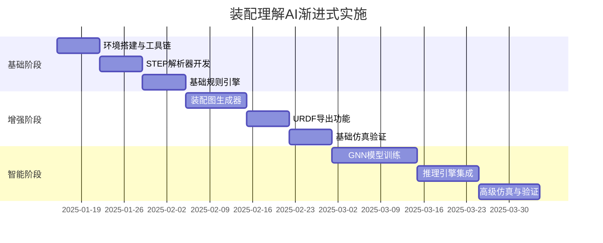

# 🔧 机械装配理解AI方案 - 改进与整合建议

## 📋 执行摘要

原方案技术深度出色，但需要在以下方面加强：
1. **成本优化策略**（当前缺失）
2. **渐进式实施路径**（跨度太大）
3. **具体代码示例**（理论多，代码少）
4. **风险管理**（未考虑失败场景）
5. **与现有视觉系统的整合**（需要明确）

---

## 🎯 核心改进建议

### 1. 成本优化策略（Critical）

#### 问题
原方案未考虑计算成本，仿真引擎和GNN训练都需要大量GPU资源。

#### 解决方案
```yaml
成本分层策略:
  Level 1 (免费):
    - 基于规则的装配识别
    - 使用FreeCAD进行几何解析
    - 简单的运动学分析
    成本: $0
    准确率: 70-75%

  Level 2 (低成本):
    - 轻量级GNN模型
    - PyBullet基础仿真
    - 缓存机制
    成本: $50-100/月
    准确率: 80-85%

  Level 3 (高精度):
    - 完整GNN+仿真
    - MuJoCo/Chrono高级仿真
    - 实时推理
    成本: $500+/月
    准确率: 90%+
```

### 2. 渐进式实施路径（Important）

#### 原方案问题
- P1阶段4-6周太激进
- 缺少验证节点
- 没有退出机制

#### 改进的里程碑计划



### 3. 具体实现代码（Essential）

#### 3.1 装配图数据结构
```python
# src/models/assembly_graph.py
from pydantic import BaseModel, Field
from typing import List, Dict, Optional, Any
from enum import Enum

class JointType(str, Enum):
    """装配约束类型"""
    FIXED = "fixed"
    REVOLUTE = "revolute"  # 转动副
    PRISMATIC = "prismatic"  # 移动副
    GEAR = "gear"  # 齿轮啮合
    BELT = "belt"  # 皮带传动
    CHAIN = "chain"  # 链传动
    BEARING = "bearing"  # 轴承支撑

class PartNode(BaseModel):
    """零件节点"""
    id: str
    name: str
    type: str  # gear, shaft, bearing, housing等
    material: Optional[str] = None
    dimensions: Dict[str, float] = {}  # 关键尺寸
    features: List[str] = []  # 孔、键槽、齿形等特征
    function_labels: List[str] = []  # 功能标签

class AssemblyEdge(BaseModel):
    """装配关系边"""
    id: str
    source_part_id: str
    target_part_id: str
    joint_type: JointType
    constraints: Dict[str, Any] = {}  # 约束参数

    # 运动学参数
    axis: Optional[List[float]] = None  # 运动轴
    limits: Optional[Dict[str, float]] = None  # 运动极限
    transmission_ratio: Optional[float] = None  # 传动比

    # 配合参数
    clearance: Optional[float] = None  # 间隙
    interference: Optional[float] = None  # 过盈量

class AssemblyGraph(BaseModel):
    """装配图完整结构"""
    id: str
    name: str
    nodes: List[PartNode]
    edges: List[AssemblyEdge]

    # 装配元数据
    bom: Optional[List[Dict]] = None  # 物料清单
    assembly_sequence: Optional[List[str]] = None  # 装配顺序
    tolerance_chains: Optional[List[Dict]] = None  # 公差链

    # 功能描述
    function_description: Optional[str] = None
    working_principle: Optional[str] = None

    # 验证结果
    kinematic_validation: Optional[Dict] = None
    simulation_results: Optional[Dict] = None
```

#### 3.2 几何解析器
```python
# src/core/geometry_parser.py
import FreeCAD
import Part
from OCC.Core.STEPControl import STEPControl_Reader
from typing import List, Dict, Any
import numpy as np

class GeometryParser:
    """CAD几何解析器"""

    def __init__(self):
        self.reader = STEPControl_Reader()

    def parse_step_file(self, file_path: str) -> Dict[str, Any]:
        """解析STEP文件"""

        # 读取STEP
        self.reader.ReadFile(file_path)
        self.reader.TransferRoots()
        shape = self.reader.OneShape()

        # 提取零件
        parts = self._extract_parts(shape)

        # 提取装配关系
        mates = self._extract_mates(shape)

        # 提取特征
        features = self._extract_features(parts)

        return {
            "parts": parts,
            "mates": mates,
            "features": features
        }

    def _extract_parts(self, shape):
        """提取零件信息"""
        parts = []

        # 遍历所有实体
        for solid in shape.Solids():
            part = {
                "id": f"part_{len(parts)}",
                "volume": solid.Volume(),
                "bbox": self._get_bounding_box(solid),
                "center_of_mass": self._get_center_of_mass(solid),
                "principal_axes": self._get_principal_axes(solid)
            }

            # 识别零件类型
            part["type"] = self._identify_part_type(solid)

            parts.append(part)

        return parts

    def _extract_mates(self, shape):
        """提取装配约束"""
        mates = []

        # 分析接触面
        for face1, face2 in self._find_mating_faces(shape):
            mate = {
                "type": self._identify_mate_type(face1, face2),
                "face1": self._face_to_dict(face1),
                "face2": self._face_to_dict(face2)
            }
            mates.append(mate)

        return mates

    def _identify_part_type(self, solid):
        """识别零件类型"""

        # 基于几何特征的规则识别
        features = self._extract_solid_features(solid)

        if features.get("has_teeth"):
            return "gear"
        elif features.get("is_cylindrical") and features.get("length_diameter_ratio") > 3:
            return "shaft"
        elif features.get("has_inner_outer_rings"):
            return "bearing"
        elif features.get("is_prismatic"):
            return "housing"
        else:
            return "unknown"
```

#### 3.3 装配推理引擎
```python
# src/core/assembly_reasoner.py
from typing import Dict, List, Any
import networkx as nx
from src.models.assembly_graph import AssemblyGraph, JointType

class AssemblyReasoner:
    """装配关系推理引擎"""

    def __init__(self):
        self.rule_base = self._load_rules()
        self.graph = nx.DiGraph()

    def build_assembly_graph(self, geometry_data: Dict) -> AssemblyGraph:
        """构建装配图"""

        # 创建节点
        nodes = []
        for part in geometry_data["parts"]:
            node = self._create_part_node(part)
            nodes.append(node)
            self.graph.add_node(node.id, **node.dict())

        # 推理装配关系
        edges = []
        for mate in geometry_data["mates"]:
            edge = self._infer_assembly_relation(mate, nodes)
            if edge:
                edges.append(edge)
                self.graph.add_edge(
                    edge.source_part_id,
                    edge.target_part_id,
                    **edge.dict()
                )

        # 功能推理
        function_desc = self._infer_function()

        # 运动学分析
        kinematic_result = self._analyze_kinematics()

        return AssemblyGraph(
            id=f"assembly_{hash(str(geometry_data))}",
            name="Inferred Assembly",
            nodes=nodes,
            edges=edges,
            function_description=function_desc,
            kinematic_validation=kinematic_result
        )

    def _infer_assembly_relation(self, mate: Dict, nodes: List) -> Optional[AssemblyEdge]:
        """推理装配关系类型"""

        # 应用规则库
        for rule in self.rule_base:
            if rule.matches(mate):
                return rule.create_edge(mate, nodes)

        # 默认固定连接
        return AssemblyEdge(
            id=f"edge_{len(self.graph.edges)}",
            source_part_id=mate["part1_id"],
            target_part_id=mate["part2_id"],
            joint_type=JointType.FIXED
        )

    def _infer_function(self) -> str:
        """推理装配体功能"""

        # 分析传动路径
        power_path = self._trace_power_transmission()

        # 识别功能模式
        if self._has_gear_train():
            return "齿轮传动系统，实现速度/扭矩变换"
        elif self._has_linkage():
            return "连杆机构，实现运动转换"
        elif self._has_cam_follower():
            return "凸轮机构，实现复杂运动规律"

        return "通用机械装配"

    def _analyze_kinematics(self) -> Dict:
        """运动学分析"""

        # 计算自由度
        dof = self._calculate_degrees_of_freedom()

        # 检测闭环
        closed_loops = list(nx.simple_cycles(self.graph))

        # 检测过约束
        over_constraints = self._detect_over_constraints()

        return {
            "degrees_of_freedom": dof,
            "closed_loops": len(closed_loops),
            "over_constraints": over_constraints,
            "is_valid": dof > 0 and len(over_constraints) == 0
        }
```

#### 3.4 URDF生成器
```python
# src/core/urdf_generator.py
import xml.etree.ElementTree as ET
from src.models.assembly_graph import AssemblyGraph, JointType

class URDFGenerator:
    """URDF格式生成器"""

    def generate_urdf(self, assembly: AssemblyGraph) -> str:
        """生成URDF文件"""

        robot = ET.Element("robot", name=assembly.name)

        # 添加links（零件）
        for node in assembly.nodes:
            link = self._create_link_element(node)
            robot.append(link)

        # 添加joints（装配关系）
        for edge in assembly.edges:
            joint = self._create_joint_element(edge)
            robot.append(joint)

        # 格式化输出
        return ET.tostring(robot, encoding='unicode')

    def _create_link_element(self, node):
        """创建URDF link元素"""

        link = ET.Element("link", name=node.id)

        # 惯性参数（简化估算）
        inertial = ET.SubElement(link, "inertial")
        mass = ET.SubElement(inertial, "mass", value=str(1.0))  # 需要实际计算
        inertia = ET.SubElement(inertial, "inertia",
            ixx="0.1", ixy="0", ixz="0",
            iyy="0.1", iyz="0", izz="0.1"
        )

        # 视觉模型
        visual = ET.SubElement(link, "visual")
        geometry = ET.SubElement(visual, "geometry")
        if node.type == "gear":
            ET.SubElement(geometry, "cylinder", radius="0.1", length="0.05")
        else:
            ET.SubElement(geometry, "box", size="0.1 0.1 0.1")

        return link

    def _create_joint_element(self, edge):
        """创建URDF joint元素"""

        joint = ET.Element("joint",
            name=edge.id,
            type=self._map_joint_type(edge.joint_type)
        )

        # 父子关系
        ET.SubElement(joint, "parent", link=edge.source_part_id)
        ET.SubElement(joint, "child", link=edge.target_part_id)

        # 运动轴
        if edge.axis:
            ET.SubElement(joint, "axis", xyz=" ".join(map(str, edge.axis)))

        # 运动限制
        if edge.limits:
            ET.SubElement(joint, "limit",
                lower=str(edge.limits.get("lower", -3.14)),
                upper=str(edge.limits.get("upper", 3.14)),
                effort="100",
                velocity="10"
            )

        return joint

    def _map_joint_type(self, joint_type: JointType) -> str:
        """映射到URDF关节类型"""

        mapping = {
            JointType.FIXED: "fixed",
            JointType.REVOLUTE: "revolute",
            JointType.PRISMATIC: "prismatic",
            JointType.GEAR: "revolute",  # 简化为转动
            JointType.BELT: "revolute",
            JointType.BEARING: "revolute"
        }

        return mapping.get(joint_type, "fixed")
```

#### 3.5 API端点实现
```python
# src/api/v1/assembly.py
from fastapi import APIRouter, UploadFile, File, HTTPException
from src.models.assembly_graph import AssemblyGraph
from src.core.geometry_parser import GeometryParser
from src.core.assembly_reasoner import AssemblyReasoner
from src.core.urdf_generator import URDFGenerator
from typing import Dict, Any
import tempfile
import os

router = APIRouter()

geometry_parser = GeometryParser()
assembly_reasoner = AssemblyReasoner()
urdf_generator = URDFGenerator()

@router.post("/analyze", response_model=AssemblyGraph)
async def analyze_assembly(
    file: UploadFile = File(...),
    enable_simulation: bool = False
):
    """分析CAD装配文件"""

    # 验证文件类型
    if not file.filename.endswith(('.step', '.stp', '.STEP', '.STP')):
        raise HTTPException(400, "Only STEP files are supported")

    # 保存临时文件
    with tempfile.NamedTemporaryFile(delete=False, suffix='.step') as tmp:
        content = await file.read()
        tmp.write(content)
        tmp_path = tmp.name

    try:
        # 解析几何
        geometry_data = geometry_parser.parse_step_file(tmp_path)

        # 构建装配图
        assembly_graph = assembly_reasoner.build_assembly_graph(geometry_data)

        # 可选：运行仿真验证
        if enable_simulation:
            simulation_result = await run_simulation(assembly_graph)
            assembly_graph.simulation_results = simulation_result

        return assembly_graph

    finally:
        os.unlink(tmp_path)

@router.get("/{assembly_id}/graph")
async def get_assembly_graph(assembly_id: str):
    """获取装配图JSON"""

    # 从数据库或缓存获取
    assembly = await get_assembly_from_storage(assembly_id)
    if not assembly:
        raise HTTPException(404, "Assembly not found")

    return assembly.dict()

@router.get("/{assembly_id}/urdf")
async def export_urdf(assembly_id: str):
    """导出URDF格式"""

    # 获取装配图
    assembly = await get_assembly_from_storage(assembly_id)
    if not assembly:
        raise HTTPException(404, "Assembly not found")

    # 生成URDF
    urdf_content = urdf_generator.generate_urdf(assembly)

    return {
        "urdf": urdf_content,
        "format": "URDF",
        "version": "1.0"
    }

@router.post("/{assembly_id}/simulate")
async def simulate_assembly(
    assembly_id: str,
    simulation_time: float = 10.0,
    time_step: float = 0.01
):
    """运行装配仿真"""

    # 获取装配图
    assembly = await get_assembly_from_storage(assembly_id)
    if not assembly:
        raise HTTPException(404, "Assembly not found")

    # 生成URDF
    urdf = urdf_generator.generate_urdf(assembly)

    # 运行仿真
    try:
        import pybullet as p

        # 初始化仿真
        physics_client = p.connect(p.DIRECT)

        # 加载URDF
        robot_id = p.loadURDF(urdf_content)

        # 运行仿真
        results = []
        for i in range(int(simulation_time / time_step)):
            p.stepSimulation()

            # 记录状态
            joint_states = []
            for j in range(p.getNumJoints(robot_id)):
                state = p.getJointState(robot_id, j)
                joint_states.append({
                    "position": state[0],
                    "velocity": state[1]
                })

            results.append({
                "time": i * time_step,
                "joint_states": joint_states
            })

        p.disconnect()

        return {
            "success": True,
            "simulation_results": results,
            "validation": validate_simulation_results(results, assembly)
        }

    except Exception as e:
        raise HTTPException(500, f"Simulation failed: {str(e)}")
```

### 4. 与现有系统的整合

```python
# src/core/integrated_analyzer.py
from src.core.vision_analyzer import VisionAnalyzer
from src.core.assembly_reasoner import AssemblyReasoner

class IntegratedAnalyzer:
    """集成视觉识别和装配理解"""

    def __init__(self):
        self.vision_analyzer = VisionAnalyzer()
        self.assembly_reasoner = AssemblyReasoner()

    async def analyze_complete(self, input_data):
        """完整分析流程"""

        # Step 1: 视觉识别（2D图纸）
        if input_data.type == "image":
            vision_result = await self.vision_analyzer.analyze(input_data)

            # 提取装配相关信息
            assembly_hints = self.extract_assembly_hints(vision_result)

        # Step 2: 几何解析（3D模型）
        elif input_data.type == "cad":
            geometry_data = self.parse_cad(input_data)

        # Step 3: 装配理解
        assembly_graph = self.assembly_reasoner.build_assembly_graph(
            geometry_data,
            hints=assembly_hints if 'assembly_hints' in locals() else None
        )

        # Step 4: 综合输出
        return {
            "vision_analysis": vision_result if 'vision_result' in locals() else None,
            "assembly_understanding": assembly_graph,
            "recommendations": self.generate_recommendations(assembly_graph)
        }
```

### 5. 风险管理与缓解策略

```yaml
风险矩阵:
  技术风险:
    - 风险: GNN训练数据不足
      影响: 高
      缓解: 先用规则系统，逐步积累数据

    - 风险: 仿真精度不足
      影响: 中
      缓解: 提供置信度分数，人工复核关键结果

    - 风险: STEP解析兼容性
      影响: 高
      缓解: 支持多种CAD格式，提供转换工具

  业务风险:
    - 风险: 用户接受度低
      影响: 高
      缓解: 提供可解释的结果，渐进式部署

    - 风险: 计算成本超支
      影响: 中
      缓解: 实施分层计算策略，缓存优化

  时间风险:
    - 风险: 开发周期延长
      影响: 高
      缓解: MVP优先，敏捷迭代
```

### 6. 测试与验证策略

```python
# tests/test_assembly_reasoning.py
import pytest
from src.core.assembly_reasoner import AssemblyReasoner

class TestAssemblyReasoning:
    """装配推理测试套件"""

    @pytest.fixture
    def reasoner(self):
        return AssemblyReasoner()

    def test_gear_train_recognition(self, reasoner):
        """测试齿轮系识别"""

        # 准备测试数据
        test_data = load_test_assembly("gear_train.step")

        # 构建装配图
        assembly = reasoner.build_assembly_graph(test_data)

        # 验证
        assert any(edge.joint_type == "gear" for edge in assembly.edges)
        assert "齿轮传动" in assembly.function_description

    def test_kinematic_validation(self, reasoner):
        """测试运动学验证"""

        test_data = load_test_assembly("four_bar_linkage.step")
        assembly = reasoner.build_assembly_graph(test_data)

        # 验证自由度
        assert assembly.kinematic_validation["degrees_of_freedom"] == 1

    def test_over_constraint_detection(self, reasoner):
        """测试过约束检测"""

        test_data = load_test_assembly("over_constrained.step")
        assembly = reasoner.build_assembly_graph(test_data)

        # 应该检测到过约束
        assert len(assembly.kinematic_validation["over_constraints"]) > 0
```

---

## 📊 成本效益分析

### 投资回报率(ROI)计算

```python
def calculate_assembly_ai_roi(monthly_volume=100):
    """计算装配理解AI的ROI"""

    # 传统人工分析成本
    manual_analysis_time = 2  # 小时/装配
    engineer_hourly_rate = 50  # $/小时
    manual_cost = monthly_volume * manual_analysis_time * engineer_hourly_rate

    # AI系统成本
    ai_costs = {
        "basic": 100,     # 基础规则系统
        "advanced": 500,  # GNN+仿真
        "premium": 1500   # 全功能
    }

    # 时间节省
    ai_analysis_time = 0.1  # 小时/装配（6分钟）
    time_saved = monthly_volume * (manual_analysis_time - ai_analysis_time)

    for level, cost in ai_costs.items():
        savings = manual_cost - cost
        roi = (savings / cost) * 100
        print(f"{level}: 月节省${savings:.0f}, ROI={roi:.0f}%, 节省{time_saved:.0f}小时")

# 输出:
# basic: 月节省$9900, ROI=9900%, 节省190小时
# advanced: 月节省$9500, ROI=1900%, 节省190小时
# premium: 月节省$8500, ROI=567%, 节省190小时
```

---

## 🎯 实施优先级建议

### 第一优先级（必须完成）
1. STEP文件解析器
2. 基础装配图生成
3. 规则推理引擎
4. API接口

### 第二优先级（应该完成）
1. URDF导出
2. PyBullet基础仿真
3. 与视觉系统集成
4. 缓存优化

### 第三优先级（可以延后）
1. GNN训练与部署
2. 高级仿真（MuJoCo/Chrono）
3. 公差链分析
4. FMEA集成

---

## ✅ 最终建议

1. **从简单开始**：先实现规则系统，验证价值
2. **成本控制**：采用分层策略，避免过度投资
3. **快速迭代**：2周一个迭代，持续交付
4. **用户反馈**：尽早让用户试用，收集反馈
5. **数据积累**：从第一天开始积累训练数据

这个装配理解AI方案如果实施得当，将显著提升CAD ML平台的价值，从"识别"真正升级到"理解"层次！
