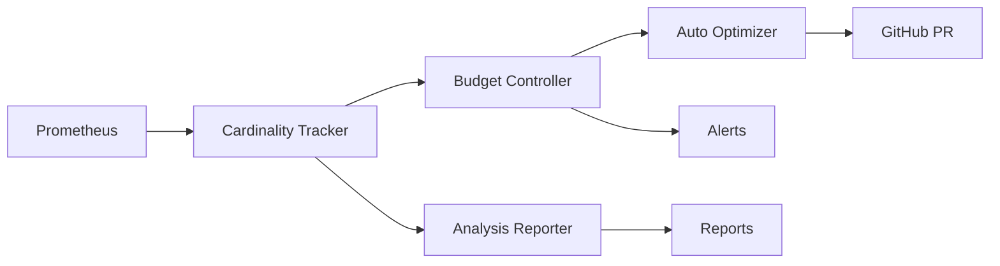

# Day 5-7: 指标基数预算系统开发计划

**开始时间**: 2025-11-22
**预计完成**: 2025-11-24
**优先级**: Priority 1
**主题**: 指标成本治理与优化

---

## 🎯 目标

建立完整的Prometheus指标基数（Cardinality）预算管理系统，通过主动控制和优化指标基数来：
- 降低监控存储成本 30-50%
- 防止指标基数爆炸导致的性能问题
- 提供清晰的成本可见性和归因
- 自动化优化高基数指标

---

## 📋 Day 5-6: 核心功能开发

### 1. 指标基数追踪器 (metrics_cardinality_tracker.py)

**功能要求**：
- 实时查询Prometheus获取每个指标的基数
- 计算label组合数和增长趋势
- 预测存储成本（基于时间序列数量）
- 支持多种Prometheus数据源

**核心实现**：
```python
class MetricsCardinalityTracker:
    def __init__(self, prometheus_url: str):
        self.prom_client = PrometheusClient(prometheus_url)

    def get_metric_cardinality(self, metric_name: str) -> CardinalityInfo:
        """获取指标基数信息"""
        # 查询该指标的所有时间序列
        # 分析label组合
        # 计算基数和成本

    def track_cardinality_trends(self) -> TrendReport:
        """追踪基数变化趋势"""
        # 对比历史数据
        # 识别快速增长的指标
        # 预测未来趋势

    def identify_high_cardinality_labels(self) -> List[LabelAnalysis]:
        """识别高基数labels"""
        # 分析每个label的唯一值数量
        # 识别异常爆炸的labels
```

### 2. 预算控制器 (metrics_budget_controller.py)

**功能要求**：
- 配置团队/服务级别的基数预算
- 实时监控预算使用情况
- 超预算自动告警和限流
- 预算分配和转移机制

**核心实现**：
```python
class MetricsBudgetController:
    def __init__(self, budget_config: BudgetConfig):
        self.budgets = budget_config
        self.current_usage = {}

    def check_budget(self, team: str, service: str) -> BudgetStatus:
        """检查预算状态"""
        # 计算当前使用量
        # 对比预算限制
        # 返回状态和剩余额度

    def enforce_budget(self, metric_change: MetricChange) -> Decision:
        """强制执行预算限制"""
        # 评估变更影响
        # 决定是否允许
        # 触发告警/限流

    def optimize_budget_allocation(self) -> AllocationPlan:
        """优化预算分配"""
        # 分析使用模式
        # 重新分配未使用预算
        # 生成优化建议
```

### 3. 分析报告器 (cardinality_analysis_report.py)

**功能要求**：
- 生成Top高基数指标报告
- 识别异常label爆炸
- 提供具体优化建议
- 多格式输出（JSON/Markdown/HTML）

**核心实现**：
```python
class CardinalityAnalysisReporter:
    def __init__(self, tracker: MetricsCardinalityTracker):
        self.tracker = tracker

    def generate_top_offenders_report(self) -> Report:
        """生成高基数指标Top列表"""
        # 排序所有指标
        # 计算成本影响
        # 生成优化优先级

    def detect_anomalies(self) -> List[Anomaly]:
        """检测基数异常"""
        # 统计异常检测
        # 突发增长识别
        # 根因分析

    def generate_optimization_recommendations(self) -> List[Recommendation]:
        """生成优化建议"""
        # 基于模式匹配
        # 提供具体操作建议
        # 预估优化效果
```

---

## 📋 Day 7: 自动优化与集成

### 4. 自动优化器 (metrics_auto_optimizer.py)

**功能要求**：
- 自动合并低价值labels
- 降采样高基数时间序列
- 生成优化配置和PR
- 安全回滚机制

**核心实现**：
```python
class MetricsAutoOptimizer:
    def __init__(self, optimization_rules: OptimizationRules):
        self.rules = optimization_rules

    def apply_label_merging(self, metric: Metric) -> OptimizedMetric:
        """合并相似labels"""
        # 识别可合并的labels
        # 应用合并规则
        # 验证不影响告警

    def apply_downsampling(self, high_cardinality_metrics: List[Metric]) -> DownsamplingConfig:
        """应用降采样策略"""
        # 根据基数选择策略
        # 配置retention规则
        # 生成recording rules

    def generate_optimization_pr(self, optimizations: List[Optimization]) -> PullRequest:
        """生成优化PR"""
        # 修改Prometheus配置
        # 更新recording rules
        # 创建GitHub PR
```

### 5. CI/CD集成 (.github/workflows/metrics-budget-check.yml)

**功能要求**：
- PR中检查新指标的基数影响
- 评估成本增加
- 超预算自动阻断
- 生成影响报告

**工作流设计**：
```yaml
name: Metrics Budget Check

on:
  pull_request:
    paths:
      - 'src/**/*.py'
      - 'prometheus/**/*.yml'

jobs:
  cardinality-check:
    steps:
      - name: Analyze Metric Changes
      - name: Calculate Cardinality Impact
      - name: Check Budget Compliance
      - name: Post PR Comment
      - name: Block if Over Budget
```

### 6. 使用文档 (METRICS_BUDGET_GUIDE.md)

**内容规划**：
- 快速开始指南
- 预算配置说明
- 优化策略详解
- 最佳实践
- 故障排除
- API参考

---

## 🏗️ 技术架构

### 数据流



### 存储设计

```yaml
数据存储:
  实时数据:
    - Redis: 当前基数缓存
    - 内存: 预算状态

  历史数据:
    - SQLite: 基数趋势
    - JSON: 配置文件

  报告输出:
    - Markdown: 人类可读
    - JSON: API集成
    - Prometheus: 自监控指标
```

---

## 📊 预期成果

### 量化指标
- **成本降低**: 30-50% Prometheus存储成本
- **性能提升**: 20-40% 查询速度提升
- **自动化率**: 80% 优化建议自动执行
- **可见性**: 100% 指标成本归因

### 交付物清单
1. **核心组件** (5个Python模块)
   - metrics_cardinality_tracker.py
   - metrics_budget_controller.py
   - cardinality_analysis_report.py
   - metrics_auto_optimizer.py
   - metrics_budget_config.py

2. **CI/CD集成** (1个工作流)
   - metrics-budget-check.yml

3. **文档** (3个文档)
   - METRICS_BUDGET_GUIDE.md
   - API_REFERENCE.md
   - OPTIMIZATION_PLAYBOOK.md

4. **测试与演示** (2个脚本)
   - test_metrics_budget.py
   - demo_metrics_budget.py

---

## 🚀 实施步骤

### Day 5 上午
- [x] 制定详细计划
- [ ] 实现cardinality_tracker基础功能
- [ ] 集成Prometheus客户端

### Day 5 下午
- [ ] 完成tracker全部功能
- [ ] 实现budget_controller核心逻辑
- [ ] 添加预算配置管理

### Day 6 上午
- [ ] 完成budget_controller
- [ ] 实现analysis_reporter
- [ ] 生成首个分析报告

### Day 6 下午
- [ ] 优化报告格式
- [ ] 添加异常检测
- [ ] 完成Day 5-6测试

### Day 7 上午
- [ ] 实现auto_optimizer
- [ ] 添加优化规则引擎
- [ ] 测试自动优化

### Day 7 下午
- [ ] 创建CI/CD工作流
- [ ] 编写完整文档
- [ ] 运行集成测试
- [ ] 准备演示

---

## ⚠️ 风险与缓解

### 技术风险
1. **Prometheus API限制**
   - 缓解: 实现请求缓存和批处理

2. **优化副作用**
   - 缓解: 渐进式优化，充分测试

3. **性能影响**
   - 缓解: 异步处理，避免阻塞

### 业务风险
1. **团队接受度**
   - 缓解: 提供清晰价值说明

2. **预算分配冲突**
   - 缓解: 灵活的协商机制

---

## 🎯 成功标准

1. **功能完整性**: 所有计划功能实现并测试通过
2. **性能达标**: 分析1000个指标 < 10秒
3. **易用性**: 配置简单，5分钟快速上手
4. **可靠性**: 错误处理完善，优雅降级
5. **文档质量**: 清晰完整，包含实例

---

**准备开始实施！** 🚀