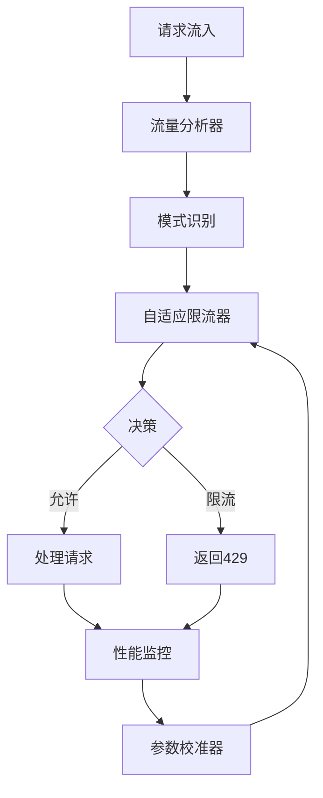

# Day 8-10: 自适应限流参数校准系统开发计划

**开始时间**: 2025-11-22
**预计完成**: 2025-11-24
**优先级**: Priority 1
**主题**: 动态性能优化与保护

---

## 🎯 目标

建立智能的自适应限流系统，通过实时分析流量模式和系统负载，动态调整限流参数，实现：
- 自动适应流量变化，无需人工调参
- 平衡系统保护与用户体验
- 基于历史数据的智能预测
- 多维度限流策略协同

---

## 📋 Day 8-9: 核心限流引擎

### 1. 自适应限流器 (adaptive_rate_limiter.py)

**功能要求**：
- 动态调整限流阈值
- 多算法支持（令牌桶、漏桶、滑动窗口）
- 实时负载感知
- 优雅降级机制

**核心实现**：
```python
class AdaptiveRateLimiter:
    def __init__(self, initial_config: RateLimitConfig):
        self.config = initial_config
        self.algorithms = {
            'token_bucket': TokenBucketAlgorithm(),
            'leaky_bucket': LeakyBucketAlgorithm(),
            'sliding_window': SlidingWindowAlgorithm(),
            'adaptive_window': AdaptiveWindowAlgorithm()
        }

    def should_allow_request(self, request: Request) -> Decision:
        """判断是否允许请求"""
        # 获取当前系统负载
        # 选择合适的算法
        # 动态调整阈值
        # 返回决策

    def adapt_thresholds(self, metrics: SystemMetrics):
        """根据系统指标自适应调整阈值"""
        # 分析CPU、内存、延迟
        # 计算最优阈值
        # 平滑过渡

    def predict_traffic_pattern(self) -> TrafficPattern:
        """预测流量模式"""
        # 基于历史数据
        # 识别周期性模式
        # 预测峰值
```

### 2. 流量模式分析器 (rate_limit_analyzer.py)

**功能要求**：
- 实时流量分析
- 模式识别（正常、突发、攻击）
- 用户行为画像
- 异常检测

**核心实现**：
```python
class RateLimitAnalyzer:
    def __init__(self):
        self.pattern_detector = PatternDetector()
        self.anomaly_detector = AnomalyDetector()

    def analyze_traffic(self, time_window: TimeWindow) -> TrafficAnalysis:
        """分析时间窗口内的流量"""
        # 统计请求分布
        # 识别访问模式
        # 检测异常行为

    def classify_traffic_pattern(self, metrics: TrafficMetrics) -> PatternType:
        """分类流量模式"""
        # 正常业务流量
        # 促销/活动流量
        # 爬虫流量
        # DDoS攻击

    def generate_user_profile(self, user_id: str) -> UserProfile:
        """生成用户行为画像"""
        # 访问频率
        # 请求模式
        # 资源消耗
        # 信誉评分
```

### 3. 参数自动校准器 (auto_calibrator.py)

**功能要求**：
- 参数优化算法
- A/B测试框架
- 效果评估
- 回滚机制

**核心实现**：
```python
class AutoCalibrator:
    def __init__(self, optimization_goal: OptimizationGoal):
        self.goal = optimization_goal
        self.optimizer = GradientOptimizer()

    def calibrate_parameters(self, current_params: Parameters) -> Parameters:
        """校准限流参数"""
        # 定义目标函数
        # 运行优化算法
        # 验证新参数
        # 返回最优参数

    def run_ab_test(self, variant_a: Parameters, variant_b: Parameters) -> TestResult:
        """运行A/B测试"""
        # 流量分割
        # 效果对比
        # 统计显著性

    def evaluate_performance(self, params: Parameters) -> PerformanceScore:
        """评估参数效果"""
        # 错误率
        # 延迟分布
        # 吞吐量
        # 用户满意度
```

---

## 📋 Day 10: 性能监控与集成

### 4. 性能影响监控器 (performance_monitor.py)

**功能要求**：
- 实时性能指标收集
- 限流效果评估
- SLA合规性检查
- 告警生成

**核心实现**：
```python
class PerformanceMonitor:
    def __init__(self, sla_config: SLAConfig):
        self.sla = sla_config
        self.metrics_collector = MetricsCollector()

    def monitor_impact(self, time_range: TimeRange) -> ImpactReport:
        """监控限流影响"""
        # 收集性能指标
        # 对比基线
        # 计算影响程度

    def check_sla_compliance(self) -> ComplianceStatus:
        """检查SLA合规性"""
        # 可用性 > 99.9%
        # P95延迟 < 100ms
        # 错误率 < 0.1%

    def generate_alerts(self, severity: AlertSeverity) -> List[Alert]:
        """生成告警"""
        # 限流过度
        # 性能退化
        # SLA违规
```

### 5. CI/CD集成 (.github/workflows/adaptive-rate-limit-monitor.yml)

**功能要求**：
- 负载测试自动化
- 参数调优验证
- 性能基准对比
- 自动回滚

### 6. 配置与文档

**配置管理**：
```yaml
rate_limiting:
  algorithms:
    token_bucket:
      initial_rate: 1000  # req/s
      burst_size: 100
    sliding_window:
      window_size: 60s
      max_requests: 60000

  adaptation:
    enabled: true
    adjustment_interval: 30s
    max_adjustment_ratio: 0.2  # 每次最多调整20%

  thresholds:
    cpu_high: 80
    memory_high: 85
    latency_p95_high: 100ms

  profiles:
    normal:
      rate_multiplier: 1.0
    peak:
      rate_multiplier: 1.5
    degraded:
      rate_multiplier: 0.5
```

---

## 🏗️ 系统架构

### 数据流



### 限流算法对比

| 算法 | 优点 | 缺点 | 适用场景 |
|------|------|------|----------|
| 令牌桶 | 允许突发 | 可能瞬间耗尽 | API限流 |
| 漏桶 | 流量平滑 | 不支持突发 | 下游保护 |
| 滑动窗口 | 精确计数 | 内存消耗大 | 精确限流 |
| 自适应窗口 | 动态调整 | 复杂度高 | 变化流量 |

---

## 📊 关键指标

### 性能指标
- **响应时间**: P50, P95, P99
- **吞吐量**: QPS, TPS
- **错误率**: 4xx, 5xx比例
- **限流率**: 被限流请求比例

### 业务指标
- **用户体验**: 成功率、等待时间
- **资源利用**: CPU、内存、带宽
- **成本效益**: 单请求成本
- **SLA达成**: 可用性、延迟

### 自适应指标
- **调整频率**: 参数变更次数
- **调整幅度**: 参数变化范围
- **收敛速度**: 达到稳定时间
- **预测准确度**: 流量预测误差

---

## 🚀 实施步骤

### Day 8
- [x] 制定详细计划
- [ ] 实现TokenBucket算法
- [ ] 实现LeakyBucket算法
- [ ] 实现SlidingWindow算法
- [ ] 完成基础限流器框架

### Day 9
- [ ] 实现流量模式分析
- [ ] 完成异常检测
- [ ] 实现参数优化算法
- [ ] 添加A/B测试框架

### Day 10
- [ ] 实现性能监控
- [ ] 创建CI/CD工作流
- [ ] 编写API文档
- [ ] 完成集成测试
- [ ] 准备演示Demo

---

## ⚠️ 技术挑战

### 1. 参数震荡
**问题**: 频繁调整导致系统不稳定
**解决**:
- 指数移动平均平滑
- 最小调整间隔
- 死区设置

### 2. 流量预测
**问题**: 突发流量难以预测
**解决**:
- 多模型集成
- 实时学习
- 快速响应机制

### 3. 公平性
**问题**: 如何公平分配限额
**解决**:
- 用户分级
- 动态配额
- 公平队列算法

---

## 🎯 预期成果

### 核心能力
1. **自适应调整**: 根据负载自动调整限流阈值
2. **智能预测**: 基于历史预测未来流量
3. **多维限流**: 用户、IP、API多维度限流
4. **优雅降级**: 分级服务保障核心功能

### 量化目标
- **延迟改善**: P95延迟降低20-30%
- **可用性提升**: 从99.9%提升到99.95%
- **资源利用**: CPU利用率提升15-25%
- **人工干预**: 减少80%的手动调参

### 交付物
1. **Python模块** (4个)
   - adaptive_rate_limiter.py
   - rate_limit_analyzer.py
   - auto_calibrator.py
   - performance_monitor.py

2. **配置文件** (2个)
   - rate_limit_config.yaml
   - calibration_rules.yaml

3. **CI/CD** (1个)
   - adaptive-rate-limit-monitor.yml

4. **文档** (3个)
   - ADAPTIVE_RATE_LIMIT_GUIDE.md
   - API_REFERENCE.md
   - TUNING_GUIDE.md

5. **测试** (2个)
   - test_adaptive_rate_limit.py
   - load_test_suite.py

---

## 🔗 与已完成模块的集成

### Day 1-4 集成
- 将限流状态纳入发布风险评分
- 限流参数变更触发风险评估

### Day 5-7 集成
- 限流指标纳入成本预算
- 优化限流减少不必要的重试成本

---

**准备开始Day 8-10的实施！** 🚀