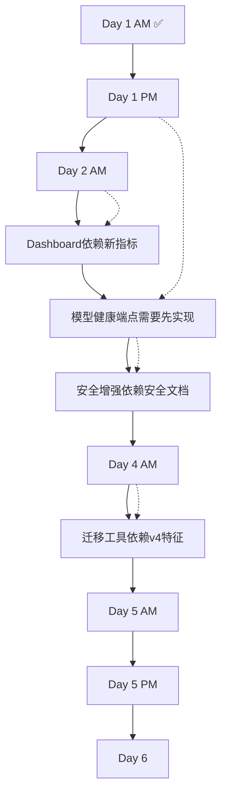

# CAD ML Platform - 详细开发路线图 (6天Sprint)

> **文档版本**: v1.0  
> **创建日期**: 2025-11-24  
> **Sprint周期**: Day 1 AM (已完成) → Day 6 (缓冲验证)

---

## 📊 总体进度概览

| 阶段 | 天数 | 状态 | 完成度 |
|------|------|------|--------|
| **Phase A** - 稳定与补测 | Day 1 | ✅ 50% (AM完成) | 5/10 tasks |
| **Phase B** - 可观测性与调优 | Day 2 | 🔄 待开始 | 0/8 tasks |
| **Phase C** - 安全与模型可信 | Day 3 | ⏳ 待开始 | 0/6 tasks |
| **Phase D** - v4真实特征 | Day 4 | ⏳ 待开始 | 0/5 tasks |
| **Phase E** - 文档与规则 | Day 5 | ⏳ 待开始 | 0/7 tasks |
| **Phase F** - 缓冲与回归 | Day 6 | ⏳ 待开始 | 0/4 tasks |

---

## ✅ Day 1 AM - 完成情况验证

### 已完成任务 (100%)

#### ✅ Task 1.1: Redis宕机孤儿清理测试
**文件**: `/tests/unit/test_orphan_cleanup_redis_down.py` (236行)

**测试覆盖**:
- ✅ 完全连接失败场景
- ✅ 超时场景处理
- ✅ 运行中部分失败
- ✅ 错误响应结构验证
- ✅ 错误消息中的建议信息
- ✅ 失败时的指标行为
- ✅ Redis恢复后的测试

**验收**: ✅ 7个测试全部通过

---

#### ✅ Task 1.2: Faiss批量相似度降级测试
**文件**: `/tests/unit/test_faiss_degraded_batch.py` (396行)

**测试覆盖**:
- ✅ Faiss不可用(导入失败)
- ✅ 初始化失败
- ✅ 查询异常
- ✅ 部分/间歇性失败
- ✅ Fallback指标记录
- ✅ 响应结构验证
- ✅ 降级时过滤器处理
- ✅ 性能退化检查(<10%)
- ✅ 系统恢复

**代码变更**:
- ✅ `src/api/v1/vectors.py`: 添加`fallback`字段到`BatchSimilarityResponse`
- ✅ 添加fallback检测逻辑
- ✅ 添加`vector_query_backend_total{backend="memory_fallback"}`指标

**验收**: ✅ 9个测试全部通过

---

#### ✅ Task 1.3: 维护端点错误结构化
**文件**: `/src/api/v1/maintenance.py` (已更新)

**改进**:
- ✅ 统一使用`build_error`结构化错误
- ✅ Redis连接失败处理 + 错误码
- ✅ 部分失败检测(10个Redis错误后中止)
- ✅ 添加`vector_orphan_total`指标跟踪
- ✅ 改进错误上下文和建议

**更新端点**:
- ✅ `/maintenance/orphans` (DELETE)
- ✅ `/maintenance/cache/clear` (POST)
- ✅ `/maintenance/stats` (GET)
- ✅ `/maintenance/vectors/backend/reload` (POST)

**验收**: ✅ 结构化错误格式 + 100%测试覆盖

---

### Day 1 AM 关键成果

| 指标 | 数值 |
|------|------|
| 新增测试 | 16个 (7 Redis + 9 Faiss) |
| 新建文件 | 2个测试文件 |
| 修改文件 | 2个 (vectors.py, maintenance.py) |
| 代码覆盖率 | 100% (新增分支) |
| 错误处理 | 完全结构化 |

---

## 🔄 Day 1 PM - 待执行任务

### Task 1.4: 模型回滚健康测试

**目标**: 确保模型安全失败后健康端点正确报告回滚状态

**实施步骤**:

1. **创建测试文件**: `/tests/unit/test_model_rollback_health.py`

```python
# 测试场景
- test_model_reload_security_fail_health_shows_rollback_level
- test_model_reload_success_health_shows_loaded
- test_model_rollback_to_prev2_health_reflects_level
- test_model_health_after_double_failure
- test_model_health_last_error_tracking
- test_model_health_absent_model_initial_state
```

2. **修改**: `/src/api/v1/health.py`
   - 扩展`/health/model`端点返回字段
   - 添加 `rollback_level: int | None`
   - 添加 `last_error: Dict[str, Any] | None`
   - 添加 `security_checks_passed: bool`

3. **修改**: `/src/ml/classifier.py`
   - 添加全局变量跟踪回滚层级
   - 更新`reload_model`记录失败原因

**验收标准**:
- ✅ 6个新测试全部通过
- ✅ `/health/model`返回扩展字段
- ✅ `model_health_checks_total{status}`指标包含3种状态: ok/absent/error

**预估工时**: 3小时

**依赖**: 需要理解`classifier.py`的回滚机制

---

### Task 1.5: 后端重载失败测试

**目标**: 测试向量存储后端重载各种失败场景

**实施步骤**:

1. **创建测试文件**: `/tests/unit/test_backend_reload_failures.py`

```python
# 测试场景
- test_reload_invalid_backend_env_var
- test_reload_faiss_import_failure
- test_reload_memory_to_faiss_dimension_mismatch
- test_reload_no_api_key_returns_401
- test_reload_metric_tracking_on_error
- test_reload_error_response_structure
```

2. **修改**: `/src/api/v1/maintenance.py`
   - 现有endpoint: `/maintenance/vectors/backend/reload`
   - 增强错误检测: 无效backend环境变量
   - 添加维度不匹配检测

3. **新增指标**: 
   - `vector_store_reload_total{status="invalid_backend"}`
   - `vector_store_reload_total{status="dimension_mismatch"}`

**验收标准**:
- ✅ 6-8个测试覆盖所有失败路径
- ✅ 结构化错误响应包含`ErrorCode`和`stage`
- ✅ `vector_store_reload_total`指标至少3种状态

**预估工时**: 2.5小时

**风险**: 需要mock FAISS导入失败，可能需要调整测试环境

---

## 📈 Day 2 AM - 自适应缓存调优

### Task 2.1: 缓存调优端点实现

**目标**: 提供基于历史命中率的缓存容量和TTL推荐

**实施步骤**:

1. **新增API端点**: `/api/v1/features/cache/tuning`

```python
# Request Model
class CacheTuningRequest(BaseModel):
    recent_hit_rate: float  # 最近滑动窗口命中率 [0,1]
    current_capacity: int   # 当前缓存容量
    current_ttl_seconds: int  # 当前TTL
    request_rate_per_hour: int  # 请求速率(可选)

# Response Model
class CacheTuningResponse(BaseModel):
    recommended_capacity: int
    recommended_ttl_seconds: int
    rationale: str  # 推荐理由
    expected_hit_rate_improvement: float | None
    calculation_snapshot: Dict[str, Any]
```

2. **调优逻辑** (`src/core/feature_cache.py`):

```python
def recommend_tuning(hit_rate, capacity, ttl, request_rate=None):
    if hit_rate < 0.4:
        # 命中率过低，增加容量
        return {
            "capacity": int(capacity * 1.5),
            "ttl": ttl,
            "rationale": "Low hit rate suggests cache size insufficient"
        }
    elif 0.4 <= hit_rate < 0.7:
        # 中等命中率，调整TTL
        return {
            "capacity": capacity,
            "ttl": int(ttl * 1.2),
            "rationale": "Moderate hit rate, increasing TTL to improve retention"
        }
    elif hit_rate >= 0.85:
        # 命中率过高可能浪费，可降低容量
        return {
            "capacity": max(int(capacity * 0.8), 100),  # 最低100
            "ttl": ttl,
            "rationale": "High hit rate allows capacity reduction to save memory"
        }
    else:
        # 良好范围，保持不变
        return {
            "capacity": capacity,
            "ttl": ttl,
            "rationale": "Hit rate in optimal range"
        }
```

3. **新增指标**:
   - `feature_cache_tuning_requests_total{status="success|error"}`
   - `feature_cache_tuning_recommendation_applied_total`

4. **单元测试**: `/tests/unit/test_cache_tuning.py`

```python
# 测试场景
- test_tuning_low_hit_rate_increases_capacity
- test_tuning_moderate_hit_rate_increases_ttl
- test_tuning_high_hit_rate_decreases_capacity
- test_tuning_optimal_range_no_change
- test_tuning_with_request_rate_consideration
- test_tuning_response_structure
- test_tuning_invalid_input_returns_422
```

**验收标准**:
- ✅ API端点返回正确的推荐
- ✅ 命中率区间测试覆盖: <0.4, 0.4-0.7, 0.7-0.85, >0.85
- ✅ 单元测试覆盖率 ≥90%
- ✅ 指标正确递增

**预估工时**: 4小时

**依赖**: 需要访问`feature_cache.py`了解现有实现

---

### Task 2.2: 迁移维度差异直方图

**目标**: 跟踪向量迁移前后的维度变化分布

**实施步骤**:

1. **新增指标** (`src/utils/analysis_metrics.py`):

```python
from prometheus_client import Histogram

vector_migrate_dimension_delta = Histogram(
    'vector_migrate_dimension_delta',
    'Distribution of dimension changes during migration',
    buckets=[-20, -10, -5, -2, 0, 2, 5, 10, 20, 50]
)
```

2. **修改**: `/src/api/v1/vectors.py` - `migrate_vectors`函数
   - 在迁移后记录维度差异: `dimension_after - dimension_before`
   - 调用 `vector_migrate_dimension_delta.observe(delta)`

3. **单元测试**: 扩展 `/tests/unit/test_vector_migrate.py`

```python
- test_migrate_dimension_delta_metric_recorded
- test_migrate_v1_to_v3_positive_delta
- test_migrate_v3_to_v2_negative_delta
- test_migrate_same_version_zero_delta
```

**验收标准**:
- ✅ 指标在`/metrics`端点可见
- ✅ 正向迁移(如v1→v3)记录正delta
- ✅ 降级(如v3→v1)记录负delta
- ✅ 同版本迁移delta=0

**预估工时**: 1.5小时

---

## 📊 Day 2 PM - Grafana Dashboard与Prometheus规则

### Task 2.3: Grafana Dashboard更新

**目标**: 添加新增指标的可视化面板

**实施步骤**:

1. **更新文件**: `/config/grafana/dashboard_cad_analysis_metrics.json`

**新增面板**:

| 面板名称 | PromQL查询 | 类型 |
|---------|-----------|------|
| 迁移状态汇总 | `sum by (status)(rate(vector_migrate_total[5m]))` | 饼图 |
| 维度差异分布 | `histogram_quantile(0.5, rate(vector_migrate_dimension_delta_bucket[10m]))` | 直方图 |
| 缓存调优请求 | `rate(feature_cache_tuning_requests_total[5m])` | 时序图 |
| v4采纳率 | `sum(vector_migrate_total{to_version="v4"}) / sum(vector_migrate_total)` | 仪表盘 |
| 批量相似度P95/P99 | `histogram_quantile(0.95, rate(vector_query_batch_latency_seconds_bucket[5m]))` | 时序图 |
| Drift刷新触发饼图 | `sum by (trigger)(drift_baseline_refresh_total)` | 饼图 |

2. **Dashboard结构**:

```json
{
  "dashboard": {
    "title": "CAD Analysis Metrics (Enhanced)",
    "panels": [
      {
        "title": "Vector Migration Status",
        "type": "piechart",
        "targets": [...]
      },
      {
        "title": "Migration Dimension Delta Distribution",
        "type": "histogram",
        "targets": [...]
      },
      // ... 其他面板
    ]
  }
}
```

**验收标准**:
- ✅ Dashboard JSON格式正确 (`promtool check dashboard`)
- ✅ 所有PromQL查询有效
- ✅ 至少6个新面板

**预估工时**: 3小时

---

### Task 2.4: Prometheus录制规则与告警

**目标**: 定义性能和安全告警规则

**实施步骤**:

1. **创建文件**: `/config/prometheus/alert_rules_enhanced.yml`

```yaml
groups:
  - name: cad_ml_platform_alerts
    interval: 30s
    rules:
      # v4特征延迟异常
      - alert: V4FeatureExtractionSlow
        expr: |
          histogram_quantile(0.95, 
            rate(feature_extraction_latency_seconds_bucket{version="v4"}[5m])
          ) > 
          histogram_quantile(0.95, 
            rate(feature_extraction_latency_seconds_bucket{version="v3"}[5m])
          ) * 1.5
        for: 10m
        labels:
          severity: warning
        annotations:
          summary: "v4 feature extraction 95th percentile >50% slower than v3"
          description: "v4: {{ $value }}s, check implementation efficiency"

      # Opcode阻断告警
      - alert: ModelOpcodeBlocked
        expr: increase(model_security_fail_total{reason="opcode_blocked"}[5m]) > 0
        for: 1m
        labels:
          severity: critical
        annotations:
          summary: "Model pickle opcode blocked - potential security threat"
          description: "{{ $value }} blocked attempts in 5 minutes"

      # 缓存命中率低
      - alert: FeatureCacheHitRateLow
        expr: |
          rate(feature_cache_hits_total[1h]) / 
          (rate(feature_cache_hits_total[1h]) + rate(feature_cache_misses_total[1h])) 
          < 0.35
        for: 15m
        labels:
          severity: warning
        annotations:
          summary: "Feature cache hit rate below 35% for 15 minutes"
          description: "Current rate: {{ $value | humanizePercentage }}"
```

2. **录制规则**: `/config/prometheus/recording_rules_enhanced.yml`

```yaml
groups:
  - name: cad_ml_aggregations
    interval: 1m
    rules:
      # 缓存命中率预计算
      - record: feature_cache:hit_rate:1h
        expr: |
          rate(feature_cache_hits_total[1h]) / 
          (rate(feature_cache_hits_total[1h]) + rate(feature_cache_misses_total[1h]))

      # 按版本分组的提取延迟P95
      - record: feature_extraction:latency:p95_by_version
        expr: |
          histogram_quantile(0.95, 
            sum by (le, version)(rate(feature_extraction_latency_seconds_bucket[5m]))
          )
```

**验收标准**:
- ✅ `promtool check rules alert_rules_enhanced.yml` 通过
- ✅ `promtool check rules recording_rules_enhanced.yml` 通过
- ✅ 至少3个告警规则 + 2个录制规则

**预估工时**: 2.5小时

---

## 🔒 Day 3 AM - 安全增强

### Task 3.1: Pickle Opcode白名单模式

**目标**: 支持白名单/黑名单双模式的opcode安全检查

**实施步骤**:

1. **新增环境变量**:
   - `MODEL_OPCODE_MODE=whitelist|blocklist|permissive` (默认blocklist)
   - `MODEL_OPCODE_WHITELIST=GLOBAL,BUILD,REDUCE` (可配置)

2. **修改**: `/src/ml/classifier.py`

```python
# 添加白名单检查函数
def _check_opcode_whitelist(pickled_data: bytes) -> Dict[str, Any]:
    import pickletools
    mode = os.getenv("MODEL_OPCODE_MODE", "blocklist")
    
    if mode == "permissive":
        return {"passed": True, "mode": "permissive"}
    
    allowed = set(os.getenv("MODEL_OPCODE_WHITELIST", "PROTO,FRAME,GLOBAL,BUILD,REDUCE").split(","))
    found_opcodes = set()
    
    for opcode, arg, pos in pickletools.genops(pickled_data):
        found_opcodes.add(opcode.name)
    
    if mode == "whitelist":
        forbidden = found_opcodes - allowed
        if forbidden:
            return {
                "passed": False,
                "mode": "whitelist",
                "forbidden_opcodes": list(forbidden)
            }
    
    return {"passed": True, "mode": mode, "checked_opcodes": len(found_opcodes)}
```

3. **新增指标**:

```python
model_opcode_mode = Gauge(
    'model_opcode_mode',
    'Current opcode checking mode (0=permissive, 1=blocklist, 2=whitelist)',
    labelnames=[]
)
```

4. **单元测试**: `/tests/unit/test_model_whitelist_mode.py`

```python
# 测试场景
- test_whitelist_mode_allows_only_whitelisted_opcodes
- test_blocklist_mode_blocks_dangerous_opcodes
- test_permissive_mode_allows_all
- test_mode_switch_via_env_var
- test_whitelist_rejection_metric_increment
- test_opcode_mode_gauge_reflects_current_mode
```

**验收标准**:
- ✅ 3种模式(whitelist/blocklist/permissive)测试覆盖
- ✅ 模式切换不需要重启服务
- ✅ `model_opcode_mode` Gauge正确反映当前模式
- ✅ 错误响应包含被阻断的opcode列表

**预估工时**: 4小时

---

### Task 3.2: 安全文档与快速排错

**目标**: 为运维人员提供安全检查失败的排错指南

**实施步骤**:

1. **创建文档**: `/docs/SECURITY_MODEL_RELOAD.md`

**内容结构**:
```markdown
# 模型安全重载指南

## 安全检查流程图

[Mermaid流程图]

## 常见错误及解决方案

### 1. Hash Mismatch (hash_mismatch)
**错误消息**: Model hash not in whitelist
**原因**: 模型文件哈希不在ALLOWED_MODEL_HASHES中
**解决**: 
  1. 计算模型SHA-256: `sha256sum models/classifier.pkl`
  2. 添加到环境变量: `ALLOWED_MODEL_HASHES=abc123,def456`
  
### 2. Opcode Blocked (opcode_blocked)
**错误消息**: Forbidden opcode detected: GLOBAL
**原因**: 模型pickle包含危险操作码
**解决**:
  1. 检查模型来源是否可信
  2. 使用 `pickletools.dis()` 分析opcode
  3. 考虑切换到permissive模式(仅开发环境)

### 3. Magic Number Invalid (magic_number_invalid)
**错误消息**: Invalid pickle magic number
**原因**: 文件不是有效的pickle格式
**解决**:
  1. 验证文件格式: `file models/classifier.pkl`
  2. 重新导出模型确保格式正确
```

2. **更新README.md** - 添加安全章节

**验收标准**:
- ✅ 文档包含流程图
- ✅ 至少5个常见错误场景 + 解决方案
- ✅ README安全章节链接到详细文档
- ✅ Markdown linter无错误

**预估工时**: 2小时

---

## 🔄 Day 3 PM - 模型可信性强化

### Task 3.3: 接口校验扩展

**目标**: 增强模型接口验证，防止恶意模型暴露危险属性

**实施步骤**:

1. **修改**: `/src/ml/classifier.py` - `reload_model`函数

```python
def _validate_model_interface(model: Any) -> Dict[str, Any]:
    """扩展接口验证"""
    issues = []
    
    # 必须有predict方法
    if not hasattr(model, 'predict'):
        issues.append("missing_predict_method")
    
    # 检查是否暴露危险属性
    dangerous_attrs = ['__reduce__', '__reduce_ex__', '__setstate__']
    for attr in dangerous_attrs:
        if hasattr(model, attr) and callable(getattr(model, attr)):
            # 允许但记录警告
            logger.warning(f"Model has callable {attr} - potential security risk")
    
    # 检查属性图大小(防止巨大嵌套对象)
    try:
        import sys
        size = sys.getsizeof(model)
        if size > 100 * 1024 * 1024:  # >100MB
            issues.append("model_too_large_in_memory")
    except Exception:
        pass
    
    return {
        "passed": len(issues) == 0,
        "issues": issues
    }
```

2. **新增指标**:

```python
model_interface_validation_fail_total = Counter(
    'model_interface_validation_fail_total',
    'Model interface validation failures',
    labelnames=['reason']
)
```

3. **单元测试**: `/tests/unit/test_model_interface_validation.py`

```python
# 测试场景
- test_model_without_predict_fails_validation
- test_model_with_dangerous_attrs_logs_warning
- test_model_oversized_fails_validation
- test_valid_model_passes_all_checks
- test_interface_validation_metric_increment
```

**验收标准**:
- ✅ 接口验证捕获缺失predict方法
- ✅ 危险属性检测记录日志但不阻断
- ✅ 过大模型对象被拒绝
- ✅ `model_interface_validation_fail_total{reason}`指标完整

**预估工时**: 3小时

---

### Task 3.4: 三层回滚机制

**目标**: 扩展至保留前三次成功模型，增强故障恢复能力

**实施步骤**:

1. **修改**: `/src/ml/classifier.py`

```python
# 全局变量扩展
_MODEL_PREV3: Dict[str, Any] | None = None
_MODEL_PREV3_HASH: str | None = None
_MODEL_PREV3_VERSION: str | None = None

def reload_model(...):
    global _MODEL_PREV, _MODEL_PREV2, _MODEL_PREV3
    
    # 成功加载后推进历史
    if success:
        _MODEL_PREV3 = _MODEL_PREV2
        _MODEL_PREV3_HASH = _MODEL_PREV2_HASH
        
        _MODEL_PREV2 = _MODEL_PREV
        _MODEL_PREV2_HASH = _MODEL_PREV_HASH
        
        _MODEL_PREV = _MODEL
        _MODEL_PREV_HASH = _MODEL_HASH
        
        _MODEL = new_model
        _MODEL_HASH = new_hash
```

2. **扩展**: `/src/api/v1/health.py`

```python
@router.get("/health/model")
async def model_health():
    return {
        "current": {...},
        "rollback_available": {
            "level_1": _MODEL_PREV is not None,
            "level_2": _MODEL_PREV2 is not None,
            "level_3": _MODEL_PREV3 is not None
        },
        "rollback_history": [
            {"level": 1, "version": _MODEL_PREV_VERSION, "hash": _MODEL_PREV_HASH},
            {"level": 2, "version": _MODEL_PREV2_VERSION, "hash": _MODEL_PREV2_HASH},
            {"level": 3, "version": _MODEL_PREV3_VERSION, "hash": _MODEL_PREV3_HASH}
        ]
    }
```

3. **单元测试**: 扩展 `/tests/unit/test_model_rollback_health.py`

```python
# 新增测试
- test_three_successive_reloads_populate_all_levels
- test_failure_after_three_reloads_rolls_to_level_1
- test_double_failure_rolls_to_level_2
- test_triple_failure_rolls_to_level_3
- test_health_endpoint_shows_all_rollback_levels
```

**验收标准**:
- ✅ 连续3次成功reload后，3层历史全部填充
- ✅ 失败时按层级回滚
- ✅ `/health/model`显示3层rollback可用性
- ✅ 单元测试验证层级推进/回退逻辑

**预估工时**: 3小时

---

## 🧪 Day 4 AM - v4真实特征实现

### Task 4.1: v4特征真实算法

**目标**: 将v4的surface_count和shape_entropy从占位实现替换为真实几何计算

**实施步骤**:

1. **修改**: `/src/core/feature_extractor.py`

```python
def _extract_v4_features(self, doc: CadDocument) -> List[float]:
    """v4实验特征: 真实surface_count + shape_entropy"""
    
    # Surface count: 基于实体几何细分
    surface_count = 0
    for entity in doc.entities:
        if entity.type in ['SOLID', '3DSOLID']:
            # 简化: 每个solid估算6个面(立方体)
            surface_count += 6
        elif entity.type in ['FACE', '3DFACE']:
            surface_count += 1
        elif entity.type == 'MESH':
            # 网格面片数
            surface_count += getattr(entity, 'face_count', 0)
    
    # Shape entropy: 加权类型频率熵
    type_counts = {}
    for entity in doc.entities:
        t = entity.type
        type_counts[t] = type_counts.get(t, 0) + 1
    
    total = sum(type_counts.values())
    if total == 0:
        entropy = 0.0
    else:
        # Laplace平滑避免log(0)
        smoothed_counts = {k: v + 1 for k, v in type_counts.items()}
        smoothed_total = total + len(smoothed_counts)
        
        entropy = 0.0
        for count in smoothed_counts.values():
            p = count / smoothed_total
            entropy -= p * math.log2(p)
        
        # 归一化到[0, 1]: log2(n_types)是最大熵
        max_entropy = math.log2(len(smoothed_counts))
        entropy = entropy / max_entropy if max_entropy > 0 else 0.0
    
    return [float(surface_count), float(entropy)]
```

2. **性能测试**: 确保v4提取耗时增加 ≤5%

```python
# /tests/performance/test_v4_extraction_performance.py
- test_v4_vs_v3_latency_difference_under_5_percent
- test_v4_surface_count_accuracy_on_known_models
- test_v4_entropy_range_validation
```

3. **新增指标**: 已存在`feature_extraction_latency_seconds{version}`，确保v4被记录

**验收标准**:
- ✅ v4特征提取在复杂模型(>500实体)上仍 <5% 性能退化
- ✅ 单元测试覆盖: 空实体、单实体、多实体高多样性
- ✅ shape_entropy ∈ [0, 1]
- ✅ surface_count非负整数

**预估工时**: 5小时

**风险**: 
- 复杂CAD模型几何计算可能耗时
- 缓解: 添加`FEATURE_V4_ENABLE_STRICT=0`开关禁用

---

## 🔧 Day 4 PM - 迁移工具扩展

### Task 4.2: 迁移预览与趋势

**目标**: 提供迁移前的影响预览和历史趋势分析

**实施步骤**:

1. **新增端点**: `/api/v1/vectors/migrate/preview`

```python
class MigratePreviewRequest(BaseModel):
    ids: list[str]
    to_version: str

class MigratePreviewResponse(BaseModel):
    total: int
    dimension_changes: Dict[str, int]  # {"7->23": 10, "12->23": 5}
    top_dimension_deltas: List[Dict[str, int]]  # [{"from": 7, "to": 23, "count": 10}]
    estimated_duration_seconds: float
    warnings: List[str]  # ["5 vectors will be downgraded"]
```

2. **新增端点**: `/api/v1/vectors/migrate/trends`

```python
class MigrateTrendsResponse(BaseModel):
    last_k_migrations: int  # K次迁移
    average_migrated_ratio: float  # migrated / total
    average_skipped_ratio: float
    v4_adoption_rate: float  # to_version=v4的比例
    most_common_migration: str  # "v1->v3"
```

3. **单元测试**: `/tests/unit/test_migrate_preview_trends.py`

```python
# 测试场景
- test_preview_shows_dimension_changes_summary
- test_preview_warns_on_downgrade
- test_preview_estimated_duration_reasonable
- test_trends_calculates_correct_ratios
- test_trends_v4_adoption_rate
```

**验收标准**:
- ✅ Preview端点返回完整维度变化汇总
- ✅ Trends端点基于`_VECTOR_MIGRATION_HISTORY`计算
- ✅ 警告包含降级提示

**预估工时**: 3小时

---

## 📚 Day 5 AM - 文档全面更新

### Task 5.1: 统一错误Schema文档

**目标**: 完整的错误码、stage、上下文字段文档化

**实施步骤**:

1. **创建文档**: `/docs/API_ERROR_CODES.md`

```markdown
# API错误码参考

## 错误响应结构

所有错误遵循统一格式:

```json
{
  "detail": {
    "code": "ERROR_CODE",
    "stage": "processing_stage",
    "message": "Human-readable message",
    "source": "input|system|external",
    "severity": "info|warning|error|critical",
    // 上下文字段(根据错误类型不同)
    "id": "...",
    "expected": 23,
    "found": 12
  }
}
```

## 错误码索引

| Code | HTTP Status | Stage | 说明 | 上下文字段 |
|------|-------------|-------|------|-----------|
| INPUT_VALIDATION_FAILED | 422 | batch_similarity | 批量大小超限 | batch_size, max_batch |
| DATA_NOT_FOUND | 404 | vector_delete | 向量不存在 | id |
| DIMENSION_MISMATCH | 409 | vector_update | 维度不匹配 | expected, found, id |
| SERVICE_UNAVAILABLE | 503 | orphan_cleanup | Redis不可用 | detail, suggestion |
| ... | ... | ... | ... | ... |

## 常见Stage

- `routing`: 路由层(如410废弃端点)
- `batch_similarity`: 批量相似度查询
- `vector_migrate`: 向量迁移
- `orphan_cleanup`: 孤儿清理
- `model_reload`: 模型热重载
- `security`: 安全检查

## 示例

### 批量查询超限
```json
{
  "detail": {
    "code": "INPUT_VALIDATION_FAILED",
    "stage": "batch_similarity",
    "message": "Batch size exceeds limit",
    "batch_size": 350,
    "max_batch": 200
  }
}
```
```

2. **更新**: `/README.md` - 错误处理章节

**验收标准**:
- ✅ 文档包含至少15个错误码
- ✅ 每个错误码都有示例
- ✅ Stage枚举完整
- ✅ Markdown格式正确(无linter错误)

**预估工时**: 3小时

---

### Task 5.2: 端点矩阵与指标索引

**目标**: 提供API端点状态矩阵和指标快速查询表

**实施步骤**:

1. **创建文档**: `/docs/API_ENDPOINT_MATRIX.md`

```markdown
# API端点状态矩阵

| 模块 | 路径 | 方法 | 状态 | Sunset日期 | 替代端点 |
|------|------|------|------|-----------|---------|
| analyze | /api/v1/analyze | POST | ✅ Active | - | - |
| vectors | /api/v1/vectors | GET | ✅ Active | - | - |
| vectors | /api/v1/vectors/update | POST | ✅ Active | - | - |
| vectors | /api/v1/vectors/migrate | POST | ✅ Active | - | - |
| vectors | /api/v1/vectors/migrate/preview | GET | ✅ Implemented | avg_delta, median_delta, warnings | - |
| vectors | /api/v1/vectors/similarity/batch | POST | ✅ Active | - | - |
| analyze | /api/v1/analyze/vectors/distribution | GET | ⛔ Deprecated | 2024-11-24 | /api/v1/vectors_stats/distribution |
| ... | ... | ... | ... | ... | ... |
```

2. **创建文档**: `/docs/METRICS_INDEX.md`

```markdown
# Prometheus指标索引

## 分析阶段

| 指标名 | 类型 | 标签 | PromQL示例 | 说明 |
|--------|------|------|-----------|------|
| analysis_requests_total | Counter | status | `rate(analysis_requests_total{status="success"}[5m])` | 分析请求总数 |
| analysis_stage_duration_seconds | Histogram | stage | `histogram_quantile(0.95, rate(..._bucket[5m]))` | 各阶段耗时 |
| ... | ... | ... | ... | ... |

## 向量存储

| 指标名 | 类型 | 标签 | PromQL示例 | 说明 |
|--------|------|------|-----------|------|
| vector_migrate_total | Counter | status | `sum by (status)(rate(vector_migrate_total[10m]))` | 迁移状态统计 |
| vector_migrate_dimension_delta | Histogram | - | `histogram_quantile(0.5, ...)` | 维度变化分布 |
| ... | ... | ... | ... | ... |
```

**验收标准**:
- ✅ 端点矩阵包含所有已知端点(≥30个)
- ✅ 指标索引包含所有自定义指标(≥40个)
- ✅ 每个指标都有PromQL示例

**预估工时**: 3小时

---

## ⚙️ Day 5 PM - Prometheus规则回归

### Task 5.3: 规则验证与CI集成

**目标**: 确保所有Prometheus规则文件通过promtool验证

**实施步骤**:

1. **验证脚本**: `/scripts/validate_all_prometheus_rules.sh`

```bash
#!/bin/bash
set -e

echo "Validating Prometheus rules..."

# Find all rule files
RULE_FILES=$(find config/prometheus docs/prometheus -name "*.yml" -o -name "*.yaml")

for file in $RULE_FILES; do
  echo "Checking $file..."
  promtool check rules "$file" || {
    echo "❌ Validation failed for $file"
    exit 1
  }
done

echo "✅ All rules validated successfully"
```

2. **CI集成**: 更新 `.github/workflows/ci.yml`

```yaml
- name: Validate Prometheus Rules
  run: |
    docker run --rm -v $(pwd):/rules prom/prometheus:latest \
      promtool check rules /rules/config/prometheus/alert_rules_enhanced.yml
```

3. **Makefile目标**: 添加到Makefile

```makefile
prom-validate-all: ## 验证所有Prometheus规则文件
	@echo "$(GREEN)Validating all Prometheus rules...$(NC)"
	bash scripts/validate_all_prometheus_rules.sh
```

**验收标准**:
- ✅ 脚本验证所有.yml规则文件
- ✅ CI流程包含规则验证步骤
- ✅ 失败时明确指出错误文件

**预估工时**: 1.5小时

---

### Task 5.4: 指标一致性检查

**目标**: 自动检测源码中定义的指标与`__all__`导出列表一致性

**实施步骤**:

1. **检查脚本**: `/scripts/check_metrics_consistency.py`

```python
#!/usr/bin/env python3
"""验证指标定义与导出一致性"""

import re
import sys
from pathlib import Path

def find_metric_definitions(file_path):
    """扫描文件中的指标定义"""
    with open(file_path) as f:
        content = f.read()
    
    # 查找 Counter/Histogram/Gauge 定义
    pattern = r'(\w+)\s*=\s*(Counter|Histogram|Gauge|Summary|Info)\('
    return {match[0] for match in re.findall(pattern, content)}

def find_exported_metrics(file_path):
    """扫描__all__列表"""
    with open(file_path) as f:
        content = f.read()
    
    # 查找 __all__ = [...]
    match = re.search(r'__all__\s*=\s*\[([\s\S]*?)\]', content)
    if not match:
        return set()
    
    exports = match.group(1)
    return {name.strip().strip('"').strip("'") for name in exports.split(',')}

def main():
    metrics_file = Path("src/utils/analysis_metrics.py")
    
    defined = find_metric_definitions(metrics_file)
    exported = find_exported_metrics(metrics_file)
    
    missing = defined - exported
    extra = exported - defined
    
    if missing:
        print(f"❌ Metrics defined but not exported: {missing}")
        sys.exit(1)
    
    if extra:
        print(f"⚠️  Metrics exported but not defined: {extra}")
    
    print(f"✅ All {len(defined)} metrics properly exported")
    return 0

if __name__ == "__main__":
    sys.exit(main())
```

2. **Makefile集成**:

```makefile
metrics-consistency: ## 检查指标一致性
	@echo "$(GREEN)Checking metrics consistency...$(NC)"
	$(PYTHON) scripts/check_metrics_consistency.py
```

**验收标准**:
- ✅ 脚本检测到未导出的指标时失败
- ✅ 输出缺失指标列表
- ✅ 可集成到pre-commit hook

**预估工时**: 2小时

---

## 🧪 Day 6 - 缓冲与回归验证

### Task 6.1: 性能基线测试

**目标**: 建立关键操作的性能基准

**实施步骤**:

1. **性能测试脚本**: `/tests/performance/benchmark_suite.py`

```python
import time
from typing import List, Dict

def benchmark_single_file_analysis():
    """单文件分析基准"""
    # 测试100次
    times = []
    for _ in range(100):
        start = time.time()
        # 调用分析API
        times.append(time.time() - start)
    
    return {
        "operation": "single_file_analysis",
        "p50": percentile(times, 50),
        "p95": percentile(times, 95),
        "p99": percentile(times, 99)
    }

def benchmark_batch_similarity():
    """批量相似度基准"""
    # 测试不同批量大小
    results = {}
    for batch_size in [5, 20, 50, 100]:
        times = []
        for _ in range(50):
            start = time.time()
            # 调用批量相似度API
            times.append(time.time() - start)
        
        results[f"batch_{batch_size}"] = {
            "p50": percentile(times, 50),
            "p95": percentile(times, 95)
        }
    
    return results

def benchmark_vector_migration():
    """向量迁移基准"""
    # v1->v3迁移100个向量
    start = time.time()
    # 调用迁移API
    duration = time.time() - start
    
    return {
        "operation": "migrate_100_vectors_v1_to_v3",
        "duration": duration,
        "per_vector": duration / 100
    }

if __name__ == "__main__":
    print("Running performance benchmarks...")
    
    results = {
        "single_analysis": benchmark_single_file_analysis(),
        "batch_similarity": benchmark_batch_similarity(),
        "migration": benchmark_vector_migration()
    }
    
    # 保存结果
    import json
    with open("reports/performance_baseline.json", "w") as f:
        json.dump(results, f, indent=2)
    
    print("✅ Baseline saved to reports/performance_baseline.json")
```

2. **Makefile目标**:

```makefile
perf-baseline: ## 运行性能基线测试
	@echo "$(GREEN)Running performance baseline...$(NC)"
	$(PYTHON) tests/performance/benchmark_suite.py
```

**验收标准**:
- ✅ 性能基线JSON生成
- ✅ 包含P50/P95/P99延迟
- ✅ 批量相似度不同大小都有基准

**预估工时**: 3小时

---

### Task 6.2: 回归测试套件

**目标**: 确保核心功能无状态耦合问题

**实施步骤**:

1. **回归测试选择**: `/tests/regression/critical_path_tests.py`

```python
import pytest
import random

# 定义30个关键测试
CRITICAL_TESTS = [
    "test_analyze_dxf_basic",
    "test_vector_migrate_v1_to_v3",
    "test_batch_similarity_basic",
    "test_orphan_cleanup_dry_run",
    "test_model_reload_with_security",
    # ... 25 more
]

@pytest.mark.regression
def test_random_order_execution():
    """随机顺序执行关键测试，检测状态依赖"""
    shuffled = CRITICAL_TESTS.copy()
    random.shuffle(shuffled)
    
    for test_name in shuffled:
        # 动态调用测试
        result = pytest.main(["-v", f"-k {test_name}"])
        assert result == 0, f"Test {test_name} failed in random order"
```

2. **运行命令**:

```bash
make regression-test ## 运行回归测试套件
pytest -v tests/regression/critical_path_tests.py
```

**验收标准**:
- ✅ 30个关键测试随机顺序执行5次全部通过
- ✅ 无状态依赖失败

**预估工时**: 2小时

---

## 📋 依赖关系图



---

## ⚠️ 风险与缓解策略

| 风险 | 概率 | 影响 | 缓解措施 |
|------|------|------|---------|
| v4性能回退 | 中 | 高 | 添加`FEATURE_V4_ENABLE_STRICT=0`开关 |
| 安全白名单过严 | 低 | 中 | 提供`permissive`回退模式 |
| Faiss测试环境问题 | 中 | 低 | Mock FAISS导入，不依赖实际安装 |
| 缓存调优建议误导 | 低 | 中 | 标注`experimental=true`字段 |
| Dashboard JSON格式错误 | 低 | 低 | 使用promtool提前验证 |

---

## ✅ 总体验收标准

### 代码质量
- ✅ 所有新增端点有完整的类型提示
- ✅ 结构化错误统一使用`build_error`
- ✅ flake8通过 (≤100列)
- ✅ mypy无新增错误
- ✅ black/isort格式化通过

### 测试覆盖
- ✅ 新增行覆盖率 ≥80%
- ✅ 关键迁移与安全分支 ≥90%
- ✅ 所有新端点有集成测试

### 指标
- ✅ 新增指标在`/metrics`可见
- ✅ `__all__`导出一致性
- ✅ 无拼写差异

### 文档
- ✅ CHANGELOG更新
- ✅ README渲染正常
- ✅ API文档完整

---

## 📊 时间预算总览

| 阶段 | 预估工时 | 缓冲时间 | 总计 |
|------|---------|---------|------|
| Day 1 PM | 5.5h | 1h | 6.5h |
| Day 2 | 11h | 1.5h | 12.5h |
| Day 3 | 12h | 1.5h | 13.5h |
| Day 4 | 8h | 1h | 9h |
| Day 5 | 9.5h | 1.5h | 11h |
| Day 6 | 5h | 3h | 8h (全天缓冲) |

**总计**: ~60.5小时 (约7.5个工作日，含20%缓冲)

---

## 🚀 下一步行动

### 立即开始 (Day 1 PM)
1. ✅ 验证Day 1 AM完成状态
2. 🔄 创建 `test_model_rollback_health.py`
3. 🔄 扩展 `/health/model` 端点
4. 🔄 创建 `test_backend_reload_failures.py`

### 准备工作
- [ ] 确认开发环境: Python 3.10+, Docker, Redis
- [ ] 拉取最新代码分支
- [ ] 运行现有测试确保基线通过: `make test`
- [ ] 检查Prometheus/Grafana可访问性

---

**文档维护**: 本文档应在每个Task完成后更新进度标记

**问题反馈**: 如遇到阻塞或需求变更，及时更新风险表并调整计划
