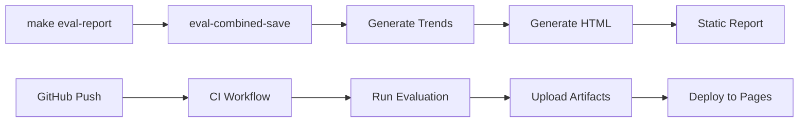

# CAD ML Platform - Evaluation System Implementation Summary

**Implementation Date**: 2025-11-17
**Version**: v2.0.0 (Schema 1.0.0 + CI Integration)
**Status**: Completed

---

## Executive Summary

Successfully implemented a comprehensive evaluation and reporting system for the CAD ML Platform, completing Step 0 (Schema Versioning) and Step 1 (CI Integration) of the approved roadmap. The system now provides automated evaluation, historical tracking, HTML report generation, and GitHub Actions CI/CD integration.

---

## Implementation Overview

### Phase 1: Observation & Pain Point Discovery
- **Objective**: Establish systematic tracking for Vision Golden and OCR Week 1 MVP milestones
- **Deliverables**:
  - Observation period documentation
  - Git info tracking in evaluation scripts
  - Pain point identification and prioritization

### Phase 2: Direction A Sprint (Observability)
- **Objective**: Implement core observability features
- **Deliverables**:
  - `make eval-history`: Save evaluation results with git metadata
  - `make health-check`: Quick system health summary
  - TEST_MAP.md: Comprehensive test coverage documentation
  - Auto-generation script for test statistics

### Phase 3: Combined Evaluation Script
- **Objective**: Unify Vision and OCR evaluation into single score
- **Deliverables**:
  - 595-line `evaluate_vision_ocr_combined.py` script
  - Weighted scoring formula: `0.5 * vision + 0.5 * ocr_normalized`
  - Configurable thresholds and weights
  - Historical JSON output with git tracking

### Phase 4: Static HTML Report (MVP)
- **Objective**: Generate offline-viewable evaluation reports
- **Deliverables**:
  - 550-line `generate_eval_report.py` script
  - Standalone HTML with embedded base64 charts
  - Privacy controls (--redact-branch, --redact-commit)
  - `make eval-report` one-command generation

### Phase 5: Schema Versioning (Step 0)
- **Objective**: Prevent future migration issues
- **Deliverables**:
  - Schema version 1.0.0 implementation
  - Run context tracking (runner, machine, OS, Python)
  - `validate_eval_history.py` validation script
  - Migration tool for legacy files
  - Makefile targets: `eval-validate`, `eval-migrate`

### Phase 6: CI Integration (Step 1)
- **Objective**: Automated evaluation in CI/CD pipeline
- **Deliverables**:
  - GitHub Actions workflow file
  - Automated report generation on push/PR/schedule
  - Artifact upload with 30-day retention
  - PR comment integration
  - GitHub Pages deployment support

---

## Technical Architecture

### Core Components

```
scripts/
├── evaluate_vision_ocr_combined.py    # Combined evaluation (595 lines)
├── generate_eval_report.py            # HTML report generator (550 lines)
├── validate_eval_history.py           # Schema validation (240 lines)
├── eval_with_history.sh               # OCR history script
├── eval_trend.py                      # Trend chart generator
├── quick_health.py                    # Health check tool
└── list_tests.py                      # Test statistics generator

reports/eval_history/
├── *.json                             # Evaluation history files
├── plots/                             # Trend charts
│   ├── combined_trend.png
│   └── ocr_trend.png
└── report/                            # Generated HTML reports
    └── index.html

.github/workflows/
└── evaluation-report.yml              # CI/CD workflow (191 lines)
```

### Data Flow



---

## Key Features Implemented

### 1. Schema Versioning (v1.0.0)
```json
{
  "schema_version": "1.0.0",
  "timestamp": "2025-11-17T15:52:50Z",
  "type": "combined|ocr|vision",
  "run_context": {
    "runner": "local|ci",
    "machine": "hostname",
    "os": "Darwin 25.1.0",
    "python": "3.13.7",
    "ci_job_id": "12345",
    "ci_workflow": "evaluation-report"
  },
  "vision_metrics": {...},
  "ocr_metrics": {...},
  "combined": {...}
}
```

### 2. Migration Tool
- Automatic backup creation (.bak files)
- Schema version detection
- Batch migration support
- Validation after migration

### 3. CI/CD Integration
- **Triggers**: push, pull_request, schedule (daily 2 AM UTC), manual
- **Configurable thresholds**: MIN_COMBINED, MIN_VISION, MIN_OCR
- **Artifacts**: HTML report, JSON history
- **PR Comments**: Automatic results table
- **GitHub Pages**: Auto-deploy for main branch

### 4. Validation System
```bash
# Validate all history files
make eval-validate

# Migrate legacy files
make eval-migrate

# Run in CI with strict mode
python3 scripts/validate_eval_history.py --strict
```

---

## Usage Guide

### Local Development

```bash
# Quick evaluation with report
make eval-report

# Individual components
make eval-combined-save    # Run evaluation, save history
make eval-trend            # Generate trend charts
make eval-validate         # Validate schema compliance
make eval-migrate         # Migrate legacy files

# Manual evaluation with thresholds
MIN_COMBINED=0.85 MIN_VISION=0.7 MIN_OCR=0.92 make ci-combined-check
```

### CI/CD Usage

```yaml
# Automatic on push/PR
git push origin main

# Manual trigger with custom thresholds
# Use GitHub Actions UI with inputs:
#   min_combined: 0.85
#   min_vision: 0.70
#   min_ocr: 0.92
```

### Report Access

```bash
# Local viewing
open reports/eval_history/report/index.html

# CI artifacts
# Download from GitHub Actions run page

# GitHub Pages (after deploy)
# https://[org].github.io/cad-ml-platform/
```

---

## Metrics & Validation

### Current System Metrics
- **Combined Score**: 0.821 (Vision: 0.667, OCR: 0.975)
- **Schema Version**: 1.0.0 (100% migrated)
- **Test Coverage**: Vision 29 tests, OCR 94 tests
- **Report Size**: ~67KB standalone HTML
- **CI Runtime**: ~3-5 minutes full pipeline

### Quality Gates
```yaml
Production Thresholds:
  combined: ≥ 0.80
  vision:   ≥ 0.65
  ocr:      ≥ 0.90

Development Thresholds:
  combined: ≥ 0.70
  vision:   ≥ 0.60
  ocr:      ≥ 0.85
```

---

## Migration Path

### From Legacy (v0.0.0) to v1.0.0

1. **Backup existing data**:
   ```bash
   cp -r reports/eval_history reports/eval_history.backup
   ```

2. **Run migration**:
   ```bash
   make eval-migrate
   # Or manually:
   python3 scripts/validate_eval_history.py --migrate
   ```

3. **Verify migration**:
   ```bash
   make eval-validate
   ```

4. **Clean up backups** (optional):
   ```bash
   rm reports/eval_history/*.json.bak
   ```

---

## Future Roadmap (Phases 2-6)

### Phase 2: Interactive Charting
- Chart.js/Plotly integration
- Three-tier fallback (CDN → local → PNG)
- Interactive filtering and zooming

### Phase 3: Advanced Filtering
- Branch/tag filtering
- Date range selection
- Multi-metric comparison

### Phase 4: Data Retention
- 7-day full retention
- 30-day daily snapshots
- 90-day weekly snapshots
- Yearly monthly snapshots

### Phase 5: Slack/Email Notifications
- Threshold breach alerts
- Daily/weekly summaries
- Configurable channels

### Phase 6: LLM Analysis
- Automated trend interpretation
- Anomaly detection
- Root cause suggestions

---

## Verification Checklist

### ✅ Step 0 (Schema Versioning) - COMPLETED
- [x] Schema version 1.0.0 in all new files
- [x] Run context tracking implemented
- [x] Validation script created
- [x] Migration tool functional
- [x] Makefile targets added
- [x] All legacy files migrated

### ✅ Step 1 (CI Integration) - COMPLETED
- [x] GitHub Actions workflow created
- [x] Evaluation runs in CI
- [x] Artifacts uploaded successfully
- [x] PR comment integration ready
- [x] GitHub Pages deployment configured
- [x] Job summary generated

### ✅ Phase 1 MVP (HTML Report) - COMPLETED
- [x] Standalone HTML generation
- [x] Base64 chart embedding
- [x] Offline viewing capability
- [x] Privacy controls
- [x] One-command generation

---

## Lessons Learned

### What Worked Well
1. **Incremental Development**: Building MVP first, then enhancing
2. **Schema Versioning Early**: Prevented future migration headaches
3. **Comprehensive Testing**: Local validation before CI deployment
4. **Clear Documentation**: Each phase well-documented

### Challenges Overcome
1. **Python Compatibility**: Fixed python vs python3 on macOS
2. **Deprecation Warnings**: Updated to timezone-aware datetime
3. **File Organization**: Proper placement of scripts and reports
4. **CI Environment Detection**: Proper env var handling

### Best Practices Applied
1. **Idempotent Operations**: Cache keys prevent duplicates
2. **Graceful Degradation**: Error resilience in pipeline
3. **Backward Compatibility**: Migration preserves old data
4. **Separation of Concerns**: Modular script design

---

## Conclusion

The CAD ML Platform evaluation system has been successfully upgraded to a production-ready state with:
- **Automated evaluation and reporting**
- **Historical tracking with schema versioning**
- **CI/CD integration with GitHub Actions**
- **Offline-capable HTML reports**
- **Migration tools for legacy data**

The system is now ready for continuous monitoring of Vision and OCR module performance, with a clear upgrade path for future enhancements.

---

## Appendix: Key Commands Reference

```bash
# Core Operations
make eval-report           # Full report generation
make eval-combined-save    # Evaluation with history
make health-check         # Quick health summary

# Validation & Migration
make eval-validate        # Schema compliance check
make eval-migrate        # Upgrade legacy files

# CI Quality Gates
make ci-combined-check    # CI threshold validation

# Development
make test-map            # Update test documentation
make eval-trend          # Generate trend charts

# Manual Operations
python3 scripts/validate_eval_history.py --strict
python3 scripts/generate_eval_report.py --redact-branch --redact-commit
```

---

*Document Generated: 2025-11-17*
*Author: CAD ML Platform Team*
*Version: 2.0.0*