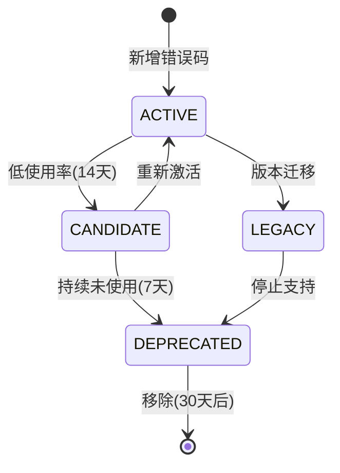
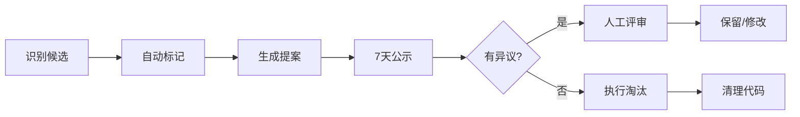

# Governance Index - CAD ML Platform
# 治理索引 - 统一治理标准与流程

## 📋 目录

1. [错误码生命周期管理](#错误码生命周期管理)
2. [指标白名单策略](#指标白名单策略)
3. [标签组合策略](#标签组合策略)
4. [Cardinality 阈值管理](#cardinality-阈值管理)
5. [审计周期与流程](#审计周期与流程)
6. [准入标准](#准入标准)
7. [淘汰策略](#淘汰策略)
8. [违规处理流程](#违规处理流程)

---

## 错误码生命周期管理

### 生命周期状态定义

| 状态 | 定义 | 转换条件 | 行动 |
|-----|------|---------|------|
| **ACTIVE** | 活跃使用中 | 7天内有使用记录 | 正常维护 |
| **CANDIDATE** | 弃用候选 | 连续14天使用率<5次 | 标记观察 |
| **DEPRECATED** | 已弃用 | 连续21天无使用 | 计划移除 |
| **UNUSED** | 从未使用 | 定义后30天无使用 | 立即移除 |
| **LEGACY** | 遗留代码 | 仅在旧版本使用 | 维护兼容性 |

### 生命周期转换规则



### 错误码上限策略

- **活跃错误码上限**: 80个
- **总定义上限**: 100个
- **超限处理**: 触发强制淘汰流程

---

## 指标白名单策略

### 核心指标白名单

```json
{
  "allowed_metrics": [
    "http_requests_total",
    "http_request_duration_seconds",
    "ocr_provider_requests_total",
    "ocr_processing_duration_seconds",
    "ocr_confidence_score",
    "vision_analysis_duration_seconds",
    "resilience_circuit_breaker_state",
    "resilience_rate_limit_tokens"
  ]
}
```

### 标签白名单

#### 一级标签（始终允许）
- `service`
- `endpoint`
- `method`
- `status`

#### 二级标签（需审批）
- `provider`
- `error_code`
- `stage`
- `model`

#### 三级标签（严格限制）
- `user_id` (仅采样)
- `request_id` (仅调试)
- `detail` (临时使用)

### 禁止的标签组合

```yaml
forbidden_combinations:
  - [provider, error_code, stage, severity]  # 4层组合
  - [user_id, endpoint, timestamp]           # 高基数组合
  - [request_id, "*"]                        # 请求级组合
```

---

## 标签组合策略

### 组合基数计算

```
基数上限 = min(
  provider_count * 5,
  endpoint_count * 10,
  1000
)
```

### 允许的组合模式

| 组合 | 用途 | 基数预估 |
|------|------|---------|
| `provider + status` | Provider健康度 | ~20 |
| `endpoint + method` | API性能 | ~50 |
| `provider + error_code` | 错误分析 | ~100 |
| `stage + status` | 流程分析 | ~20 |

### 组合审批流程

1. **提议**: 提交组合需求和预估基数
2. **评估**: 运行基数影响分析
3. **测试**: 在测试环境验证1周
4. **审批**: 通过后加入白名单
5. **监控**: 持续跟踪实际基数

---

## Cardinality 阈值管理

### 动态阈值策略

| 指标类型 | Warning | Critical | 增长率限制 |
|---------|---------|----------|-----------|
| 核心指标 | P75*1.5 | P95*2 | <8%/周 |
| 辅助指标 | 100 | 500 | <10%/周 |
| 调试指标 | 50 | 200 | <15%/周 |

### 阈值调整规则

```python
# 自动调整算法
if consecutive_weeks_stable >= 4:
    threshold *= 0.95  # 收紧5%
elif growth_rate > 0.15:
    threshold *= 1.1   # 放宽10%
else:
    threshold = baseline  # 保持基线
```

### 超阈值处理

1. **Warning (黄色)**:
   - 发送通知
   - 加入观察列表
   - 每日监控

2. **Critical (红色)**:
   - 立即告警
   - 自动创建Issue
   - 24小时内处理

3. **Emergency (紫色)**:
   - 触发熔断
   - 降级采样
   - 紧急干预

---

## 审计周期与流程

### 自动审计计划

| 审计项 | 频率 | 触发时间 | 输出 |
|-------|------|---------|------|
| 错误码使用率 | 每周 | 周一 8:00 | error_audit.json |
| Cardinality分析 | 每周 | 周三 8:00 | cardinality_report.md |
| 性能基准 | 每周 | 周五 8:00 | perf_benchmark.json |
| 漂移检测 | 每日 | 2:00 AM | drift_report.json |
| 综合治理 | 每月 | 月初 | governance_monthly.md |

### 人工审计要求

- **季度审计**: 全面代码审查
- **发布前审计**: 强制性检查
- **事故后审计**: 根因分析

---

## 准入标准

### 新错误码准入

✅ **必须满足**:
1. 不重复现有语义（source+severity+context唯一）
2. 有明确处置策略和预防措施
3. 预计出现频率 >0.5% 或显著降低MTTR
4. 不引入新的标签维度

📋 **需提供**:
- 触发模式描述（3段落）
- 处置步骤（SOP）
- 预防策略
- 运行手册条目

### 新指标准入

✅ **必须满足**:
1. 直接用于告警/SLO/优化决策
2. 标签组合笛卡尔积 < 阈值
3. 有对应的录制规则
4. 2周试用期验证

⚠️ **禁止**:
- 纯调试指标进入生产
- 无聚合规则的原始指标
- 用户级别细粒度指标

---

## 淘汰策略

### 自动淘汰触发

```yaml
auto_deprecation_rules:
  error_codes:
    - condition: "usage_count_7d == 0 AND weeks_since_last_use >= 3"
      action: "mark_deprecated"
    - condition: "lifecycle == 'DEPRECATED' AND days_since_deprecated >= 30"
      action: "remove"

  metrics:
    - condition: "query_count_30d == 0"
      action: "mark_unused"
    - condition: "cardinality > 1000 AND growth_rate > 0.2"
      action: "emergency_prune"
```

### 淘汰流程



### 淘汰补偿

- 保留30天历史记录
- 提供迁移指南
- 兼容性适配期

---

## 违规处理流程

### 违规级别定义

| 级别 | 描述 | 示例 | 处理 |
|------|------|------|------|
| **INFO** | 轻微违规 | 标签命名不规范 | 提醒 |
| **WARN** | 中度违规 | 超出基数软限制 | 限期整改 |
| **ERROR** | 严重违规 | 使用禁止组合 | 立即修复 |
| **BLOCK** | 阻塞违规 | 引入爆炸性标签 | 拒绝合并 |

### 违规处理SLA

- **INFO**: 下次迭代处理
- **WARN**: 1周内处理
- **ERROR**: 24小时内处理
- **BLOCK**: 立即处理

### 违规上报机制

```python
# 自动上报流程
if violation_level >= "ERROR":
    create_github_issue(
        title=f"[Governance] {violation_type}",
        labels=["governance", "violation", level],
        assignee=code_owner
    )

if violation_level == "BLOCK":
    block_ci_pipeline()
    notify_slack_channel("#platform-alerts")
```

---

## 治理工具集

### 核心脚本

| 脚本 | 功能 | 使用场景 |
|------|------|---------|
| `error_codes_audit.py` | 错误码生命周期审计 | 周度审计 |
| `cardinality_weekly_report.py` | 基数分析报告 | 周度报告 |
| `perf_resilience_benchmark.py` | 性能基准测试 | 性能验证 |
| `metrics_drift_check.py` | 漂移检测 | 日度检查 |
| `labels_policy_check.py` | 标签策略检查 | CI/CD |
| `governance_summary.py` | 治理汇总 | 月度报告 |

### CI/CD 集成

```yaml
# .github/workflows/governance.yml
name: Governance Checks

on:
  pull_request:
    paths:
      - 'src/**'
      - 'config/**'
  schedule:
    - cron: '0 8 * * 1'  # Weekly

jobs:
  governance:
    runs-on: ubuntu-latest
    steps:
      - name: Error Code Audit
        run: make error-audit

      - name: Label Policy Check
        run: make label-check

      - name: Cardinality Analysis
        run: make cardinality-check

      - name: Upload Reports
        uses: actions/upload-artifact@v3
        with:
          name: governance-reports
          path: reports/governance/
```

---

## 治理指标 KPI

### 核心 KPI

| 指标 | 目标 | 当前 | 状态 |
|------|------|------|------|
| 错误码活跃集中度 | <65% | TBD | 🟡 |
| Cardinality周增长 | <8% | TBD | 🟡 |
| Resilience覆盖率 | ≥90% | TBD | 🔴 |
| 自愈成功率 | ≥80% | TBD | 🔴 |
| 漂移误报率 | <5% | TBD | 🟡 |
| Deprecated引用率 | <1% | TBD | 🟢 |

### 健康度评分

```python
health_score = (
    error_code_health * 0.2 +
    cardinality_health * 0.3 +
    resilience_health * 0.3 +
    compliance_health * 0.2
)
```

---

## 月度治理模板

### 报告结构

```markdown
# Monthly Governance Report - [YYYY-MM]

## Executive Summary
- Health Score: X/100
- Critical Issues: N
- Improvements: N

## Error Codes
- Total/Active/Deprecated: X/Y/Z
- Top 3 Concentration: X%
- New/Removed: +N/-M

## Metrics & Cardinality
- Total Metrics: N
- Avg Cardinality: X
- Growth Rate: Y%
- Violations: N

## Resilience
- Coverage: X%
- Circuit Opens: N
- Recovery Time: Xs

## Compliance
- Policy Violations: N
- Auto-fixes: M
- Manual Reviews: K

## Action Items
1. [Priority] Issue Description
2. ...

## Appendix
- Detailed metrics
- Trend charts
- Raw data links
```

---

## 更新历史

| 版本 | 日期 | 更改 | 作者 |
|------|------|------|------|
| 1.0.0 | 2024-01-20 | 初始版本 | Platform Team |
| 1.1.0 | TBD | 添加联邦指标 | TBD |

---

*本文档是 CAD ML Platform 的核心治理规范，所有变更需要通过 PR 评审流程。*