# 治理工具使用指南

**版本**: v1.0.0
**最后更新**: 2025-11-22
**工具集**: 发布风险评分器 & 错误码生命周期管理

---

## 📚 目录

1. [快速开始](#快速开始)
2. [发布风险评分器](#发布风险评分器)
3. [错误码生命周期管理](#错误码生命周期管理)
4. [CI/CD集成](#cicd集成)
5. [配置与定制](#配置与定制)
6. [最佳实践](#最佳实践)
7. [故障排除](#故障排除)

---

## 🚀 快速开始

### 安装依赖

```bash
# Python 3.8+ required
pip install -r requirements.txt
```

### 验证安装

```bash
# 运行测试脚本
python scripts/test_governance_tools.py
```

### 快速体验

```bash
# 1. 评估当前分支风险
python scripts/release_risk_scorer.py --base-branch main

# 2. 扫描错误码
python scripts/error_code_scanner.py

# 3. 生成清理计划
python scripts/error_code_lifecycle.py --plan
```

---

## 📊 发布风险评分器

### 功能概述

发布风险评分器通过8个维度评估即将发布的代码风险，提供0-100的风险分数。

### 风险维度

| 维度 | 权重 | 说明 |
|------|------|------|
| 代码变更 | 18% | 文件数量和代码行数 |
| 测试健康度 | 22% | 测试通过率和覆盖率 |
| 依赖变更 | 12% | 新增/删除的依赖包 |
| 错误码 | 16% | 错误码的增删 |
| 指标变更 | 14% | Prometheus指标变更 |
| 工作流 | 8% | CI/CD工作流变更 |
| 脚本 | 5% | 运维脚本变更 |
| 文档信号 | 5% | 文档与代码比例 |

### 风险等级

- **LOW** (0-39): ✅ 低风险，可安全发布
- **MEDIUM** (40-59): ⚠️ 中等风险，需要关注
- **HIGH** (60-84): 🟠 高风险，建议谨慎
- **CRITICAL** (85-100): 🔴 极高风险，自动阻断

### 使用示例

#### 基本使用

```bash
# JSON输出（默认）
python scripts/release_risk_scorer.py \
  --base-branch main \
  --output-format json \
  --output-file risk_report.json

# Markdown输出（人类可读）
python scripts/release_risk_scorer.py \
  --base-branch main \
  --output-format markdown
```

#### 自定义权重

```bash
# 创建权重配置
cat > weights.json << EOF
{
  "changes": 0.15,
  "tests": 0.30,
  "deps": 0.10,
  "error_codes": 0.15,
  "metrics": 0.10,
  "workflows": 0.10,
  "scripts": 0.05,
  "docs_signal": 0.05
}
EOF

# 使用自定义权重
python scripts/release_risk_scorer.py \
  --base-branch main \
  --weights weights.json
```

#### 环境变量配置

```bash
# 设置阻断阈值（默认85）
export RELEASE_RISK_BLOCK_THRESHOLD=90

# 设置测试结果（CI环境）
export TEST_TOTAL=100
export TEST_PASSED=95
export TEST_FAILED=3
export TEST_ERRORS=2
export TEST_SKIPPED=0
```

### 输出示例

```json
{
  "score": 42.3,
  "level": "MEDIUM",
  "blocking": false,
  "parts": {
    "changes": 0.3521,
    "tests": 0.2500,
    "deps": 0.1000,
    "error_codes": 0.4333,
    "metrics": 0.2750,
    "workflows": 0.0000,
    "scripts": 0.1500,
    "docs_signal": 0.4800
  },
  "data": {
    "git": { ... },
    "tests": { ... },
    "deps": { ... },
    "errors": { ... },
    "metrics": { ... }
  }
}
```

---

## 🔧 错误码生命周期管理

### 功能概述

自动扫描、分析和清理项目中的错误码，保持错误码体系的整洁。

### 工作流程

```mermaid
graph LR
    A[扫描] --> B[分析]
    B --> C[分类]
    C --> D[生成计划]
    D --> E[创建PR]
    E --> F[审核&合并]
```



### 错误码分类

| 状态 | 说明 | 处理建议 |
|------|------|----------|
| ACTIVE | 活跃使用（>100次/月） | 保留 |
| RARE | 稀有使用（<10次/月） | 监控 |
| UNUSED | 未使用 | 标记删除 |
| DEPRECATED | 已弃用 | 计划删除 |
| DUPLICATE | 重复定义 | 合并 |
| ORPHAN | 只在日志中 | 调查 |
| ZOMBIE | 超60天未用 | 立即删除 |

### 使用示例

#### 扫描错误码

```bash
# 基本扫描
python scripts/error_code_scanner.py

# JSON输出
python scripts/error_code_scanner.py \
  --format json \
  --output scan_results.json

# Markdown报告
python scripts/error_code_scanner.py \
  --format markdown \
  --output ERROR_CODE_REPORT.md

# 详细日志
python scripts/error_code_scanner.py --verbose
```

#### 生成清理计划

```bash
# 分析并生成计划
python scripts/error_code_lifecycle.py --plan

# 输出到文件
python scripts/error_code_lifecycle.py \
  --plan \
  --format markdown \
  --output cleanup_plan.md

# 使用自定义配置
cat > lifecycle_config.json << EOF
{
  "thresholds": {
    "unused_days": 30,
    "rare_usage_count": 5,
    "deprecation_days": 14
  },
  "policies": {
    "auto_remove_unused": true,
    "auto_deprecate_rare": false
  },
  "exclusions": {
    "protected_codes": ["ERR_CRITICAL", "ERR_SYSTEM"],
    "ignore_patterns": ["LEGACY_"]
  }
}
EOF

python scripts/error_code_lifecycle.py \
  --config lifecycle_config.json \
  --plan
```

#### 创建清理PR

```bash
# 演练模式（不创建PR）
python scripts/error_code_pr_generator.py --dry-run

# 创建真实PR
python scripts/error_code_pr_generator.py \
  --base-branch main \
  --create-pr

# 使用GitHub CLI（需要安装gh）
gh auth login
python scripts/error_code_pr_generator.py --create-pr
```

---

## 🔄 CI/CD集成

### GitHub Actions工作流

#### 1. PR风险评估 (`.github/workflows/release-risk-check.yml`)

**触发条件**:
- Pull Request到main/master/production分支
- 手动触发

**功能**:
- 自动计算风险分数
- 在PR中添加评论
- 风险>85分自动阻断
- 添加风险标签

**配置示例**:
```yaml
env:
  RELEASE_RISK_BLOCK_THRESHOLD: 85  # 阻断阈值
```

#### 2. 月度错误码清理 (`.github/workflows/error-code-cleanup.yml`)

**触发条件**:
- 每月1号凌晨2点（UTC）
- 手动触发

**功能**:
- 扫描所有错误码
- 生成清理计划
- 自动创建PR
- Slack通知（可选）

**配置示例**:
```yaml
env:
  SLACK_WEBHOOK_URL: ${{ secrets.SLACK_WEBHOOK_URL }}
```

### 本地Git Hooks

```bash
# pre-push hook示例
cat > .git/hooks/pre-push << 'EOF'
#!/bin/sh
echo "运行发布风险评估..."
python scripts/release_risk_scorer.py --base-branch main
if [ $? -ne 0 ]; then
  echo "风险评分过高，推送被阻止"
  exit 1
fi
EOF

chmod +x .git/hooks/pre-push
```

---

## ⚙️ 配置与定制

### 风险评分器配置

```json
{
  "weights": {
    "changes": 0.18,
    "tests": 0.22,
    "deps": 0.12,
    "error_codes": 0.16,
    "metrics": 0.14,
    "workflows": 0.08,
    "scripts": 0.05,
    "docs_signal": 0.05
  },
  "thresholds": {
    "low": 40,
    "medium": 60,
    "high": 85,
    "blocking": 85
  }
}
```

### 错误码管理配置

```json
{
  "thresholds": {
    "unused_days": 60,
    "rare_usage_count": 10,
    "deprecation_days": 30,
    "min_usage_for_active": 100
  },
  "policies": {
    "auto_remove_unused": true,
    "auto_deprecate_rare": true,
    "merge_duplicates": true,
    "require_migration_doc": true
  },
  "exclusions": {
    "protected_codes": [],
    "ignore_patterns": []
  }
}
```

---

## 💡 最佳实践

### 发布风险管理

1. **渐进式发布**
   - 风险>60分：考虑分批发布
   - 风险>85分：必须分解为小PR

2. **测试优先**
   - 保持测试通过率>95%
   - 测试覆盖率>70%

3. **依赖管理**
   - 避免一次性更新多个主版本
   - 新依赖需要安全审查

### 错误码治理

1. **定期清理**
   - 每月运行一次自动清理
   - 季度进行深度审查

2. **文档同步**
   - 清理后更新API文档
   - 通知客户端团队

3. **渐进式弃用**
   - 先标记弃用，给予30天缓冲期
   - 监控日志确认无使用后删除

---

## 🔨 故障排除

### 常见问题

#### Q: 风险评分器无法获取Git数据
```bash
# 确保fetch完整历史
git fetch --unshallow
git fetch origin main:main
```

#### Q: 错误码扫描器找不到定义
```bash
# 检查错误码定义位置
find . -name "*.py" | xargs grep -l "class.*Error\|ERR_"

# 更新扫描路径
# 修改 error_code_scanner.py 中的 definition_patterns
```

#### Q: GitHub CLI创建PR失败
```bash
# 安装并登录GitHub CLI
brew install gh  # macOS
gh auth login

# 检查权限
gh auth status
```

#### Q: CI工作流不触发
```yaml
# 检查分支保护规则
# Settings > Branches > Branch protection rules
# 确保 "Restrict who can push to matching branches" 未阻止Actions
```

### 调试模式

```bash
# 启用详细日志
export LOG_LEVEL=DEBUG

# Python调试
python -m pdb scripts/release_risk_scorer.py --base-branch main

# 查看中间数据
python scripts/release_data_collector.py --base-branch main --output debug.json
cat debug.json | jq '.'
```

---

## 📞 支持

- **问题反馈**: 创建GitHub Issue
- **功能建议**: 提交PR或Issue
- **技术支持**: platform-team@example.com

---

## 📝 更新日志

### v1.0.0 (2025-11-22)
- ✨ 初始版本发布
- ✨ 发布风险评分器
- ✨ 错误码生命周期管理
- ✨ CI/CD集成
- 📝 完整文档

---

*本指南由CAD ML Platform治理团队维护*