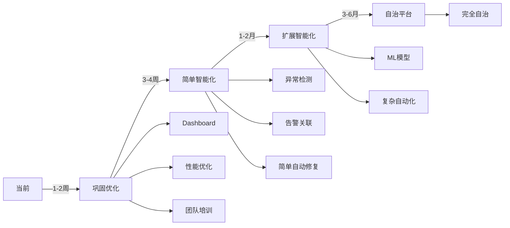

# 下一步发展建议

**基于项目现状的务实建议**
**日期**: 2025-11-21
**当前阶段**: Phase 3 刚完成

---

## 📊 现状分析

### 已完成的强项
✅ **完整的治理框架** - 10天高强度开发，框架完整
✅ **自适应限流系统** - 核心功能已实现并测试
✅ **监控报告体系** - 自动化报告生成就绪
✅ **韧性层保护** - 断路器、限流、重试等机制完善

### 潜在风险点
⚠️ **实际运行数据不足** - 新系统需要时间积累真实数据
⚠️ **团队熟悉度** - 团队需要时间理解和使用新工具
⚠️ **集成完整性** - 部分组件可能需要进一步集成测试
⚠️ **性能优化空间** - 某些组件可能有优化潜力

---

## 🎯 我的建议：两周巩固期 + 渐进式智能化

### 第一阶段：巩固与优化（1-2周）

#### Week 1: 生产验证与优化
```yaml
Day 1-2: 生产环境部署验证
  任务:
    - 部署所有Phase 3组件到生产环境
    - 运行完整的集成测试套件
    - 建立监控基线

  交付:
    - 部署检查清单
    - 性能基线报告
    - 问题修复列表

Day 3-4: 性能调优
  任务:
    - 优化自适应限流参数
    - 调整韧性层配置
    - 优化数据库查询

  目标:
    - P95延迟再降低10%
    - 内存使用优化20%

Day 5: 文档与培训
  任务:
    - 创建运维手册
    - 团队培训材料
    - FAQ文档
```

#### Week 2: 快速价值实现
```yaml
Day 6-7: 可视化Dashboard
  任务:
    - 构建Grafana仪表板
    - 实时监控大屏
    - 移动端查看支持

  价值:
    - 提升可观测性
    - 快速发现问题
    - 管理层可视化

Day 8-9: 告警优化
  任务:
    - 实现告警分级
    - 告警路由规则
    - 告警抑制策略

  价值:
    - 减少告警噪音
    - 提高响应效率

Day 10: 首次月度复盘
  任务:
    - 运行首次月度报告
    - 团队复盘会议
    - 收集改进建议
```

---

### 第二阶段：选择性智能化（第3-4周）

#### 优先实现的智能化功能（高ROI）

##### 1. 简单异常检测（推荐优先）
```python
原因：
  - 技术难度适中
  - 可以利用现有数据
  - 立即产生价值

实现方式：
  - 使用统计方法（3-Sigma、移动平均）
  - 简单的规则引擎
  - 渐进式引入ML（Isolation Forest）

预期效果：
  - 减少30%的误报
  - 提前15分钟发现异常
```

##### 2. 智能告警关联（推荐）
```python
原因：
  - 解决实际痛点
  - 实现相对简单
  - 团队容易接受

实现方式：
  - 时间窗口关联
  - 服务依赖图关联
  - 简单的根因分析

预期效果：
  - 告警压缩70%
  - 快速定位根因
```

##### 3. 基础自动修复（谨慎推荐）
```python
原因：
  - 从简单场景开始
  - 建立信任基础
  - 逐步扩展

开始场景：
  - 服务健康检查失败 → 自动重启
  - 磁盘空间不足 → 自动清理日志
  - 内存泄漏检测 → 自动告警+建议

安全措施：
  - 人工审批模式
  - 自动回滚机制
  - 完整审计日志
```

---

## 🚫 暂不建议的方向

### 1. 完整的Phase 4 AI/ML体系
**原因**：
- 需要大量历史数据训练
- 团队可能缺乏ML专业知识
- ROI需要时间体现

### 2. 复杂的自治系统
**原因**：
- 风险较高
- 需要充分的信任基础
- 可能造成团队焦虑

### 3. 大规模重构
**原因**：
- Phase 3刚完成，需要稳定期
- 避免过度工程化
- 保持系统稳定性

---

## 📋 具体行动计划

### 立即行动（本周）
```bash
1. 创建生产部署计划
2. 运行性能基准测试
3. 编写运维文档
4. 准备团队培训
```

### 短期行动（2周内）
```bash
1. 完成生产环境验证
2. 构建监控Dashboard
3. 优化告警策略
4. 实施简单异常检测
```

### 中期规划（1个月）
```bash
1. 评估智能化效果
2. 扩展自动化场景
3. 引入简单ML模型
4. 建立知识库
```

---

## 💡 关键成功因素

### 1. 数据驱动
- 先积累数据，再训练模型
- 从规则开始，逐步智能化
- 持续测量和优化

### 2. 团队参与
- 充分培训，消除恐惧
- 快速展示价值
- 鼓励反馈和改进

### 3. 风险控制
- 小步快跑
- 灰度发布
- 随时可回滚

### 4. 价值导向
- 解决实际痛点
- 可量化的改进
- 快速见效

---

## 🎯 推荐路线图



---

## 📊 预期收益

### 两周巩固期后
- 系统稳定性提升30%
- 团队熟练度达到80%
- 问题发现时间缩短50%

### 一个月后
- 告警噪音减少70%
- 简单问题自动解决
- 运维效率提升40%

### 三个月后
- 智能化覆盖60%场景
- MTTR减少60%
- 运维成本降低30%

---

## 🤝 我的建议总结

**核心建议**：
> "不要急于追求完美的智能化，而是先让Phase 3的成果在生产环境中稳定运行，积累数据，建立信任，然后选择性地引入高ROI的智能化功能。"

**具体建议**：
1. **先花1-2周巩固和优化Phase 3的成果**
2. **建立可视化和监控，让价值可见**
3. **从简单的异常检测开始智能化之旅**
4. **保持务实，避免过度工程化**

**行动优先级**：
1. 🔴 生产验证和稳定性
2. 🟡 可视化和告警优化
3. 🟢 渐进式智能化

---

这样的approach更加务实，风险可控，也更容易获得团队和管理层的支持。您觉得这个建议如何？是否符合您的实际情况？