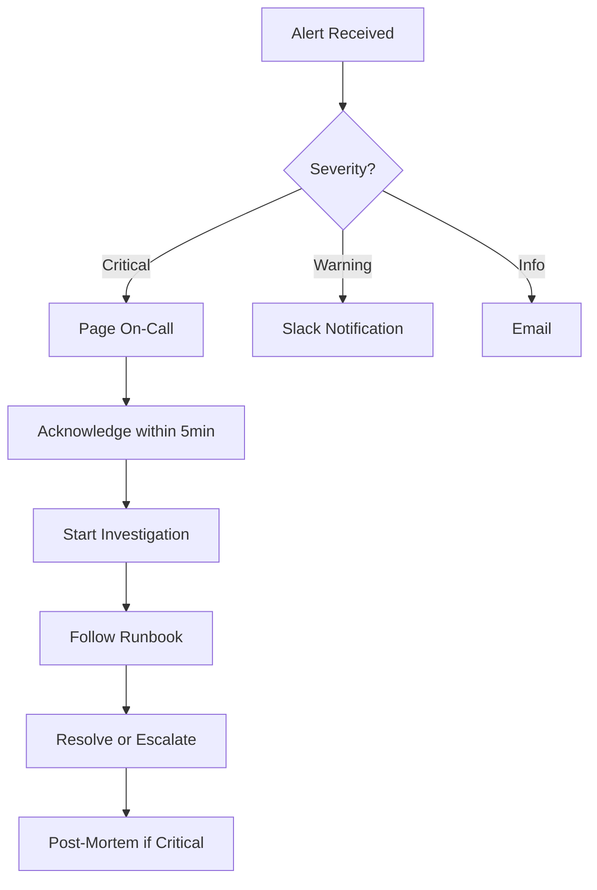

# 📖 CAD ML Platform - Operations Manual

## Table of Contents
1. [System Overview](#system-overview)
2. [Daily Operations](#daily-operations)
3. [Monitoring & Alerting](#monitoring--alerting)
4. [Incident Response](#incident-response)
5. [Maintenance Procedures](#maintenance-procedures)
6. [Troubleshooting Guide](#troubleshooting-guide)
7. [Performance Tuning](#performance-tuning)
8. [Disaster Recovery](#disaster-recovery)
9. [Security Operations](#security-operations)
10. [Appendix](#appendix)

---

## System Overview

### Architecture Components
```
┌─────────────────────────────────────────────┐
│              Load Balancer                   │
└────────────────┬────────────────────────────┘
                 │
┌────────────────▼────────────────────────────┐
│         CAD ML Platform (3 replicas)         │
│  ┌──────────┐ ┌──────────┐ ┌──────────┐   │
│  │   App    │ │   App    │ │   App    │   │
│  └──────────┘ └──────────┘ └──────────┘   │
└────────────────┬────────────────────────────┘
                 │
     ┌───────────┴───────────┬──────────────┐
     │                       │              │
┌────▼────┐           ┌─────▼────┐   ┌─────▼────┐
│  Redis  │           │Prometheus│   │ Grafana  │
└─────────┘           └──────────┘   └──────────┘
```

### Service Endpoints

| Service | Internal URL | External URL | Port | Purpose |
|---------|-------------|--------------|------|---------|
| Application | http://cad-ml-platform:8000 | https://api.example.com | 8000 | Main API |
| Metrics | http://cad-ml-platform:8000/metrics | N/A | 8000 | Prometheus metrics |
| Prometheus | http://prometheus:9090 | https://prom.example.com | 9090 | Metrics storage |
| Grafana | http://grafana:3000 | https://grafana.example.com | 3000 | Dashboards |
| AlertManager | http://alertmanager:9093 | N/A | 9093 | Alert routing |
| Redis | redis://redis:6379 | N/A | 6379 | Cache |

### Key Metrics

| Metric | Description | Alert Threshold | Target |
|--------|-------------|-----------------|--------|
| `platform_error_ratio` | Overall error rate | >5% | <1% |
| `provider_health_score` | Provider availability | <50 | >95 |
| `ocr_p95_latency_seconds` | Request latency P95 | >2s | <1s |
| `error_budget_remaining` | SLO error budget | <20% | >50% |
| `circuit_breaker_open_ratio` | Circuit breaker state | >0.5 | 0 |

---

## Daily Operations

### 🌅 Morning Checks (9:00 AM)

#### 1. System Health Check
```bash
# Check all services
make observability-status

# Verify self-check
make self-check-strict

# Review overnight alerts
open https://grafana.example.com/d/alerts
```

#### 2. Metrics Review
```bash
# Check error rates
curl -s http://prometheus:9090/api/v1/query?query=platform_error_ratio | jq '.data.result[0].value[1]'

# Check provider health
curl -s http://prometheus:9090/api/v1/query?query=provider_health_score | jq '.data.result'

# Check SLO compliance
curl -s http://prometheus:9090/api/v1/query?query=slo_availability | jq '.data.result[0].value[1]'
```

#### 3. Log Review
```bash
# Check for errors
docker-compose -f docker-compose.observability.yml logs --since 8h app | grep ERROR

# Check for warnings
kubectl logs -l app=cad-ml-platform --since=8h | grep WARN
```

### 📊 Hourly Monitoring

```bash
# Automated hourly check (add to cron)
*/60 * * * * /opt/cad-ml-platform/scripts/hourly_check.sh
```

**hourly_check.sh**:
```bash
#!/bin/bash
# Check key metrics
METRICS=$(curl -s http://localhost:8000/metrics)
ERROR_RATE=$(echo "$METRICS" | grep platform_error_ratio | awk '{print $2}')

if (( $(echo "$ERROR_RATE > 0.05" | bc -l) )); then
    echo "High error rate: $ERROR_RATE" | mail -s "Alert: High Error Rate" oncall@example.com
fi
```

### 🌙 End of Day (6:00 PM)

#### Daily Report Generation
```bash
# Generate daily report
python scripts/generate_daily_report.py > reports/daily_$(date +%Y%m%d).md

# Review capacity metrics
kubectl top pods -n cad-ml-platform
kubectl top nodes

# Check tomorrow's schedule
cal
```

---

## Monitoring & Alerting

### Dashboard Access

#### Primary Dashboards
1. **Main Overview**: https://grafana.example.com/d/observability
2. **Provider Health**: https://grafana.example.com/d/providers
3. **Performance**: https://grafana.example.com/d/performance
4. **SLO Tracking**: https://grafana.example.com/d/slo

#### Key Panels to Monitor
- Platform Error Rates (top-left)
- Provider Error Code Breakdown (top-right)
- SLO Compliance (bottom-right)
- Error Budget Remaining (bottom-right gauge)

### Alert Handling

#### Alert Severity Levels

| Severity | Response Time | Escalation | Examples |
|----------|--------------|------------|----------|
| Critical | 5 minutes | Immediate page | Platform down, data loss |
| Warning | 30 minutes | Slack notification | High latency, provider degraded |
| Info | Next business day | Email | Low confidence, usage spike |

#### Alert Response Workflow



#### Compare Alert Response (L2 /api/compare)

1. Confirm sustained traffic to avoid low-sample noise.
   ```promql
   sum(rate(compare_requests_total[5m]))
   ```
2. Identify the dominant status.
   ```promql
   sum by(status) (rate(compare_requests_total[5m]))
   ```
3. If `status="error"` dominates, validate dependency health (vector search, storage, network).
4. If `status="not_found"` dominates, verify candidate id alignment and indexing freshness.
5. Follow runbooks:
   - `docs/runbooks/compare_failure_rate.md`
   - `docs/runbooks/compare_not_found.md`

### Custom Queries

#### Useful Prometheus Queries
```promql
# Top errors by provider
topk(5, sum by(provider, code) (rate(ocr_errors_total[5m])))

# Request rate trend
rate(ocr_requests_total[5m])

# Memory usage by pod
container_memory_usage_bytes{pod=~"cad-ml-platform.*"}

# Slow queries
histogram_quantile(0.99, rate(ocr_processing_duration_seconds_bucket[5m]))
```

---

## Incident Response

### Incident Classification

| Class | Impact | Response | Example |
|-------|--------|----------|---------|
| P1 | Service Down | All hands | Complete outage |
| P2 | Degraded Service | On-call + backup | >50% errors |
| P3 | Partial Impact | On-call | Single provider down |
| P4 | Minor Issue | Business hours | Cosmetic bug |

### Response Procedures

#### P1 - Critical Incident Response

1. **Acknowledge** (0-5 min)
   ```bash
   # Acknowledge in PagerDuty
   pd-cli incident acknowledge <incident-id>

   # Join incident channel
   slack-cli join #incident-YYYYMMDD-HHMM
   ```

2. **Assess** (5-10 min)
   ```bash
   # Quick health check
   make observability-status
   curl http://localhost:8000/health

   # Check recent deployments
   kubectl rollout history deployment/cad-ml-platform
   ```

3. **Mitigate** (10-30 min)
   ```bash
   # Option 1: Rollback if recent deployment
   kubectl rollout undo deployment/cad-ml-platform

   # Option 2: Scale up if load issue
   kubectl scale deployment/cad-ml-platform --replicas=6

   # Option 3: Disable problematic provider
   kubectl set env deployment/cad-ml-platform DISABLED_PROVIDERS=deepseek
   ```

4. **Communicate** (Continuous)
   ```bash
   # Update status page
   statuspage-cli incident create --name "Service Degradation" --status investigating

   # Slack updates every 15 min
   slack-cli send "#incidents" "Update: Working on fix, ETA 30 min"
   ```

5. **Resolve** (30+ min)
   ```bash
   # Verify fix
   make self-check-strict

   # Monitor for stability (15 min)
   watch 'curl -s http://localhost:8000/metrics | grep error_rate'
   ```

6. **Post-Mortem** (Next day)
   - Create document from template
   - Timeline of events
   - Root cause analysis
   - Action items
   - Lessons learned

### Runbook Directory

| Issue | Runbook | Quick Fix |
|-------|---------|-----------|
| Provider Timeout | [provider_timeout.md](runbooks/provider_timeout.md) | Increase timeout, disable provider |
| Model Load Error | [model_load_error.md](runbooks/model_load_error.md) | Restart pod, increase memory |
| High Error Rate | [high_error_rate.md](runbooks/high_error_rate.md) | Scale up, check dependencies |
| Compare Failure Rate | [compare_failure_rate.md](runbooks/compare_failure_rate.md) | Check compare deps, rollback recent change |
| Compare Not Found Dominant | [compare_not_found.md](runbooks/compare_not_found.md) | Verify candidate id alignment, re-index |
| Memory Exhaustion | [memory_exhaustion.md](runbooks/memory_exhaustion.md) | Restart pods, increase limits |
| Circuit Breaker Open | [circuit_breaker.md](runbooks/circuit_breaker.md) | Reset breaker, check provider |

---

## Maintenance Procedures

### Scheduled Maintenance

#### Weekly Tasks (Thursdays 2-4 PM)

1. **Security Updates**
   ```bash
   # Check for vulnerabilities
   make security-audit

   # Update dependencies
   pip-audit --fix
   safety check --json
   ```

2. **Performance Review**
   ```bash
   # Analyze slow queries
   python scripts/analyze_slow_queries.py

   # Review resource usage
   kubectl top pods --sort-by=memory
   ```

3. **Backup Verification**
   ```bash
   # Test backup restore
   ./scripts/test_backup_restore.sh
   ```

#### Monthly Tasks (First Tuesday)

1. **Capacity Planning**
   ```bash
   # Generate capacity report
   python scripts/capacity_report.py

   # Review growth trends
   open https://grafana.example.com/d/capacity
   ```

2. **Dependency Updates**
   ```bash
   # Update Python packages
   pip list --outdated
   pip-compile --upgrade requirements.in

   # Update Docker images
   docker images | grep cad-ml
   ```

3. **Documentation Review**
   - Update runbooks
   - Review API documentation
   - Update training materials

### Deployment Procedures

#### Standard Deployment

```bash
# 1. Pre-deployment checks
make metrics-validate
make prom-validate
make self-check-strict

# 2. Deploy to staging
kubectl set image deployment/cad-ml-platform \
    cad-ml-platform=registry.example.com/cad-ml-platform:v1.2.3 \
    -n staging

# 3. Staging validation (30 min)
SELF_CHECK_BASE_URL=https://staging.example.com make self-check-strict

# 4. Production deployment (canary)
kubectl set image deployment/cad-ml-platform-canary \
    cad-ml-platform=registry.example.com/cad-ml-platform:v1.2.3 \
    -n production

# 5. Monitor canary (1 hour)
watch 'kubectl get pods -n production | grep canary'

# 6. Full rollout
kubectl set image deployment/cad-ml-platform \
    cad-ml-platform=registry.example.com/cad-ml-platform:v1.2.3 \
    -n production

# 7. Post-deployment validation
make self-check-strict
```

#### Emergency Rollback

```bash
# Immediate rollback
kubectl rollout undo deployment/cad-ml-platform -n production

# Verify rollback
kubectl rollout status deployment/cad-ml-platform -n production

# Validate health
make self-check-strict
```

---

## Troubleshooting Guide

### Common Issues & Solutions

#### Issue: High Memory Usage

**Symptoms**: Pods restarting, OOM kills
```bash
# Check memory
kubectl top pods -n cad-ml-platform
kubectl describe pod <pod-name> | grep -A 10 "Last State"
```

**Solution**:
```bash
# Increase memory limits
kubectl set resources deployment/cad-ml-platform \
    --limits=memory=4Gi --requests=memory=2Gi

# Enable memory profiling
kubectl set env deployment/cad-ml-platform ENABLE_PROFILING=true
```

#### Issue: Slow Response Times

**Symptoms**: P95 latency >2s
```bash
# Check latency
curl http://prometheus:9090/api/v1/query?query=ocr_p95_latency_seconds
```

**Solution**:
```bash
# Scale horizontally
kubectl scale deployment/cad-ml-platform --replicas=5

# Check cache hit rate
redis-cli INFO stats | grep hit_rate

# Enable query optimization
kubectl set env deployment/cad-ml-platform ENABLE_QUERY_CACHE=true
```

#### Issue: Classifier cache misses or rate limiting

**Symptoms**: Low classifier cache hit ratio, spikes in rate-limited requests
```bash
# Inspect classifier cache stats (admin token required)
curl -s -H "X-Admin-Token: $ADMIN_TOKEN" \
  http://localhost:8000/api/v1/health/classifier/cache | jq '.'

# Confirm active cache + rate limit config in /health
curl -s http://localhost:8000/health | \
  jq '.config.monitoring | {classifier_rate_limit_per_min, classifier_rate_limit_burst, classifier_cache_max_size}'

# Check rate-limited requests
curl http://prometheus:9090/api/v1/query?query='rate(classification_rate_limited_total[5m])'
```

**Solution**:
```bash
# Increase cache size (requires restart)
kubectl set env deployment/cad-ml-platform CLASSIFIER_CACHE_MAX_SIZE=2000

# Loosen rate limits if client volume is expected
kubectl set env deployment/cad-ml-platform CLASSIFIER_RATE_LIMIT_PER_MIN=240
kubectl set env deployment/cad-ml-platform CLASSIFIER_RATE_LIMIT_BURST=40
```

#### Issue: Provider Failures

**Symptoms**: Specific provider health <50
```bash
# Check provider health
curl http://prometheus:9090/api/v1/query?query='provider_health_score{provider="deepseek"}'
```

**Solution**:
```bash
# Temporarily disable provider
kubectl set env deployment/cad-ml-platform DISABLED_PROVIDERS=deepseek

# Reset circuit breaker
curl -X POST http://localhost:8000/admin/reset-circuit-breaker?provider=deepseek

# Test provider directly
python scripts/test_provider.py --provider deepseek
```

### Debug Commands

```bash
# Get pod logs
kubectl logs -f <pod-name> -n cad-ml-platform

# Execute commands in pod
kubectl exec -it <pod-name> -n cad-ml-platform -- /bin/bash

# Port forward for debugging
kubectl port-forward <pod-name> 8000:8000 -n cad-ml-platform

# Trace requests
kubectl exec <pod-name> -- tcpdump -i any -w trace.pcap

# Profile CPU
kubectl exec <pod-name> -- py-spy record -o profile.svg -d 30 -p 1
```

---

## Performance Tuning

### Application Tuning

#### Environment Variables
```yaml
# Concurrency settings
MAX_WORKERS: "4"           # Worker processes
THREAD_POOL_SIZE: "10"     # Thread pool size
CONNECTION_POOL_SIZE: "20" # Database connections

# Cache settings
REDIS_MAX_CONNECTIONS: "50"
CACHE_TTL: "3600"          # 1 hour
ENABLE_QUERY_CACHE: "true"

# Timeout settings
REQUEST_TIMEOUT: "30"      # seconds
PROVIDER_TIMEOUT: "10"     # seconds
CIRCUIT_BREAKER_TIMEOUT: "60"
```

#### Resource Limits
```yaml
resources:
  requests:
    memory: "2Gi"
    cpu: "1000m"
  limits:
    memory: "4Gi"
    cpu: "2000m"
```

### Database Optimization

```sql
-- Add indexes for common queries
CREATE INDEX idx_ocr_requests_created ON ocr_requests(created_at);
CREATE INDEX idx_ocr_requests_provider ON ocr_requests(provider, status);

-- Vacuum and analyze
VACUUM ANALYZE ocr_requests;

-- Connection pooling
ALTER SYSTEM SET max_connections = 200;
ALTER SYSTEM SET shared_buffers = '1GB';
```

### Prometheus Optimization

```yaml
# Reduce cardinality
metric_relabel_configs:
  - source_labels: [__name__]
    regex: '.*_bucket'
    target_label: le
    replacement: 'inf'

# Adjust retention
storage:
  tsdb:
    retention.time: 15d  # Reduce from 30d
    retention.size: 50GB
```

---

## Disaster Recovery

### Backup Strategy

#### Automated Backups
```bash
# Database backup (daily)
0 2 * * * pg_dump -h postgres -U app cad_ml_platform | gzip > /backups/db_$(date +\%Y\%m\%d).sql.gz

# Configuration backup (hourly)
0 * * * * kubectl get configmap -n cad-ml-platform -o yaml > /backups/config_$(date +\%Y\%m\%d_\%H).yaml

# Prometheus data backup (daily)
0 3 * * * tar -czf /backups/prometheus_$(date +\%Y\%m\%d).tar.gz /prometheus
```

### Recovery Procedures

#### Full System Recovery

1. **Restore Infrastructure**
   ```bash
   # Deploy Kubernetes cluster
   terraform apply

   # Install base services
   helm install prometheus prometheus-community/prometheus
   helm install grafana grafana/grafana
   ```

2. **Restore Application**
   ```bash
   # Deploy application
   kubectl apply -f k8s/

   # Restore configuration
   kubectl apply -f /backups/config_latest.yaml
   ```

3. **Restore Data**
   ```bash
   # Restore database
   gunzip < /backups/db_latest.sql.gz | psql -h postgres -U app cad_ml_platform

   # Restore Prometheus data
   tar -xzf /backups/prometheus_latest.tar.gz -C /
   ```

4. **Validation**
   ```bash
   # Run comprehensive checks
   make self-check-strict
   make observability-test
   ```

### RTO/RPO Targets

| Component | RTO | RPO | Backup Frequency |
|-----------|-----|-----|------------------|
| Application | 30 min | 0 min | Real-time (HA) |
| Database | 1 hour | 1 hour | Hourly snapshots |
| Configuration | 15 min | 1 hour | Hourly |
| Prometheus | 2 hours | 24 hours | Daily |
| Logs | 4 hours | 7 days | Weekly archive |

---

## Security Operations

### Security Checklist

#### Daily Security Tasks
- [ ] Review security alerts
- [ ] Check failed authentication attempts
- [ ] Monitor unusual API usage patterns
- [ ] Verify SSL certificates expiry

#### Weekly Security Tasks
- [ ] Run vulnerability scans
- [ ] Review access logs
- [ ] Update security patches
- [ ] Audit user permissions

#### Monthly Security Tasks
- [ ] Penetration testing
- [ ] Security audit
- [ ] Certificate rotation
- [ ] Compliance review

### Security Tools

```bash
# Vulnerability scanning
make security-audit

# Check for secrets in code
git-secrets --scan

# Network security scan
nmap -sV -p- cad-ml-platform.example.com

# SSL certificate check
openssl s_client -connect api.example.com:443 -servername api.example.com < /dev/null

# Audit logs
kubectl logs -n kube-system -l component=kube-apiserver | grep audit
```

---

## Appendix

### A. Contact Information

| Role | Name | Contact | Escalation |
|------|------|---------|------------|
| Primary On-Call | Rotation | PagerDuty | Immediate |
| Platform Lead | John Smith | john@example.com | Critical issues |
| DevOps Lead | Jane Doe | jane@example.com | Infrastructure |
| Security Team | Security | security@example.com | Security incidents |
| Management | CTO | cto@example.com | Major incidents |

### B. External Dependencies

| Service | Provider | Support | SLA |
|---------|----------|---------|-----|
| Cloud Infrastructure | AWS | Enterprise Support | 99.95% |
| Container Registry | DockerHub | Pro Support | 99.9% |
| DNS | Cloudflare | Business | 100% |
| SSL Certificates | Let's Encrypt | Community | N/A |
| Monitoring | Datadog | Pro | 99.5% |

### C. Useful Links

- **Documentation**: https://docs.example.com/cad-ml-platform
- **API Reference**: https://api.example.com/docs
- **Status Page**: https://status.example.com
- **Runbooks**: https://docs.example.com/runbooks
- **Knowledge Base**: https://kb.example.com
- **Incident History**: https://incidents.example.com

### D. Emergency Procedures

#### Complete Outage
1. Activate incident response team
2. Check infrastructure status (AWS, K8s)
3. Review recent changes
4. Implement emergency failover if needed
5. Communicate with stakeholders
6. Begin root cause analysis

#### Data Breach
1. Isolate affected systems
2. Notify security team immediately
3. Preserve evidence
4. Begin forensic analysis
5. Notify legal/compliance
6. Follow breach response plan

#### DDoS Attack
1. Enable DDoS protection
2. Scale infrastructure
3. Implement rate limiting
4. Block malicious IPs
5. Contact ISP/Cloud provider
6. Monitor and adjust

---

**Document Version**: 1.0.0
**Last Updated**: 2025-01-20
**Next Review**: 2025-02-20
**Owner**: Platform Team
