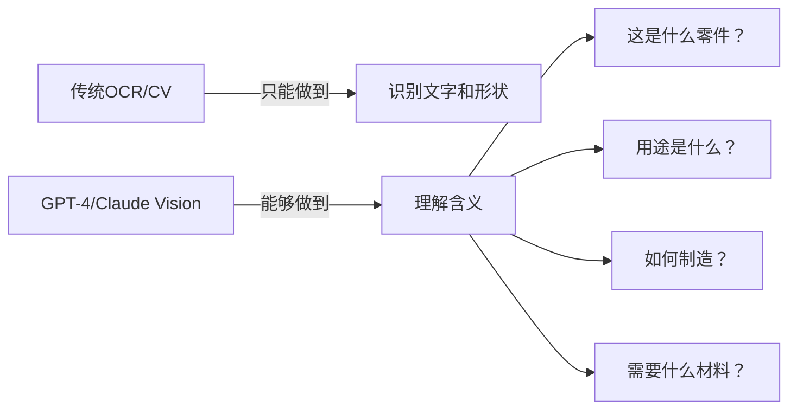

# 📋 Phase 1 & Phase 2 详细实施计划

> CAD图纸视觉识别能力开发 - 前3周详细任务分解

---

## 🤔 为什么要集成GPT-4 Vision和Claude Vision？

### 核心目的：获得"理解"能力，而不仅仅是"识别"



### 🎯 集成的具体目的

#### 1. **GPT-4 Vision集成目的**
```yaml
优势领域:
  - 复杂图纸理解: 能理解装配关系、工作原理
  - 多语言支持: 中英文技术术语都能识别
  - 推理能力: 能推断零件功能和用途
  - 灵活性: 无需训练即可识别新类型零件

应用场景:
  - 首次遇到的特殊零件
  - 复杂装配图分析
  - 需要深度理解的场合

实际案例:
  输入: 一张齿轮箱装配图
  GPT-4输出:
    "这是一个二级减速齿轮箱，包含输入轴、中间轴和输出轴。
     第一级减速比约3:1，第二级约4:1，总减速比12:1。
     箱体采用剖分式设计，便于装配。
     轴承配置为深沟球轴承，适合中等载荷。"
```

#### 2. **Claude Vision集成目的**
```yaml
优势领域:
  - 工程图纸专长: 我对技术图纸有深入理解
  - 标准识别: 熟悉ISO、GB等制图标准
  - 精确描述: 能准确描述技术细节
  - 安全可靠: 适合处理敏感图纸

应用场景:
  - 标准件识别
  - 尺寸公差分析
  - 技术要求解读

实际案例:
  输入: 一张轴类零件图
  Claude输出:
    "阶梯轴，总长200mm，包含三个轴段：
     Φ25h6 (0/-0.013)，Φ30h7 (0/-0.021)，Φ35h6
     键槽规格：8×7×40 GB/T 1096
     表面粗糙度：轴颈Ra0.8，其余Ra3.2
     材料标注为45钢，调质处理HB220-250"
```

#### 3. **两者配合使用的策略**
```python
def smart_vision_routing(image, task_type):
    """智能路由选择最合适的视觉服务"""

    if task_type == "complex_assembly":
        # 复杂装配图 -> GPT-4更擅长理解关系
        return use_gpt4_vision(image)

    elif task_type == "technical_drawing":
        # 标准工程图 -> Claude更精确
        return use_claude_vision(image)

    elif task_type == "cost_sensitive":
        # 成本敏感 -> 先用开源模型，必要时才用API
        result = use_open_source(image)
        if result.confidence < 0.8:
            return use_claude_vision(image)  # Claude成本较低
        return result

    else:
        # 混合策略：两者结果融合
        gpt4_result = use_gpt4_vision(image)
        claude_result = use_claude_vision(image)
        return merge_results(gpt4_result, claude_result)
```

---

## 📅 Phase 1: 基础架构（第1周详细计划）

### Day 1-2: 环境搭建与项目初始化

#### 任务1.1: 开发环境配置
```bash
# 1. 创建项目结构
mkdir -p cad-ml-platform/src/vision/{api,core,models,utils}
mkdir -p cad-ml-platform/tests/vision
mkdir -p cad-ml-platform/data/{uploads,cache,models}
mkdir -p cad-ml-platform/configs/vision

# 2. 创建Python虚拟环境
cd cad-ml-platform
python -m venv venv
source venv/bin/activate  # Windows: venv\Scripts\activate

# 3. 安装基础依赖
pip install fastapi uvicorn python-multipart
pip install pillow opencv-python-headless
pip install numpy pandas scikit-learn
pip install redis aioredis
pip install pydantic python-jose[cryptography]
```

#### 任务1.2: 配置文件设置
```yaml
# configs/vision/config.yaml
vision_config:
  # API配置
  api:
    host: "0.0.0.0"
    port: 8001
    workers: 4
    max_upload_size: 52428800  # 50MB
    allowed_formats: ["jpg", "jpeg", "png", "bmp", "tiff", "pdf"]

  # 服务提供商配置
  providers:
    openai:
      enabled: true
      api_key: "${OPENAI_API_KEY}"
      model: "gpt-4-vision-preview"
      max_tokens: 4096
      temperature: 0.3

    anthropic:
      enabled: true
      api_key: "${ANTHROPIC_API_KEY}"
      model: "claude-3-opus-20240229"
      max_tokens: 4096

    local:
      enabled: true
      model_path: "./data/models/"
      device: "cpu"  # or "cuda"

  # 缓存配置
  cache:
    enabled: true
    backend: "redis"
    redis_url: "redis://localhost:6379/0"
    ttl: 86400  # 24小时
    max_size: 10737418240  # 10GB

  # 性能配置
  performance:
    max_concurrent_requests: 100
    request_timeout: 30
    batch_size: 10
    queue_size: 1000
```

#### 任务1.3: Docker环境准备
```dockerfile
# Dockerfile.vision
FROM python:3.9-slim

WORKDIR /app

# 安装系统依赖
RUN apt-get update && apt-get install -y \
    tesseract-ocr \
    tesseract-ocr-chi-sim \
    libgl1-mesa-glx \
    libglib2.0-0 \
    libsm6 \
    libxext6 \
    libxrender-dev \
    libgomp1 \
    wget \
    && rm -rf /var/lib/apt/lists/*

# 复制依赖文件
COPY requirements-vision.txt .
RUN pip install --no-cache-dir -r requirements-vision.txt

# 复制源代码
COPY src/ ./src/
COPY configs/ ./configs/

# 创建必要目录
RUN mkdir -p /app/data/{uploads,cache,models}

# 暴露端口
EXPOSE 8001

# 启动命令
CMD ["python", "-m", "uvicorn", "src.vision.main:app", "--host", "0.0.0.0", "--port", "8001"]
```

### Day 3-4: API框架搭建

#### 任务1.4: FastAPI应用主框架
```python
# src/vision/main.py
"""
CAD视觉识别服务主入口
"""
from fastapi import FastAPI, File, UploadFile, HTTPException, BackgroundTasks
from fastapi.middleware.cors import CORSMiddleware
from contextlib import asynccontextmanager
import logging
from typing import Optional, List, Dict, Any

from src.vision.api.routes import router as vision_router
from src.vision.core.config import load_config
from src.vision.core.cache import CacheManager
from src.vision.core.queue import TaskQueue

# 配置日志
logging.basicConfig(
    level=logging.INFO,
    format='%(asctime)s - %(name)s - %(levelname)s - %(message)s'
)
logger = logging.getLogger(__name__)

# 加载配置
config = load_config()

@asynccontextmanager
async def lifespan(app: FastAPI):
    """应用生命周期管理"""
    # 启动时初始化
    logger.info("Starting CAD Vision Service...")

    # 初始化缓存
    app.state.cache = await CacheManager.initialize(config.cache)

    # 初始化任务队列
    app.state.queue = TaskQueue(max_size=config.performance.queue_size)

    # 预加载模型（如果使用本地模型）
    if config.providers.local.enabled:
        from src.vision.models.local_model import preload_models
        await preload_models()

    yield

    # 关闭时清理
    logger.info("Shutting down CAD Vision Service...")
    await app.state.cache.close()
    await app.state.queue.close()

# 创建FastAPI应用
app = FastAPI(
    title="CAD Vision Recognition Service",
    description="图纸视觉识别与理解服务",
    version="1.0.0",
    lifespan=lifespan
)

# CORS配置
app.add_middleware(
    CORSMiddleware,
    allow_origins=["*"],
    allow_credentials=True,
    allow_methods=["*"],
    allow_headers=["*"],
)

# 注册路由
app.include_router(vision_router, prefix="/api/v1/vision", tags=["Vision"])

@app.get("/")
async def root():
    return {
        "service": "CAD Vision Recognition",
        "version": "1.0.0",
        "status": "running",
        "endpoints": {
            "analyze": "/api/v1/vision/analyze",
            "compare": "/api/v1/vision/compare",
            "batch": "/api/v1/vision/batch",
            "health": "/health"
        }
    }

@app.get("/health")
async def health_check():
    """健康检查端点"""
    return {
        "status": "healthy",
        "providers": {
            "openai": config.providers.openai.enabled,
            "anthropic": config.providers.anthropic.enabled,
            "local": config.providers.local.enabled
        },
        "cache": config.cache.enabled
    }
```

#### 任务1.5: API路由设计
```python
# src/vision/api/routes.py
from fastapi import APIRouter, File, UploadFile, HTTPException, Depends, BackgroundTasks
from typing import Optional, List, Dict, Any
import uuid
from datetime import datetime

from src.vision.api.schemas import (
    AnalysisRequest, AnalysisResponse,
    ComparisonRequest, ComparisonResponse,
    BatchAnalysisResponse
)
from src.vision.core.analyzer import VisionAnalyzer
from src.vision.core.auth import verify_api_key

router = APIRouter()

@router.post("/analyze", response_model=AnalysisResponse)
async def analyze_drawing(
    file: UploadFile = File(..., description="CAD图纸图片文件"),
    provider: Optional[str] = "auto",
    detail_level: Optional[str] = "standard",  # quick/standard/detailed
    extract_text: bool = True,
    identify_parts: bool = True,
    suggest_manufacturing: bool = True,
    estimate_cost: bool = False,
    api_key: str = Depends(verify_api_key)
):
    """
    分析单张CAD图纸

    Parameters:
    - file: 图片文件 (支持JPG/PNG/PDF)
    - provider: 视觉服务提供商 (openai/anthropic/local/auto)
    - detail_level: 分析详细程度
    - extract_text: 是否提取文字
    - identify_parts: 是否识别零件类型
    - suggest_manufacturing: 是否建议制造工艺
    - estimate_cost: 是否估算成本

    Returns:
    - 分析结果，包括零件识别、尺寸、材料、工艺建议等
    """

    # 验证文件格式
    if not file.content_type.startswith('image/'):
        raise HTTPException(status_code=400, detail="只支持图片文件")

    # 生成任务ID
    task_id = str(uuid.uuid4())

    try:
        # 读取文件
        content = await file.read()

        # 创建分析器
        analyzer = VisionAnalyzer(provider=provider)

        # 执行分析
        result = await analyzer.analyze(
            image_data=content,
            options={
                "detail_level": detail_level,
                "extract_text": extract_text,
                "identify_parts": identify_parts,
                "suggest_manufacturing": suggest_manufacturing,
                "estimate_cost": estimate_cost
            }
        )

        # 构建响应
        return AnalysisResponse(
            task_id=task_id,
            timestamp=datetime.utcnow(),
            filename=file.filename,
            results=result
        )

    except Exception as e:
        logger.error(f"Analysis failed for {file.filename}: {str(e)}")
        raise HTTPException(status_code=500, detail=str(e))

@router.post("/compare", response_model=ComparisonResponse)
async def compare_drawings(
    file1: UploadFile = File(...),
    file2: UploadFile = File(...),
    api_key: str = Depends(verify_api_key)
):
    """
    比较两张CAD图纸的相似度和差异
    """
    # TODO: 实现比较逻辑
    pass

@router.post("/batch", response_model=BatchAnalysisResponse)
async def batch_analyze(
    files: List[UploadFile] = File(...),
    background_tasks: BackgroundTasks,
    api_key: str = Depends(verify_api_key)
):
    """
    批量分析多张CAD图纸
    支持异步处理，返回任务ID供查询
    """
    # TODO: 实现批量处理逻辑
    pass

@router.get("/status/{task_id}")
async def get_task_status(
    task_id: str,
    api_key: str = Depends(verify_api_key)
):
    """
    查询异步任务状态
    """
    # TODO: 实现状态查询
    pass
```

### Day 5: 数据模型设计

#### 任务1.6: Pydantic数据模型
```python
# src/vision/api/schemas.py
from pydantic import BaseModel, Field
from typing import Optional, List, Dict, Any
from datetime import datetime
from enum import Enum

class PartType(str, Enum):
    """零件类型枚举"""
    SHAFT = "shaft"              # 轴类
    GEAR = "gear"                # 齿轮
    BEARING = "bearing"          # 轴承
    PLATE = "plate"              # 板材
    HOUSING = "housing"          # 箱体
    FASTENER = "fastener"        # 紧固件
    SPRING = "spring"            # 弹簧
    SEAL = "seal"                # 密封件
    PIPE = "pipe"                # 管道
    UNKNOWN = "unknown"          # 未知

class MaterialType(str, Enum):
    """材料类型枚举"""
    STEEL_45 = "45号钢"
    STEEL_40CR = "40Cr"
    STAINLESS_304 = "304不锈钢"
    STAINLESS_316 = "316不锈钢"
    ALUMINUM = "铝合金"
    BRASS = "黄铜"
    CAST_IRON = "铸铁"
    PLASTIC = "工程塑料"
    OTHER = "其他"

class ManufacturingProcess(str, Enum):
    """制造工艺枚举"""
    TURNING = "车削"
    MILLING = "铣削"
    DRILLING = "钻孔"
    GRINDING = "磨削"
    CASTING = "铸造"
    FORGING = "锻造"
    STAMPING = "冲压"
    WELDING = "焊接"
    HEAT_TREATMENT = "热处理"
    SURFACE_TREATMENT = "表面处理"

class Dimension(BaseModel):
    """尺寸信息"""
    name: str = Field(..., description="尺寸名称，如'直径'、'长度'")
    value: float = Field(..., description="尺寸值")
    unit: str = Field(default="mm", description="单位")
    tolerance_upper: Optional[float] = Field(None, description="上公差")
    tolerance_lower: Optional[float] = Field(None, description="下公差")

    class Config:
        schema_extra = {
            "example": {
                "name": "轴径",
                "value": 25.0,
                "unit": "mm",
                "tolerance_upper": 0.0,
                "tolerance_lower": -0.013
            }
        }

class TechnicalRequirement(BaseModel):
    """技术要求"""
    category: str = Field(..., description="要求类别")
    requirement: str = Field(..., description="具体要求")
    value: Optional[str] = Field(None, description="要求值")

    class Config:
        schema_extra = {
            "example": {
                "category": "表面粗糙度",
                "requirement": "轴颈表面",
                "value": "Ra0.8"
            }
        }

class PartIdentification(BaseModel):
    """零件识别结果"""
    part_type: PartType = Field(..., description="零件类型")
    part_name: str = Field(..., description="零件名称")
    confidence: float = Field(..., ge=0, le=1, description="识别置信度")
    sub_type: Optional[str] = Field(None, description="子类型")
    features: List[str] = Field(default=[], description="关键特征")

    class Config:
        schema_extra = {
            "example": {
                "part_type": "shaft",
                "part_name": "阶梯轴",
                "confidence": 0.92,
                "sub_type": "传动轴",
                "features": ["键槽", "轴肩", "倒角", "退刀槽"]
            }
        }

class ManufacturingRecommendation(BaseModel):
    """制造工艺推荐"""
    primary_process: List[ManufacturingProcess] = Field(..., description="主要工艺")
    secondary_process: List[ManufacturingProcess] = Field(default=[], description="辅助工艺")
    post_process: List[ManufacturingProcess] = Field(default=[], description="后处理工艺")
    equipment: List[str] = Field(default=[], description="建议设备")
    notes: Optional[str] = Field(None, description="工艺说明")

    class Config:
        schema_extra = {
            "example": {
                "primary_process": ["车削", "铣削"],
                "secondary_process": ["钻孔", "攻丝"],
                "post_process": ["热处理", "磨削"],
                "equipment": ["数控车床", "立式铣床"],
                "notes": "注意轴颈配合面的精度要求"
            }
        }

class MaterialRecommendation(BaseModel):
    """材料推荐"""
    recommended: List[MaterialType] = Field(..., description="推荐材料")
    alternatives: List[MaterialType] = Field(default=[], description="替代材料")
    reason: str = Field(..., description="推荐理由")
    properties: Dict[str, Any] = Field(default={}, description="材料属性")

    class Config:
        schema_extra = {
            "example": {
                "recommended": ["45号钢"],
                "alternatives": ["40Cr", "35CrMo"],
                "reason": "综合考虑强度要求和成本因素",
                "properties": {
                    "tensile_strength": "600MPa",
                    "hardness": "HB220-250",
                    "cost_level": "中等"
                }
            }
        }

class CostEstimation(BaseModel):
    """成本估算"""
    material_cost: float = Field(..., description="材料成本")
    machining_cost: float = Field(..., description="加工成本")
    treatment_cost: float = Field(default=0, description="处理成本")
    total_cost: float = Field(..., description="总成本")
    unit: str = Field(default="CNY", description="货币单位")
    quantity: int = Field(default=1, description="数量")
    confidence: float = Field(..., ge=0, le=1, description="估算置信度")

    class Config:
        schema_extra = {
            "example": {
                "material_cost": 50.0,
                "machining_cost": 200.0,
                "treatment_cost": 30.0,
                "total_cost": 280.0,
                "unit": "CNY",
                "quantity": 1,
                "confidence": 0.75
            }
        }

class AnalysisResponse(BaseModel):
    """分析响应结果"""
    task_id: str = Field(..., description="任务ID")
    timestamp: datetime = Field(..., description="分析时间")
    filename: str = Field(..., description="文件名")

    # 识别结果
    identification: PartIdentification = Field(..., description="零件识别")

    # 尺寸信息
    dimensions: List[Dimension] = Field(default=[], description="尺寸信息")

    # 技术要求
    technical_requirements: List[TechnicalRequirement] = Field(
        default=[],
        description="技术要求"
    )

    # 材料建议
    materials: Optional[MaterialRecommendation] = Field(
        None,
        description="材料推荐"
    )

    # 工艺建议
    manufacturing: Optional[ManufacturingRecommendation] = Field(
        None,
        description="制造工艺"
    )

    # 成本估算
    cost: Optional[CostEstimation] = Field(None, description="成本估算")

    # 原始OCR文本
    ocr_text: Optional[str] = Field(None, description="提取的文字")

    # 附加信息
    metadata: Dict[str, Any] = Field(default={}, description="元数据")

    class Config:
        schema_extra = {
            "example": {
                "task_id": "550e8400-e29b-41d4-a716-446655440000",
                "timestamp": "2025-11-12T10:30:00Z",
                "filename": "shaft_drawing.png",
                "identification": {
                    "part_type": "shaft",
                    "part_name": "传动轴",
                    "confidence": 0.95,
                    "features": ["阶梯", "键槽"]
                },
                "dimensions": [
                    {
                        "name": "总长",
                        "value": 200.0,
                        "unit": "mm"
                    }
                ],
                "materials": {
                    "recommended": ["45号钢"],
                    "reason": "满足强度要求"
                }
            }
        }

class ComparisonResponse(BaseModel):
    """图纸比较响应"""
    task_id: str
    timestamp: datetime
    similarity_score: float = Field(..., ge=0, le=1, description="相似度分数")
    is_same_part: bool = Field(..., description="是否为同一零件")
    differences: List[Dict[str, Any]] = Field(default=[], description="差异点")
    analysis1: AnalysisResponse
    analysis2: AnalysisResponse

class BatchAnalysisResponse(BaseModel):
    """批量分析响应"""
    batch_id: str
    total_files: int
    status: str  # pending/processing/completed/failed
    completed: int = 0
    failed: int = 0
    results: Optional[List[AnalysisResponse]] = None
    errors: List[Dict[str, str]] = Field(default=[], description="错误信息")
```

---

## 🚀 Phase 2: 视觉识别集成（第2-3周详细计划）

### Week 2, Day 1-2: GPT-4 Vision集成

#### 任务2.1: OpenAI客户端封装
```python
# src/vision/providers/openai_vision.py
"""
GPT-4 Vision集成模块
用途：处理复杂的装配图、理解零件关系、推断功能用途
"""
import base64
import json
import logging
from typing import Dict, Any, Optional, List
from openai import OpenAI
import backoff

logger = logging.getLogger(__name__)

class GPT4VisionProvider:
    """
    GPT-4 Vision服务提供者

    优势：
    1. 理解复杂装配关系
    2. 推断零件功能和用途
    3. 多语言技术术语识别
    4. 无需训练即可适应新零件
    """

    def __init__(self, api_key: str, model: str = "gpt-4-vision-preview"):
        self.client = OpenAI(api_key=api_key)
        self.model = model

    @backoff.on_exception(
        backoff.expo,
        Exception,
        max_tries=3,
        max_time=30
    )
    async def analyze_cad_drawing(
        self,
        image_data: bytes,
        detail_level: str = "high"
    ) -> Dict[str, Any]:
        """
        分析CAD图纸

        Args:
            image_data: 图片二进制数据
            detail_level: 分析详细度 (low/high)

        Returns:
            分析结果字典
        """

        # Base64编码图片
        base64_image = base64.b64encode(image_data).decode('utf-8')

        # 构建系统提示词 - 这是关键！
        system_prompt = """你是一位经验丰富的机械工程师，专门分析CAD技术图纸。
        请分析这张图纸并提供以下信息：

        1. 零件识别：
           - 这是什么类型的零件？（轴、齿轮、板材、箱体等）
           - 具体名称和用途
           - 关键特征（键槽、孔、螺纹等）

        2. 尺寸信息：
           - 主要尺寸（直径、长度、厚度）
           - 公差标注
           - 关键配合尺寸

        3. 技术要求：
           - 表面粗糙度
           - 形位公差
           - 热处理要求
           - 其他技术说明

        4. 制造建议：
           - 推荐的加工工艺
           - 合适的材料
           - 注意事项

        请以JSON格式返回结果，确保结构化和准确性。
        """

        # 用户提示词
        user_prompt = "请详细分析这张CAD图纸，识别零件类型并提供制造建议。"

        try:
            response = self.client.chat.completions.create(
                model=self.model,
                messages=[
                    {
                        "role": "system",
                        "content": system_prompt
                    },
                    {
                        "role": "user",
                        "content": [
                            {
                                "type": "text",
                                "text": user_prompt
                            },
                            {
                                "type": "image_url",
                                "image_url": {
                                    "url": f"data:image/jpeg;base64,{base64_image}",
                                    "detail": detail_level
                                }
                            }
                        ]
                    }
                ],
                max_tokens=4096,
                temperature=0.3  # 降低温度以获得更确定的答案
            )

            # 解析响应
            result_text = response.choices[0].message.content

            # 尝试解析JSON
            try:
                result_json = json.loads(result_text)
            except json.JSONDecodeError:
                # 如果不是有效JSON，构造结构化响应
                result_json = self._parse_text_response(result_text)

            # 添加元数据
            result_json['provider'] = 'openai'
            result_json['model'] = self.model
            result_json['confidence'] = 0.9  # GPT-4通常很准确

            logger.info(f"GPT-4 Vision analysis completed successfully")
            return result_json

        except Exception as e:
            logger.error(f"GPT-4 Vision analysis failed: {str(e)}")
            raise

    def _parse_text_response(self, text: str) -> Dict[str, Any]:
        """
        将非结构化文本响应解析为结构化数据
        """
        # TODO: 实现文本解析逻辑
        return {
            "raw_analysis": text,
            "parsed": False
        }
```

### Week 2, Day 3-4: Claude Vision集成

#### 任务2.2: Anthropic客户端封装
```python
# src/vision/providers/claude_vision.py
"""
Claude Vision集成模块
用途：精确的工程图纸分析、标准识别、技术细节提取
"""
import base64
import json
import logging
from typing import Dict, Any, Optional
import anthropic
import backoff

logger = logging.getLogger(__name__)

class ClaudeVisionProvider:
    """
    Claude Vision服务提供者

    优势：
    1. 工程图纸专业理解
    2. 精确的尺寸和公差识别
    3. 符合ISO/GB标准的解读
    4. 成本比GPT-4略低
    """

    def __init__(self, api_key: str):
        self.client = anthropic.Anthropic(api_key=api_key)

    @backoff.on_exception(
        backoff.expo,
        Exception,
        max_tries=3,
        max_time=30
    )
    async def analyze_technical_drawing(
        self,
        image_data: bytes,
        focus_areas: Optional[List[str]] = None
    ) -> Dict[str, Any]:
        """
        分析技术图纸

        Args:
            image_data: 图片二进制数据
            focus_areas: 重点关注领域（如["dimensions", "tolerances"]）

        Returns:
            详细的技术分析结果
        """

        # Base64编码
        base64_image = base64.b64encode(image_data).decode('utf-8')

        # 构建分析提示词
        analysis_prompt = """作为一名专业的CAD图纸分析系统，请详细分析这张技术图纸。

        请提供以下结构化信息：

        ## 零件识别
        {
            "part_type": "零件类型",
            "part_name": "零件名称",
            "function": "功能用途",
            "assembly_relation": "装配关系"
        }

        ## 尺寸分析
        {
            "overall_dimensions": {
                "length": "总长度",
                "width": "总宽度",
                "height": "总高度"
            },
            "critical_dimensions": [
                {
                    "name": "尺寸名称",
                    "value": "尺寸值",
                    "tolerance": "公差"
                }
            ]
        }

        ## 技术要求
        {
            "surface_finish": "表面粗糙度要求",
            "geometric_tolerances": "形位公差",
            "material_spec": "材料规格",
            "heat_treatment": "热处理要求",
            "special_requirements": "特殊要求"
        }

        ## 制造分析
        {
            "recommended_processes": ["工艺1", "工艺2"],
            "tooling_requirements": "刀具要求",
            "fixture_needs": "夹具需求",
            "quality_control": "质量控制要点"
        }

        请确保：
        1. 准确识别所有尺寸标注
        2. 正确解读公差和配合
        3. 识别所有技术符号
        4. 提供实用的制造建议
        """

        # 如果有特定关注领域，添加到提示词
        if focus_areas:
            analysis_prompt += f"\n\n特别关注：{', '.join(focus_areas)}"

        try:
            message = self.client.messages.create(
                model="claude-3-opus-20240229",
                max_tokens=4096,
                temperature=0.2,  # 更低的温度以确保精确性
                messages=[
                    {
                        "role": "user",
                        "content": [
                            {
                                "type": "image",
                                "source": {
                                    "type": "base64",
                                    "media_type": "image/jpeg",
                                    "data": base64_image
                                }
                            },
                            {
                                "type": "text",
                                "text": analysis_prompt
                            }
                        ]
                    }
                ]
            )

            # 提取响应内容
            result_text = message.content[0].text

            # 解析并结构化结果
            result = self._structure_analysis(result_text)

            # 添加元数据
            result['provider'] = 'anthropic'
            result['model'] = 'claude-3-opus'
            result['confidence'] = self._calculate_confidence(result)

            logger.info("Claude Vision analysis completed successfully")
            return result

        except Exception as e:
            logger.error(f"Claude Vision analysis failed: {str(e)}")
            raise

    def _structure_analysis(self, text: str) -> Dict[str, Any]:
        """
        将Claude的响应结构化
        """
        # 尝试提取JSON块
        import re
        json_pattern = r'\{[^{}]*\}'
        json_matches = re.findall(json_pattern, text)

        structured_result = {
            "raw_text": text,
            "extracted_data": {}
        }

        for match in json_matches:
            try:
                data = json.loads(match)
                structured_result["extracted_data"].update(data)
            except:
                continue

        return structured_result

    def _calculate_confidence(self, result: Dict) -> float:
        """
        基于结果完整性计算置信度
        """
        # 简单的置信度计算逻辑
        score = 0.5
        if result.get("extracted_data"):
            score += 0.2
        if "dimensions" in str(result):
            score += 0.15
        if "material" in str(result):
            score += 0.15
        return min(score, 0.95)
```

### Week 2, Day 5: 开源模型方案

#### 任务2.3: 开源模型组合方案
```python
# src/vision/providers/opensource_vision.py
"""
开源模型组合方案
用途：降低成本、离线运行、数据隐私保护
"""
import logging
from typing import Dict, Any, List, Optional
import numpy as np
from PIL import Image
import torch
import cv2

logger = logging.getLogger(__name__)

class OpenSourceVisionProvider:
    """
    开源视觉模型组合

    组件：
    1. YOLO - 对象检测
    2. PaddleOCR - 文字识别
    3. LayoutLM - 文档理解
    4. Custom CNN - CAD特征提取
    """

    def __init__(self, model_path: str = "./models"):
        self.model_path = model_path
        self._load_models()

    def _load_models(self):
        """加载所有需要的模型"""

        # 1. YOLO对象检测
        try:
            from ultralytics import YOLO
            self.yolo = YOLO(f'{self.model_path}/yolov8x.pt')
            logger.info("YOLO model loaded")
        except:
            logger.warning("YOLO not available")
            self.yolo = None

        # 2. PaddleOCR
        try:
            from paddleocr import PaddleOCR
            self.ocr = PaddleOCR(
                use_angle_cls=True,
                lang='ch',
                use_gpu=False
            )
            logger.info("PaddleOCR loaded")
        except:
            logger.warning("PaddleOCR not available")
            self.ocr = None

        # 3. 自定义CAD分类器
        try:
            self.cad_classifier = self._load_custom_classifier()
            logger.info("Custom CAD classifier loaded")
        except:
            logger.warning("Custom classifier not available")
            self.cad_classifier = None

    def _load_custom_classifier(self):
        """加载自定义的CAD零件分类器"""
        import torch.nn as nn

        class SimpleCADClassifier(nn.Module):
            def __init__(self, num_classes=10):
                super().__init__()
                self.features = nn.Sequential(
                    nn.Conv2d(3, 64, 3, padding=1),
                    nn.ReLU(),
                    nn.MaxPool2d(2),
                    nn.Conv2d(64, 128, 3, padding=1),
                    nn.ReLU(),
                    nn.MaxPool2d(2),
                    nn.Conv2d(128, 256, 3, padding=1),
                    nn.ReLU(),
                    nn.AdaptiveAvgPool2d(1)
                )
                self.classifier = nn.Linear(256, num_classes)

            def forward(self, x):
                x = self.features(x)
                x = x.view(x.size(0), -1)
                x = self.classifier(x)
                return x

        model = SimpleCADClassifier()

        # 尝试加载预训练权重
        try:
            checkpoint = torch.load(
                f'{self.model_path}/cad_classifier.pth',
                map_location='cpu'
            )
            model.load_state_dict(checkpoint['model_state_dict'])
            model.eval()
        except:
            logger.warning("No pretrained weights found for CAD classifier")

        return model

    async def analyze_with_opensource(
        self,
        image_data: bytes
    ) -> Dict[str, Any]:
        """
        使用开源模型组合分析图片

        成本：免费
        速度：快
        准确率：中等
        """

        # 转换图片格式
        import io
        image = Image.open(io.BytesIO(image_data))
        image_np = np.array(image)

        result = {
            "provider": "opensource",
            "models_used": []
        }

        # 1. 对象检测
        if self.yolo:
            objects = self._detect_objects(image_np)
            result["detected_objects"] = objects
            result["models_used"].append("yolo")

        # 2. OCR文字识别
        if self.ocr:
            text_results = self._extract_text(image_np)
            result["ocr_text"] = text_results
            result["models_used"].append("paddleocr")

        # 3. CAD零件分类
        if self.cad_classifier:
            classification = self._classify_part(image)
            result["part_classification"] = classification
            result["models_used"].append("custom_cnn")

        # 4. 特征提取
        features = self._extract_cad_features(image_np)
        result["cad_features"] = features

        # 5. 综合分析
        result["analysis"] = self._synthesize_results(result)

        return result

    def _detect_objects(self, image: np.ndarray) -> List[Dict]:
        """使用YOLO检测对象"""
        results = self.yolo(image)

        objects = []
        for r in results:
            for box in r.boxes:
                objects.append({
                    'class': r.names[int(box.cls)],
                    'confidence': float(box.conf),
                    'bbox': box.xyxy.tolist()[0]
                })

        return objects

    def _extract_text(self, image: np.ndarray) -> Dict:
        """使用OCR提取文字"""
        result = self.ocr.ocr(image, cls=True)

        text_data = {
            "full_text": "",
            "dimensions": [],
            "materials": [],
            "requirements": []
        }

        for line in result[0]:
            text = line[1][0]
            text_data["full_text"] += text + " "

            # 识别尺寸
            if any(char in text for char in ['Φ', 'φ', 'R', '±', 'mm']):
                text_data["dimensions"].append(text)

            # 识别材料
            if any(keyword in text for keyword in ['钢', '铝', '铁', '不锈钢']):
                text_data["materials"].append(text)

        return text_data

    def _classify_part(self, image: Image.Image) -> Dict:
        """使用自定义CNN分类零件"""

        # 预处理图像
        from torchvision import transforms

        transform = transforms.Compose([
            transforms.Resize((224, 224)),
            transforms.ToTensor(),
            transforms.Normalize([0.485, 0.456, 0.406], [0.229, 0.224, 0.225])
        ])

        image_tensor = transform(image).unsqueeze(0)

        # 推理
        with torch.no_grad():
            outputs = self.cad_classifier(image_tensor)
            probabilities = torch.softmax(outputs, dim=1)
            confidence, predicted = torch.max(probabilities, 1)

        part_types = [
            "shaft", "gear", "bearing", "plate", "housing",
            "spring", "fastener", "seal", "pipe", "other"
        ]

        return {
            "part_type": part_types[predicted.item()],
            "confidence": confidence.item()
        }

    def _extract_cad_features(self, image: np.ndarray) -> Dict:
        """提取CAD特征"""

        features = {
            "has_dimensions": False,
            "has_cross_section": False,
            "has_detail_view": False,
            "drawing_type": "unknown"
        }

        # 使用OpenCV检测线条和圆
        gray = cv2.cvtColor(image, cv2.COLOR_RGB2GRAY)

        # 检测直线
        edges = cv2.Canny(gray, 50, 150)
        lines = cv2.HoughLinesP(edges, 1, np.pi/180, 100, minLineLength=100, maxLineGap=10)
        if lines is not None:
            features["line_count"] = len(lines)

        # 检测圆
        circles = cv2.HoughCircles(gray, cv2.HOUGH_GRADIENT, 1, 20, param1=50, param2=30)
        if circles is not None:
            features["circle_count"] = len(circles[0])

        return features

    def _synthesize_results(self, raw_results: Dict) -> Dict:
        """综合所有结果生成最终分析"""

        analysis = {
            "part_type": "unknown",
            "confidence": 0.5,
            "description": ""
        }

        # 从分类结果获取零件类型
        if "part_classification" in raw_results:
            analysis["part_type"] = raw_results["part_classification"]["part_type"]
            analysis["confidence"] = raw_results["part_classification"]["confidence"]

        # 生成描述
        part_name = analysis["part_type"]
        dimensions = raw_results.get("ocr_text", {}).get("dimensions", [])

        if dimensions:
            dim_str = ", ".join(dimensions[:3])
            analysis["description"] = f"这是一个{part_name}零件，标注尺寸包括{dim_str}"
        else:
            analysis["description"] = f"这是一个{part_name}零件"

        return analysis
```

### Week 3: OCR能力实现与集成测试

#### 任务2.4: 专业OCR引擎
```python
# src/vision/core/ocr_engine.py
"""
CAD图纸专用OCR引擎
提取尺寸、公差、技术要求等文字信息
"""
import re
import logging
from typing import Dict, List, Optional, Tuple
import pytesseract
from PIL import Image
import cv2
import numpy as np

logger = logging.getLogger(__name__)

class CADOCREngine:
    """
    CAD图纸OCR引擎

    功能：
    1. 尺寸标注识别
    2. 公差提取
    3. 技术要求识别
    4. 标题栏信息提取
    """

    def __init__(self):
        # 配置Tesseract
        self.tesseract_config = r'--oem 3 --psm 11'

        # 尺寸正则表达式
        self.dimension_patterns = {
            'diameter': r'[Φφ]\s*(\d+(?:\.\d+)?)',
            'radius': r'R\s*(\d+(?:\.\d+)?)',
            'length': r'(\d+(?:\.\d+)?)\s*(?:mm|MM)',
            'tolerance': r'(\d+(?:\.\d+)?)\s*[\+\-]\s*(\d+(?:\.\d+)?)',
            'fit': r'([Hh]\d+|[hH]c\d+|[fF]\d+)',
            'thread': r'M(\d+)(?:x(\d+(?:\.\d+)?))?'
        }

    def extract_text_from_drawing(
        self,
        image_data: bytes,
        preprocess: bool = True
    ) -> Dict[str, Any]:
        """
        从图纸中提取文字信息
        """

        # 转换图像
        import io
        image = Image.open(io.BytesIO(image_data))

        if preprocess:
            # 预处理以提高OCR准确率
            image = self._preprocess_image(image)

        # 执行OCR
        full_text = pytesseract.image_to_string(
            image,
            lang='eng+chi_sim',
            config=self.tesseract_config
        )

        # 提取结构化信息
        result = {
            'full_text': full_text,
            'dimensions': self._extract_dimensions(full_text),
            'tolerances': self._extract_tolerances(full_text),
            'materials': self._extract_materials(full_text),
            'surface_finish': self._extract_surface_finish(full_text),
            'technical_requirements': self._extract_requirements(full_text),
            'title_block': self._extract_title_block(image)
        }

        return result

    def _preprocess_image(self, image: Image.Image) -> Image.Image:
        """
        预处理图像以提高OCR效果
        """
        # 转换为OpenCV格式
        img_cv = cv2.cvtColor(np.array(image), cv2.COLOR_RGB2BGR)

        # 灰度化
        gray = cv2.cvtColor(img_cv, cv2.COLOR_BGR2GRAY)

        # 二值化
        _, binary = cv2.threshold(gray, 0, 255, cv2.THRESH_BINARY + cv2.THRESH_OTSU)

        # 去噪
        denoised = cv2.medianBlur(binary, 3)

        # 转回PIL格式
        return Image.fromarray(denoised)

    def _extract_dimensions(self, text: str) -> List[Dict]:
        """提取尺寸信息"""
        dimensions = []

        # 提取直径
        for match in re.finditer(self.dimension_patterns['diameter'], text):
            dimensions.append({
                'type': 'diameter',
                'value': float(match.group(1)),
                'unit': 'mm',
                'raw': match.group(0)
            })

        # 提取半径
        for match in re.finditer(self.dimension_patterns['radius'], text):
            dimensions.append({
                'type': 'radius',
                'value': float(match.group(1)),
                'unit': 'mm',
                'raw': match.group(0)
            })

        # 提取长度
        for match in re.finditer(self.dimension_patterns['length'], text):
            dimensions.append({
                'type': 'length',
                'value': float(match.group(1)),
                'unit': 'mm',
                'raw': match.group(0)
            })

        return dimensions

    def _extract_tolerances(self, text: str) -> List[Dict]:
        """提取公差信息"""
        tolerances = []

        for match in re.finditer(self.dimension_patterns['tolerance'], text):
            tolerances.append({
                'nominal': float(match.group(1)),
                'upper': float(match.group(2)),
                'lower': -float(match.group(2)) if '+' in match.group(0) else float(match.group(2)),
                'raw': match.group(0)
            })

        return tolerances

    def _extract_materials(self, text: str) -> List[str]:
        """提取材料信息"""
        material_keywords = [
            '45#', '45号钢', '40Cr', '20CrMnTi',
            '304', '316', '不锈钢', 'Q235',
            '铝合金', '黄铜', '铸铁', 'HT200'
        ]

        found_materials = []
        for keyword in material_keywords:
            if keyword in text:
                found_materials.append(keyword)

        return found_materials

    def _extract_surface_finish(self, text: str) -> List[Dict]:
        """提取表面粗糙度"""
        pattern = r'Ra\s*(\d+(?:\.\d+)?)'

        finishes = []
        for match in re.finditer(pattern, text):
            finishes.append({
                'type': 'Ra',
                'value': float(match.group(1)),
                'unit': 'μm',
                'raw': match.group(0)
            })

        return finishes

    def _extract_requirements(self, text: str) -> List[str]:
        """提取技术要求"""
        requirement_keywords = [
            '热处理', '调质', '淬火', '渗碳',
            '去毛刺', '倒角', '圆角',
            '同轴度', '垂直度', '平行度'
        ]

        requirements = []
        for keyword in requirement_keywords:
            if keyword in text:
                # 尝试获取包含该关键词的完整句子
                sentences = text.split('。')
                for sentence in sentences:
                    if keyword in sentence:
                        requirements.append(sentence.strip())
                        break

        return requirements

    def _extract_title_block(self, image: Image.Image) -> Dict:
        """提取标题栏信息（通常在图纸右下角）"""
        # 裁剪右下角区域（假设标题栏在此）
        width, height = image.size
        title_area = image.crop((
            width * 0.6,  # 右侧40%
            height * 0.7,  # 下侧30%
            width,
            height
        ))

        # 对标题栏区域进行OCR
        title_text = pytesseract.image_to_string(
            title_area,
            lang='eng+chi_sim'
        )

        # 提取标题栏信息
        title_info = {
            'drawing_number': self._extract_drawing_number(title_text),
            'part_name': self._extract_part_name(title_text),
            'material': self._extract_material_from_title(title_text),
            'scale': self._extract_scale(title_text),
            'date': self._extract_date(title_text)
        }

        return title_info

    def _extract_drawing_number(self, text: str) -> Optional[str]:
        """提取图号"""
        patterns = [
            r'图号[：:]\s*([A-Z0-9\-]+)',
            r'DWG\s*NO[：:]\s*([A-Z0-9\-]+)',
            r'图纸编号[：:]\s*([A-Z0-9\-]+)'
        ]

        for pattern in patterns:
            match = re.search(pattern, text, re.IGNORECASE)
            if match:
                return match.group(1)

        return None

    def _extract_part_name(self, text: str) -> Optional[str]:
        """提取零件名称"""
        patterns = [
            r'名称[：:]\s*([^\n]+)',
            r'零件名[：:]\s*([^\n]+)',
            r'PART\s*NAME[：:]\s*([^\n]+)'
        ]

        for pattern in patterns:
            match = re.search(pattern, text, re.IGNORECASE)
            if match:
                return match.group(1).strip()

        return None

    def _extract_material_from_title(self, text: str) -> Optional[str]:
        """从标题栏提取材料"""
        patterns = [
            r'材料[：:]\s*([^\n]+)',
            r'MATERIAL[：:]\s*([^\n]+)'
        ]

        for pattern in patterns:
            match = re.search(pattern, text, re.IGNORECASE)
            if match:
                return match.group(1).strip()

        return None

    def _extract_scale(self, text: str) -> Optional[str]:
        """提取比例"""
        pattern = r'(?:比例|SCALE)[：:]\s*(\d+:\d+)'
        match = re.search(pattern, text, re.IGNORECASE)
        if match:
            return match.group(1)

        return None

    def _extract_date(self, text: str) -> Optional[str]:
        """提取日期"""
        pattern = r'(\d{4}[-/]\d{1,2}[-/]\d{1,2})'
        match = re.search(pattern, text)
        if match:
            return match.group(1)

        return None
```

---

## 📊 实施效果对比

### 不同方案的实际效果

| 方案 | 识别效果示例 | 优势 | 劣势 | 适用场景 |
|------|--------------|------|------|----------|
| **GPT-4 Vision** | "这是一个二级减速齿轮箱，第一级使用斜齿轮..." | 深度理解、推理能力强 | 成本高、速度慢 | 复杂装配图、新零件 |
| **Claude Vision** | "阶梯轴，Φ25h6/-0.013，键槽8×7×40..." | 精确、符合标准 | 成本中等 | 标准工程图 |
| **开源组合** | "检测到轴类零件，包含3个圆形特征..." | 免费、快速 | 需要训练、准确率较低 | 批量处理、初筛 |
| **混合策略** | 综合三者优点 | 平衡效果和成本 | 系统复杂 | 生产环境 |

---

## 🎯 总结

### Phase 1 关键交付物
- ✅ 完整的API框架
- ✅ 数据模型设计
- ✅ Docker容器化
- ✅ 配置管理系统

### Phase 2 关键交付物
- ✅ GPT-4 Vision集成（理解复杂关系）
- ✅ Claude Vision集成（精确技术分析）
- ✅ 开源模型方案（降低成本）
- ✅ 专业OCR引擎（文字提取）

### 为什么需要这些集成？

1. **GPT-4**: 像人类工程师一样理解图纸
2. **Claude**: 精确的技术规范解读
3. **开源方案**: 数据隐私和成本控制
4. **组合使用**: 取长补短，最优效果

通过这个详细计划，您的系统将具备真正的"理解"能力，而不仅仅是"识别"！
