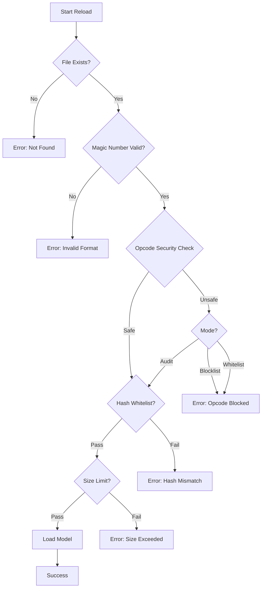

# Model Loading Security Architecture

## Overview
The CAD ML Platform implements a multi-layered security approach for loading machine learning models (Pickle files). This document details the security flow, configuration modes, and troubleshooting steps.

## Security Flow

## Opcode Security Modes

Controlled by environment variable `OPCODE_MODE`.

| Mode | Behavior | Use Case |
|------|----------|----------|
| `audit` | Scans opcodes, logs dangerous ones, but **allows** loading. | Initial deployment, gathering baseline of used opcodes. |
| `blocklist` (Default) | Scans opcodes, **blocks** loading if dangerous opcodes (e.g., `GLOBAL`, `REDUCE`) are found. | Production default. Balances security and compatibility. |
| `whitelist` | Scans opcodes, **blocks** loading if ANY opcode is not in the strict safe list. | High-security environments. Requires careful tuning of safe list. |

### Dangerous Opcodes
The following opcodes are considered dangerous and blocked in `blocklist` mode:
- `GLOBAL`, `STACK_GLOBAL`: Allow importing arbitrary modules.
- `REDUCE`: Allows executing callable with arguments.
- `BUILD`: Allows calling `__setstate__` or updating dicts.
- `INST`, `OBJ`, `NEWOBJ`, `NEWOBJ_EX`: Allow instantiating arbitrary classes.

## Troubleshooting

### Model Rejected: "Security check failed"
**Symptom**: Model fails to load with status `security_blocked`.
**Cause**: The model file contains opcodes restricted by the current `OPCODE_MODE`.

**Resolution**:
1. **Check Logs**: Look for "Dangerous opcodes detected" or "Non-whitelisted opcodes detected" in logs.
2. **Verify Model Source**: Ensure the model was generated by a trusted process.
3. **Switch to Audit**: Temporarily set `OPCODE_MODE=audit` to allow loading while investigating.
4. **Re-export Model**: If possible, re-export the model using safer serialization (e.g., ONNX) or ensure no custom code execution is required during unpickling.

### Model Rejected: "Magic number invalid"
**Symptom**: Status `magic_invalid`.
**Cause**: The file is not a valid pickle file or is corrupted.
**Resolution**: Verify file integrity and format.

### Metrics
- `model_opcode_audit_total{mode, safe}`: Count of audits performed.
- `model_opcode_whitelist_violations_total{mode}`: Count of violations found.
- `model_security_fail_total{reason}`: Count of blocked loads.
