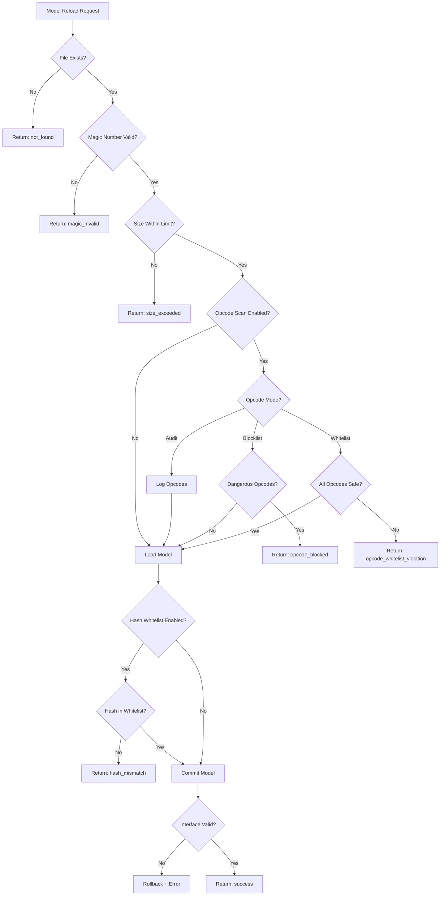
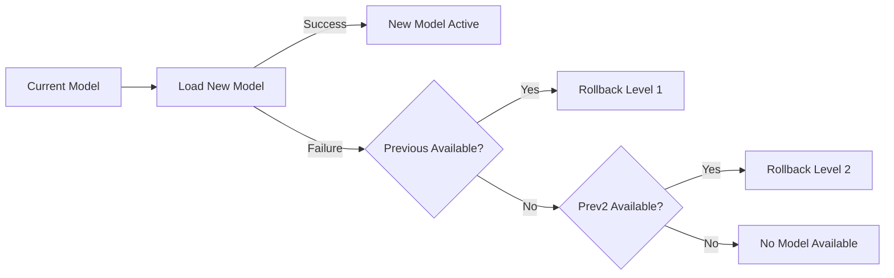

# Model Loading Security Architecture

## Overview
The CAD ML Platform implements a multi-layered security approach for loading machine learning models (Pickle files). This document details the security flow, configuration modes, and troubleshooting steps.

## Security Flow



## Opcode Security Modes

Controlled by environment variable `MODEL_OPCODE_MODE`.

| Mode | Behavior | Use Case |
|------|----------|----------|
| `audit` | Scans opcodes, logs dangerous ones, but **allows** loading. | Initial deployment, gathering baseline of used opcodes. |
| `blocklist` (Default) | Scans opcodes, **blocks** loading if dangerous opcodes are found. | Production default. Balances security and compatibility. |
| `whitelist` | Scans opcodes, **blocks** loading if ANY opcode is not in the strict safe list. | High-security environments. Requires careful tuning. |

### Mode Comparison

| Feature | Audit | Blocklist | Whitelist |
|---------|-------|-----------|-----------|
| Blocks dangerous opcodes | No | Yes | Yes |
| Blocks unlisted opcodes | No | No | Yes |
| Logs all opcodes | Yes | Yes | Yes |
| Suitable for production | No* | Yes | Yes |
| Security level | Low | Medium | High |
| False positive rate | 0% | Low | Medium |

*Audit mode should only be used temporarily for observation.

### Dangerous Opcodes
The following opcodes are considered dangerous and blocked in `blocklist` mode:

| Opcode | Risk | Description |
|--------|------|-------------|
| `GLOBAL` | Critical | Load global object (module.attr) |
| `STACK_GLOBAL` | Critical | Load global from stack |
| `REDUCE` | Critical | Apply callable to args (main RCE vector) |
| `INST` | High | Build and push class instance |
| `OBJ` | High | Build object by calling class |
| `NEWOBJ` | High | Build object using cls.__new__ |
| `NEWOBJ_EX` | High | Extended NEWOBJ |
| `BUILD` | Medium | Call obj.__setstate__ or update __dict__ |
| `EXT1/2/4` | Medium | Extension registry lookups |

### Safe Opcodes (Whitelist Mode)
In whitelist mode, only these opcodes are allowed:

- **Basic types**: `NONE`, `NEWTRUE`, `NEWFALSE`, `INT`, `BININT*`, `LONG*`, `FLOAT`, `BINFLOAT`
- **Strings**: `STRING`, `BINSTRING`, `UNICODE`, `BINUNICODE*`, `BINBYTES*`
- **Collections**: `EMPTY_LIST`, `LIST`, `APPEND*`, `EMPTY_TUPLE`, `TUPLE*`, `EMPTY_DICT`, `DICT`, `SETITEM*`
- **Memo**: `PUT`, `BINPUT`, `GET`, `BINGET`, `MEMOIZE`
- **Control**: `MARK`, `POP`, `STOP`, `PROTO`, `FRAME`

## Rollback Mechanism

When model loading fails, the system automatically rolls back:



### Rollback Levels

| Level | Description | Trigger |
|-------|-------------|---------|
| 0 | Normal operation | N/A |
| 1 | Rolled back to previous model | Single failure |
| 2 | Rolled back to pre-previous model | Consecutive failures |

## Configuration Reference

| Environment Variable | Default | Description |
|---------------------|---------|-------------|
| `MODEL_OPCODE_MODE` | `blocklist` | Security mode: audit, blocklist, whitelist |
| `MODEL_OPCODE_SCAN` | `1` | Enable/disable opcode scanning |
| `MODEL_OPCODE_STRICT` | `0` | Fail on scan errors |
| `MODEL_MAGIC_NUMBER_CHECK` | `1` | Validate pickle magic number |
| `MODEL_MAX_MB` | `50` | Maximum model file size in MB |
| `ALLOWED_MODEL_HASHES` | `` | Comma-separated approved hashes |

## API Endpoints

### GET /api/v1/model/info
Returns current model status including security info:

```json
{
  "version": "v1.2.3",
  "hash": "abc123def456",
  "loaded": true,
  "rollback_level": 0,
  "has_prev": true,
  "has_prev2": false,
  "load_seq": 5,
  "last_error": null
}
```

### POST /api/v1/model/reload
Reload model with security validation:

```json
{
  "path": "/models/classifier_v2.pkl",
  "expected_version": "v2.0.0",
  "force": false
}
```

### GET /api/v1/model/security/config
Get current security configuration:

```json
{
  "opcode_mode": "blocklist",
  "opcode_scan_enabled": true,
  "magic_number_check": true,
  "max_model_size_mb": 50,
  "dangerous_opcodes": ["GLOBAL", "REDUCE", "..."],
  "safe_opcodes_count": 45
}
```

## Metrics

### Opcode Metrics
| Metric | Labels | Description |
|--------|--------|-------------|
| `model_opcode_audit_total` | `opcode` | Count of each opcode observed |
| `model_opcode_whitelist_violations_total` | `opcode` | Whitelist violations by opcode |

### Security Failure Metrics
| Metric | Reason | Description |
|--------|--------|-------------|
| `model_security_fail_total` | `hash_mismatch` | Hash whitelist failures |
| `model_security_fail_total` | `magic_number_invalid` | Invalid pickle format |
| `model_security_fail_total` | `opcode_blocked` | Blocklist violations |
| `model_security_fail_total` | `opcode_whitelist_violation` | Whitelist violations |
| `model_security_fail_total` | `opcode_scan_error` | Scan errors |

### Reload Metrics
| Metric | Status | Description |
|--------|--------|-------------|
| `model_reload_total` | `success` | Successful reloads |
| `model_reload_total` | `rollback` | Level 1 rollbacks |
| `model_reload_total` | `rollback_level2` | Level 2 rollbacks |
| `model_reload_total` | `error` | Failed reloads |

## Troubleshooting

### Model Rejected: "opcode_blocked"
**Symptom**: Model fails to load with status `opcode_blocked`.

**Resolution**:
1. Check logs for "Dangerous opcodes detected" message
2. Verify the model source is trusted
3. Temporarily set `MODEL_OPCODE_MODE=audit` to allow loading while investigating
4. Re-export model with safer serialization if possible

### Model Rejected: "magic_invalid"
**Symptom**: Status `magic_invalid`.

**Cause**: The file is not a valid pickle file or is corrupted.

**Resolution**: Verify file integrity and format.

### Model Rejected: "hash_mismatch"
**Symptom**: Status `hash_mismatch`.

**Resolution**:
1. Add the new hash to `ALLOWED_MODEL_HASHES`
2. Verify the model file hasn't been tampered with

### Rollback Loop
**Symptom**: Models keep rolling back.

**Resolution**:
1. Check `model_reload_total` metrics for patterns
2. Examine logs for specific failure reasons
3. Verify model has `predict` method

## Best Practices

1. **Start with Audit Mode**: Deploy new models in audit mode first
2. **Review Audit Logs**: Analyze opcode usage before enabling stricter modes
3. **Use Hash Whitelists**: Enable `ALLOWED_MODEL_HASHES` in production
4. **Monitor Metrics**: Set up alerts for `model_security_fail_total`
5. **Test Rollbacks**: Verify rollback mechanism works in staging
6. **Document Models**: Keep record of approved model hashes

## Security Considerations

### Known Limitations

1. **Audit mode provides no protection**: Use only for observation
2. **Blocklist may miss novel attacks**: New exploit techniques may bypass
3. **Whitelist may be too restrictive**: Many legitimate models blocked

### Recommendations

- Use blocklist mode for general production
- Use whitelist mode only for high-security scenarios
- Always enable hash whitelisting when possible
- Monitor security metrics continuously

## Python API Usage

```python
from src.core.pickle_security import (
    scan_pickle_opcodes,
    OpcodeMode,
    get_security_config,
)

# Scan a pickle file
result = scan_pickle_opcodes("model.pkl", mode=OpcodeMode.BLOCKLIST)
if not result["safe"]:
    print(f"Blocked: {result['blocked_reason']}")
    print(f"Dangerous opcodes: {result['dangerous']}")

# Get current configuration
config = get_security_config()
print(f"Mode: {config['opcode_mode']}")
```
