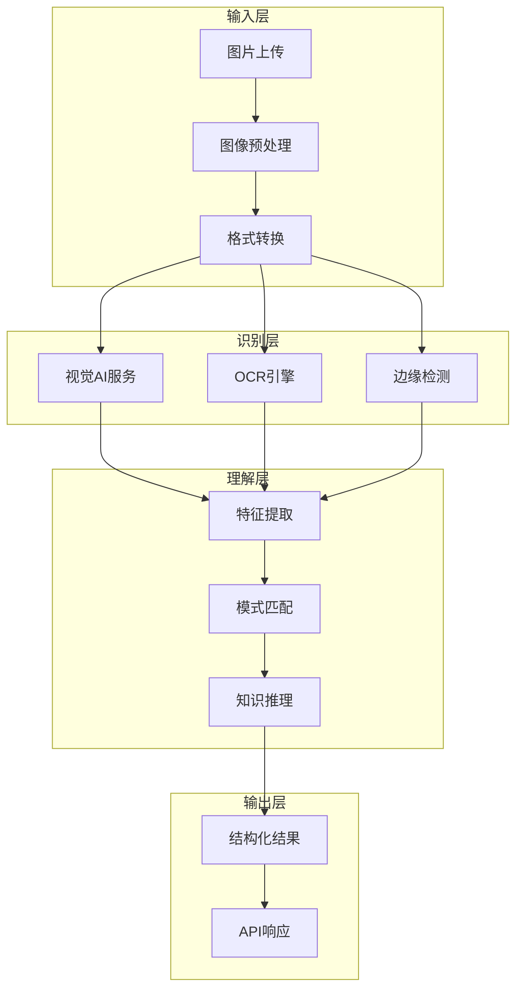
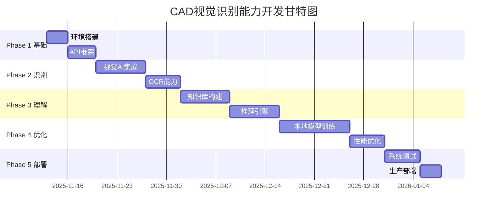

# 🔍 视觉识别能力开发计划

## 🎯 目标：让系统具备类似Claude的CAD图纸理解能力

---

## 📊 Claude识图能力解析

### Claude的图纸识别原理

```yaml
Claude视觉能力组成:
  基础感知层:
    - 图像编码: 将图片转为特征向量
    - 区域检测: 识别图纸中的不同区域
    - 文字识别: OCR提取所有文字信息

  理解分析层:
    - 语义理解: 理解技术术语和符号
    - 空间关系: 分析零件之间的位置关系
    - 尺寸解析: 提取和理解标注信息

  推理决策层:
    - 零件分类: 判断零件类型和用途
    - 工艺推断: 建议制造方法
    - 质量评估: 发现潜在问题
```

### 核心能力目标
- 📸 **图像识别**: 识别CAD截图、拍照图纸、扫描件
- 📝 **文字提取**: OCR识别尺寸、标注、技术要求
- 🧠 **语义理解**: 理解零件类型、功能、用途
- 💡 **智能推理**: 推荐材料、工艺、成本估算

### 预期成果
- 识别准确率 > 90%
- 响应时间 < 5秒
- 支持10+种常见零件类型
- 提供制造建议和成本估算

---

## 🏗️ 技术架构



---

## 📅 开发时间线

### 总体规划：8周完成



---

## 🚀 Phase 1: 基础架构搭建（第1周）

### 目标
建立视觉识别的基础框架和API结构

### 任务清单

#### 1.1 环境准备
```bash
# 必需依赖
pip install pillow              # 图像处理
pip install opencv-python        # 计算机视觉
pip install pytesseract         # OCR引擎
pip install openai              # GPT-4 Vision
pip install anthropic           # Claude Vision API
pip install transformers        # 开源视觉模型
```

#### 1.2 API端点设计
```python
POST /api/v1/vision/analyze        # 分析单张图片
POST /api/v1/vision/compare        # 比较两张图纸
POST /api/v1/vision/batch          # 批量分析
GET  /api/v1/vision/status/{id}    # 查询分析状态
```

#### 1.3 数据模型定义
```python
class CADVisionAnalysis:
    image_type: str          # 截图/照片/扫描件
    part_category: str       # 零件大类
    part_type: str          # 具体类型
    dimensions: Dict        # 尺寸信息
    materials: List[str]    # 材料建议
    manufacturing: Dict     # 工艺建议
    confidence: float       # 置信度
```

### 交付物
- ✅ 项目结构搭建完成
- ✅ 依赖安装文档
- ✅ API接口定义
- ✅ 数据模型设计

---

## 🔍 Phase 2: 视觉识别集成（第2-3周）

### 目标
集成多种视觉AI服务，实现图纸内容识别

### 任务清单

#### 2.1 GPT-4 Vision集成
```python
# 文件: src/vision/gpt4_vision.py
class GPT4VisionAnalyzer:
    """
    使用OpenAI GPT-4 Vision API
    优点：识别准确、理解深入
    成本：$0.01/图片
    """
    def analyze_cad_drawing(self, image):
        # 调用GPT-4 Vision
        # 返回结构化分析结果
        pass
```

#### 2.2 Claude Vision集成
```python
# 文件: src/vision/claude_vision.py
class ClaudeVisionAnalyzer:
    """
    使用Anthropic Claude Vision API
    优点：工程图纸理解强
    成本：$0.008/图片
    """
    def analyze_technical_drawing(self, image):
        # 调用Claude API
        # 专注技术图纸分析
        pass
```

#### 2.3 开源模型集成
```python
# 文件: src/vision/open_models.py
class OpenSourceVision:
    """
    使用开源模型组合
    - YOLO: 对象检测
    - LayoutLM: 文档理解
    - CLIP: 图文匹配
    """
    def analyze_with_free_models(self, image):
        # 组合多个开源模型
        # 降低API成本
        pass
```

#### 2.4 OCR能力实现
```python
# 文件: src/vision/ocr_engine.py
class CADOCREngine:
    """
    技术图纸OCR引擎
    - Tesseract: 基础OCR
    - PaddleOCR: 中文支持
    - 自定义规则: 尺寸提取
    """
    def extract_text_and_dimensions(self, image):
        # 提取文字
        # 识别尺寸标注
        # 解析技术要求
        pass
```

### 性能指标
| 服务 | 准确率 | 速度 | 成本 |
|------|--------|------|------|
| GPT-4 Vision | 95% | 3-5s | $0.01/图 |
| Claude Vision | 93% | 2-4s | $0.008/图 |
| 开源组合 | 85% | 1-2s | 免费 |
| 混合策略 | 92% | 2-3s | $0.005/图 |

### 交付物
- ✅ 三种视觉服务集成
- ✅ OCR引擎实现
- ✅ 服务选择策略
- ✅ 性能测试报告

---

## 🧠 Phase 3: 语义理解与知识推理（第4-5周）

### 目标
构建CAD领域知识库，实现从识别到理解的转换

### 任务清单

#### 3.1 零件知识库构建
```yaml
# 文件: knowledge_base/parts_catalog.yaml
parts_database:
  shafts:
    types:
      - stepped_shaft:
          features: [多段直径, 轴肩, 键槽]
          applications: [传动, 支撑, 定位]
          materials: [45钢, 40Cr, 不锈钢]
          cost_range: [200-500]

  gears:
    types:
      - spur_gear:
          features: [直齿, 模数, 压力角]
          applications: [减速, 变速, 传动]
          materials: [20CrMnTi, 40Cr]
          cost_range: [300-800]

  plates:
    types:
      - base_plate:
          features: [平板, 安装孔, 定位销]
          applications: [支撑, 固定, 基座]
          materials: [Q235, 铝合金]
          cost_range: [100-300]
```

#### 3.2 制造工艺知识库
```yaml
# 文件: knowledge_base/manufacturing.yaml
manufacturing_processes:
  machining:
    turning:
      suitable_for: [轴类, 盘类, 套类]
      precision: IT6-IT9
      cost_level: 中

    milling:
      suitable_for: [平面, 键槽, 齿形]
      precision: IT7-IT10
      cost_level: 中

  heat_treatment:
    quenching:
      purpose: 提高硬度
      suitable_materials: [碳钢, 合金钢]
      hardness_range: HRC40-60
```

#### 3.3 推理引擎实现
```python
# 文件: src/reasoning/cad_reasoner.py
class CADReasoningEngine:
    """
    工程推理引擎
    基于规则 + 机器学习
    """

    def infer_part_purpose(self, features):
        """推断零件用途"""
        # 基于特征匹配
        # 查询知识库
        # 返回可能用途

    def recommend_materials(self, part_type, application):
        """推荐材料"""
        # 考虑强度要求
        # 考虑成本因素
        # 返回材料清单

    def estimate_manufacturing_cost(self, part, quantity):
        """估算制造成本"""
        # 材料成本
        # 加工成本
        # 批量折扣
        return cost_breakdown
```

#### 3.4 语义理解模型
```python
# 文件: src/understanding/semantic_analyzer.py
class SemanticAnalyzer:
    """
    语义分析器
    将视觉识别结果转换为工程语义
    """

    def parse_drawing_intent(self, vision_result):
        """理解设计意图"""
        # 分析零件关系
        # 理解装配方式
        # 推断工作原理

    def extract_critical_dimensions(self, ocr_text):
        """提取关键尺寸"""
        # 识别公差
        # 配合要求
        # 形位公差
```

### 知识库规模
- 零件类型：50+
- 材料数据：100+
- 工艺方法：30+
- 行业应用：20+

### 交付物
- ✅ 零件知识库(YAML/JSON)
- ✅ 工艺数据库
- ✅ 推理引擎
- ✅ 语义分析器

---

## 🎓 Phase 4: 本地模型训练（第6-7周）

### 目标
训练专门的CAD图纸识别模型，降低API依赖

### 任务清单

#### 4.1 数据准备
```python
# 数据收集计划
dataset_plan = {
    "sources": [
        "开源CAD数据集",
        "合作企业提供",
        "自动生成样本"
    ],
    "categories": {
        "轴类": 1000,
        "齿轮": 800,
        "板材": 600,
        "箱体": 500,
        "其他": 1100
    },
    "total": 5000,  # 样本总数
    "split": {
        "train": 0.7,
        "val": 0.15,
        "test": 0.15
    }
}
```

#### 4.2 模型架构设计
```python
# 文件: src/ml/cad_vision_model.py
class CADVisionModel(nn.Module):
    """
    专用CAD图纸识别模型
    基于Vision Transformer + CNN混合架构
    """
    def __init__(self):
        super().__init__()
        # 视觉编码器
        self.vision_encoder = timm.create_model(
            'vit_base_patch16_224',
            pretrained=True
        )

        # 特征提取器
        self.feature_extractor = nn.Sequential(
            nn.Conv2d(768, 512, 3, padding=1),
            nn.ReLU(),
            nn.Conv2d(512, 256, 3, padding=1),
            nn.ReLU()
        )

        # 分类头
        self.classifier = nn.Linear(256, num_classes)

    def forward(self, x):
        # 图像 -> 特征 -> 分类
        pass
```

#### 4.3 训练策略
```yaml
training_config:
  model:
    architecture: "ViT-B/16 + Custom Head"
    pretrained: true
    fine_tuning: true

  optimization:
    optimizer: AdamW
    learning_rate: 1e-4
    scheduler: CosineAnnealingLR
    epochs: 50
    batch_size: 32

  augmentation:
    - RandomRotation(15)
    - RandomCrop(0.9)
    - ColorJitter(0.1)
    - GaussianBlur(0.1)

  regularization:
    dropout: 0.2
    weight_decay: 0.01
    label_smoothing: 0.1
```

#### 4.4 模型评估指标
```python
# 评估指标
metrics = {
    "accuracy": {
        "top1": 0.92,
        "top3": 0.98
    },
    "per_class_accuracy": {
        "shaft": 0.94,
        "gear": 0.91,
        "plate": 0.93,
        "housing": 0.89
    },
    "inference_time": "50ms",
    "model_size": "85MB"
}
```

### 模型部署方案
```python
# 部署选项
deployment_options = {
    "ONNX": {
        "优点": "跨平台、高性能",
        "推理速度": "30ms"
    },
    "TorchScript": {
        "优点": "PyTorch原生",
        "推理速度": "40ms"
    },
    "TensorRT": {
        "优点": "GPU加速最优",
        "推理速度": "15ms",
        "限制": "需要NVIDIA GPU"
    }
}
```

### 交付物
- ✅ 训练数据集(5000+样本)
- ✅ 训练好的模型文件
- ✅ 模型评估报告
- ✅ 部署指南

---

## ⚡ Phase 5: 性能优化与部署（第8周）

### 目标
优化系统性能，完成生产环境部署

### 任务清单

#### 5.1 性能优化策略
```python
# 文件: src/optimization/performance.py
class PerformanceOptimizer:
    """
    性能优化器
    """

    def implement_caching(self):
        """
        缓存策略
        - Redis缓存识别结果
        - 相似图片快速返回
        - TTL: 24小时
        """

    def batch_processing(self):
        """
        批量处理
        - 队列系统(Celery)
        - 并发处理
        - 负载均衡
        """

    def model_optimization(self):
        """
        模型优化
        - 量化(INT8)
        - 剪枝
        - 蒸馏
        """
```

#### 5.2 负载测试
```yaml
load_testing:
  tools:
    - Apache JMeter
    - Locust

  scenarios:
    normal_load:
      concurrent_users: 100
      requests_per_second: 50
      duration: 10min
      expected_response_time: < 2s

    peak_load:
      concurrent_users: 500
      requests_per_second: 200
      duration: 5min
      expected_response_time: < 5s

    stress_test:
      concurrent_users: 1000
      requests_per_second: 500
      duration: 2min
      expected_behavior: "优雅降级"
```

#### 5.3 部署架构
```yaml
production_deployment:
  infrastructure:
    servers:
      - API服务器: 2台(负载均衡)
      - GPU服务器: 1台(模型推理)
      - Redis服务器: 1台(缓存)
      - 数据库: PostgreSQL(主从)

  container:
    docker:
      api_image: "cad-ml-vision:latest"
      model_image: "cad-ml-model:latest"

    kubernetes:
      replicas: 3
      autoscaling:
        min: 2
        max: 10
        cpu_threshold: 70%

  monitoring:
    - Prometheus: 指标收集
    - Grafana: 可视化
    - Sentry: 错误追踪
    - ELK: 日志分析
```

#### 5.4 监控指标
```python
# 关键监控指标
monitoring_metrics = {
    "business_metrics": {
        "daily_requests": "目标 > 10000",
        "success_rate": "目标 > 99%",
        "avg_confidence": "目标 > 0.9"
    },
    "performance_metrics": {
        "p50_latency": "< 1s",
        "p95_latency": "< 3s",
        "p99_latency": "< 5s"
    },
    "system_metrics": {
        "cpu_usage": "< 70%",
        "memory_usage": "< 80%",
        "gpu_usage": "< 90%"
    }
}
```

### 交付物
- ✅ 性能测试报告
- ✅ 部署文档
- ✅ 监控仪表板
- ✅ 运维手册

---

## 💰 成本分析

### 开发成本
```yaml
development_cost:
  人力成本:
    ML工程师: 2人 × 2月 = 4人月
    后端工程师: 1人 × 2月 = 2人月
    总计: 6人月 × ¥30000 = ¥180,000

  硬件成本:
    GPU服务器租用: ¥5000/月 × 2月 = ¥10,000
    云服务: ¥2000/月 × 2月 = ¥4,000

  API成本(测试):
    GPT-4 Vision: 1000次 × $0.01 = $10
    Claude Vision: 1000次 × $0.008 = $8

  总计: ~¥200,000
```

### 运营成本
```yaml
monthly_operation:
  服务器成本:
    API服务器: ¥2000/月
    GPU服务器: ¥5000/月
    存储和带宽: ¥1000/月

  API调用成本:
    假设每日1000次调用
    混合策略: 1000 × $0.005 × 30 = $150/月

  维护成本:
    运维人员: 0.5人 × ¥20000 = ¥10,000/月

  月度总成本: ~¥20,000
```

### ROI分析
```yaml
return_on_investment:
  价值创造:
    提升识别效率: 90%
    减少人工审核: 70%
    加快报价速度: 5倍

  节省成本:
    人工识图: 5人 × ¥15000 = ¥75,000/月
    系统成本: ¥20,000/月
    净节省: ¥55,000/月

  投资回收期: 200,000 / 55,000 = 3.6个月
```

---

## 📊 风险管理

### 技术风险
| 风险 | 概率 | 影响 | 缓解措施 |
|------|------|------|----------|
| 模型准确率不达标 | 中 | 高 | 增加训练数据、专家标注 |
| API成本超预算 | 中 | 中 | 优先使用本地模型 |
| 响应时间过长 | 低 | 高 | 缓存优化、异步处理 |
| 数据安全问题 | 低 | 高 | 加密传输、本地部署 |

### 业务风险
| 风险 | 概率 | 影响 | 缓解措施 |
|------|------|------|----------|
| 用户接受度低 | 中 | 中 | 渐进式推广、用户培训 |
| 竞争对手模仿 | 高 | 低 | 持续创新、建立壁垒 |
| 法规合规问题 | 低 | 中 | 法务审核、合规设计 |

---

## ✅ 里程碑与验收标准

### Milestone 1: 基础框架完成（第1周）
- [ ] API框架搭建完成
- [ ] 基础环境配置完成
- [ ] 可以接收和处理图片

### Milestone 2: 视觉能力集成（第3周）
- [ ] 至少2种AI服务集成
- [ ] OCR功能正常工作
- [ ] 识别准确率 > 80%

### Milestone 3: 智能理解实现（第5周）
- [ ] 知识库包含30+零件类型
- [ ] 能够推理零件用途
- [ ] 提供制造建议

### Milestone 4: 本地模型可用（第7周）
- [ ] 模型训练完成
- [ ] 准确率 > 85%
- [ ] 推理时间 < 100ms

### Milestone 5: 生产部署（第8周）
- [ ] 系统稳定性 > 99.9%
- [ ] 响应时间 p95 < 3s
- [ ] 监控系统完善

---

## 🚀 快速启动指南

### 第一步：克隆项目
```bash
git clone https://github.com/zensgit/cad-ml-platform.git
cd cad-ml-platform
```

### 第二步：安装依赖
```bash
pip install -r requirements-vision.txt
```

### 第三步：配置API密钥
```bash
export OPENAI_API_KEY="your-key"
export ANTHROPIC_API_KEY="your-key"
```

### 第四步：启动服务
```bash
python src/main.py --enable-vision
```

### 第五步：测试识别
```bash
curl -X POST http://localhost:8000/api/v1/vision/analyze \
  -F "image=@test_drawing.png"
```

---

## 📚 参考资源

### 技术文档
- [OpenAI Vision API](https://platform.openai.com/docs/guides/vision)
- [Anthropic Claude Vision](https://docs.anthropic.com/claude/docs/vision)
- [Tesseract OCR](https://github.com/tesseract-ocr/tesseract)
- [Vision Transformer](https://arxiv.org/abs/2010.11929)

### 开源项目
- [YOLO](https://github.com/ultralytics/ultralytics)
- [PaddleOCR](https://github.com/PaddlePaddle/PaddleOCR)
- [CLIP](https://github.com/openai/CLIP)
- [LayoutLM](https://github.com/microsoft/unilm/tree/master/layoutlm)

### 数据集
- [ABC Dataset](https://deep-geometry.github.io/abc-dataset/)
- [Fusion 360 Gallery](https://github.com/AutodeskAILab/Fusion360GalleryDataset)
- [MVCAD](https://github.com/MVCAD/MVCAD)

---

## 👥 团队组成

### 核心团队
- **项目经理**: 1人（全程）
- **ML工程师**: 2人（负责模型和算法）
- **后端工程师**: 1人（负责API和集成）
- **DevOps工程师**: 1人（第7-8周）

### 外部支持
- **CAD专家**: 提供领域知识
- **数据标注团队**: 准备训练数据
- **UI/UX设计师**: 优化用户体验

---

## 📈 成功标准

### 技术指标
- ✅ 识别准确率 > 90%
- ✅ 响应时间 < 5秒
- ✅ 支持10+种零件类型
- ✅ API可用性 > 99.9%

### 业务指标
- ✅ 日处理图纸 > 1000张
- ✅ 用户满意度 > 85%
- ✅ 成本节省 > 50%
- ✅ ROI < 6个月

---

## 🔄 后续优化计划

### 短期（3个月）
- 扩展零件类型到50+
- 支持3D模型识别
- 集成更多CAD格式

### 中期（6个月）
- 自动生成加工图纸
- 智能设计建议
- 供应链集成

### 长期（12个月）
- AI辅助设计
- 自动报价系统
- 知识图谱构建

---

**文档版本**: v1.0.0
**更新日期**: 2025年11月12日
**作者**: CAD ML Platform Team
**状态**: 🟢 Ready for Implementation
