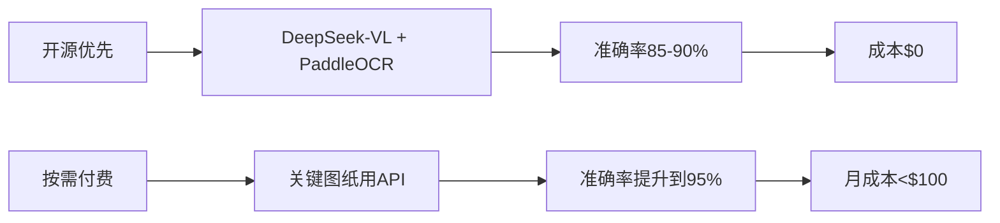
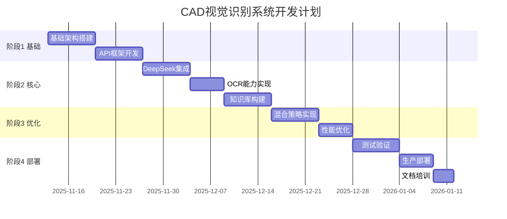

# 📋 CAD ML Platform 视觉识别系统 - 完整方案与TODO计划

> 从零到一，构建具备图纸识别理解能力的智能CAD分析系统

---

## 🎯 项目目标与定位

### 核心目标
构建一个**成本可控、准确实用**的CAD图纸视觉识别系统，能够：
- 📸 识别CAD图纸内容（截图、照片、扫描件）
- 🧠 理解零件类型和用途
- 📏 提取尺寸和技术要求
- 💡 提供制造建议
- 💰 估算加工成本

### 技术路线


---

## 🏗️ 整体架构设计

### 三层架构

```
┌─────────────────────────────────────────────┐
│           应用层 (Application Layer)         │
│  Web UI | API接口 | SDK客户端 | 批量处理工具  │
└─────────────────────────────────────────────┘
                        ↕
┌─────────────────────────────────────────────┐
│           服务层 (Service Layer)             │
│  ┌──────────┐  ┌──────────┐  ┌──────────┐  │
│  │视觉识别   │  │知识推理   │  │成本估算   │  │
│  │DeepSeek  │  │知识库     │  │价格模型   │  │
│  │PaddleOCR │  │规则引擎   │  │工艺数据   │  │
│  │YOLO      │  │AI推理     │  │材料价格   │  │
│  └──────────┘  └──────────┘  └──────────┘  │
└─────────────────────────────────────────────┘
                        ↕
┌─────────────────────────────────────────────┐
│           基础层 (Infrastructure Layer)      │
│  缓存(Redis) | 存储(MinIO) | 队列(RabbitMQ) │
│  监控(Prometheus) | 日志(ELK) | 容器(Docker)│
└─────────────────────────────────────────────┘
```

### 核心技术选型

| 模块 | 主选方案 | 备选方案 | 成本 |
|------|----------|----------|------|
| **图纸理解** | DeepSeek-VL 1.3B | GPT-4V (仅重要) | $0 |
| **OCR识别** | PaddleOCR | Tesseract | $0 |
| **对象检测** | YOLOv8 | Detectron2 | $0 |
| **知识库** | 本地JSON/YAML | Neo4j | $0 |
| **缓存** | Redis | 内存缓存 | $0 |
| **API框架** | FastAPI | Flask | $0 |
| **部署** | Docker | Kubernetes | $0-50/月 |

---

## 📅 实施路线图

### 总体时间线：12周完成



---

## ✅ 详细TODO列表

### 📌 第1阶段：基础架构（Week 1-2）

#### Week 1: 环境搭建与框架设计

- [ ] **1.1 项目初始化**
  - [ ] 创建GitHub私有仓库
  - [ ] 设置开发环境
  - [ ] 安装Python 3.9+
  - [ ] 配置虚拟环境
  ```bash
  git clone https://github.com/zensgit/cad-ml-platform.git
  cd cad-ml-platform
  python -m venv venv
  source venv/bin/activate
  ```

- [ ] **1.2 依赖安装**
  - [ ] 安装基础框架依赖
  - [ ] 安装视觉处理库
  - [ ] 安装深度学习框架
  ```bash
  # requirements-vision.txt
  fastapi==0.104.1
  uvicorn[standard]==0.24.0
  pillow==10.0.0
  opencv-python==4.8.0
  numpy==1.24.3
  torch==2.1.0
  transformers==4.35.0
  paddlepaddle==2.5.0
  paddleocr==2.7.0
  ultralytics==8.0.0
  redis==5.0.0
  ```

- [ ] **1.3 项目结构创建**
  - [ ] 创建标准目录结构
  - [ ] 设置配置文件
  - [ ] 初始化日志系统
  ```
  cad-ml-platform/
  ├── src/
  │   ├── vision/
  │   │   ├── api/
  │   │   ├── core/
  │   │   ├── providers/
  │   │   └── utils/
  │   ├── knowledge/
  │   └── config/
  ├── tests/
  ├── docs/
  └── deployments/
  ```

- [ ] **1.4 Docker环境配置**
  - [ ] 编写Dockerfile
  - [ ] 创建docker-compose.yml
  - [ ] 配置开发环境容器
  - [ ] 设置GPU支持（如有）

#### Week 2: API框架开发

- [ ] **2.1 FastAPI应用搭建**
  - [ ] 创建主应用入口
  - [ ] 配置CORS中间件
  - [ ] 实现健康检查端点
  - [ ] 设置异常处理

- [ ] **2.2 API端点设计**
  - [ ] `/analyze` - 单图分析
  - [ ] `/batch` - 批量处理
  - [ ] `/compare` - 图纸对比
  - [ ] `/status/{task_id}` - 任务状态

- [ ] **2.3 数据模型定义**
  - [ ] Pydantic请求模型
  - [ ] 响应模型设计
  - [ ] 错误模型定义
  - [ ] 枚举类型创建

- [ ] **2.4 认证与限流**
  - [ ] API Key认证
  - [ ] 请求限流机制
  - [ ] 用户配额管理
  - [ ] 日志记录

---

### 📌 第2阶段：核心功能（Week 3-5）

#### Week 3: DeepSeek-VL集成

- [ ] **3.1 DeepSeek模型部署**
  - [ ] 下载DeepSeek-VL 1.3B模型
  - [ ] 模型加载优化
  - [ ] 显存管理配置
  - [ ] 量化设置（8bit/4bit）
  ```python
  # 模型下载
  from transformers import AutoModelForCausalLM
  model = AutoModelForCausalLM.from_pretrained(
      "deepseek-ai/deepseek-vl-1.3b-chat",
      torch_dtype=torch.float16,
      device_map="auto"
  )
  ```

- [ ] **3.2 DeepSeek接口封装**
  - [ ] 创建DeepSeekProvider类
  - [ ] 实现图像预处理
  - [ ] 提示词工程优化
  - [ ] 响应解析处理

- [ ] **3.3 CAD专用提示词优化**
  - [ ] 零件识别提示词
  - [ ] 尺寸提取提示词
  - [ ] 技术要求识别
  - [ ] 中文优化调整

- [ ] **3.4 批处理优化**
  - [ ] 批量推理实现
  - [ ] 内存优化
  - [ ] 错误恢复机制
  - [ ] 进度跟踪

#### Week 4: OCR与对象检测

- [ ] **4.1 PaddleOCR集成**
  - [ ] 安装配置PaddleOCR
  - [ ] 中英文模型加载
  - [ ] 文字区域检测
  - [ ] 文本识别优化
  ```python
  from paddleocr import PaddleOCR
  ocr = PaddleOCR(use_angle_cls=True, lang='ch')
  ```

- [ ] **4.2 专业OCR处理**
  - [ ] 尺寸标注提取
  - [ ] 公差识别
  - [ ] 材料标识提取
  - [ ] 技术要求解析

- [ ] **4.3 YOLO对象检测**
  - [ ] YOLOv8模型部署
  - [ ] CAD元素检测
  - [ ] 自定义类别训练
  - [ ] 后处理优化

- [ ] **4.4 特征提取器**
  - [ ] 几何特征提取
  - [ ] 拓扑关系分析
  - [ ] 图纸类型识别
  - [ ] 视图判断

#### Week 5: 知识库与推理

- [ ] **5.1 零件知识库构建**
  - [ ] 创建零件分类体系
  - [ ] 定义特征映射
  - [ ] 材料数据库
  - [ ] 工艺知识库
  ```yaml
  # knowledge/parts.yaml
  shaft_types:
    stepped_shaft:
      features: [多段直径, 键槽, 轴肩]
      materials: [45钢, 40Cr]
      processes: [车削, 磨削]
  ```

- [ ] **5.2 制造工艺库**
  - [ ] 加工方法定义
  - [ ] 工艺路线模板
  - [ ] 设备要求
  - [ ] 成本参数

- [ ] **5.3 推理引擎**
  - [ ] 规则引擎实现
  - [ ] 零件类型推断
  - [ ] 材料推荐逻辑
  - [ ] 工艺选择算法

- [ ] **5.4 成本估算模型**
  - [ ] 材料成本计算
  - [ ] 加工时间估算
  - [ ] 人工成本
  - [ ] 综合报价

---

### 📌 第3阶段：优化提升（Week 6-8）

#### Week 6: 混合策略实现

- [ ] **6.1 智能路由器**
  - [ ] 图纸复杂度评估
  - [ ] 服务选择策略
  - [ ] 成本控制逻辑
  - [ ] 降级处理
  ```python
  class VisionRouter:
      def route(self, image, priority):
          if priority == "high":
              return self.use_api(image)
          else:
              return self.use_local(image)
  ```

- [ ] **6.2 API服务集成（可选）**
  - [ ] Claude Vision封装
  - [ ] DeepSeek API集成
  - [ ] 错误处理
  - [ ] 成本追踪

- [ ] **6.3 结果融合器**
  - [ ] 多源结果合并
  - [ ] 置信度计算
  - [ ] 冲突解决
  - [ ] 最优选择

- [ ] **6.4 缓存系统**
  - [ ] Redis缓存配置
  - [ ] 缓存键设计
  - [ ] 过期策略
  - [ ] 缓存预热

#### Week 7-8: 性能优化

- [ ] **7.1 推理优化**
  - [ ] 模型量化（INT8）
  - [ ] ONNX转换
  - [ ] TensorRT加速
  - [ ] 批处理优化

- [ ] **7.2 并发处理**
  - [ ] 异步任务队列
  - [ ] Celery集成
  - [ ] 负载均衡
  - [ ] 资源池管理

- [ ] **7.3 存储优化**
  - [ ] 图片压缩
  - [ ] MinIO对象存储
  - [ ] CDN加速
  - [ ] 清理策略

- [ ] **7.4 监控系统**
  - [ ] Prometheus指标
  - [ ] Grafana面板
  - [ ] 告警规则
  - [ ] 性能分析

---

### 📌 第4阶段：测试部署（Week 9-12）

#### Week 9-10: 测试验证

- [ ] **9.1 单元测试**
  - [ ] API端点测试
  - [ ] 核心功能测试
  - [ ] 工具类测试
  - [ ] 覆盖率>80%

- [ ] **9.2 集成测试**
  - [ ] 端到端流程
  - [ ] 服务集成测试
  - [ ] 性能测试
  - [ ] 压力测试

- [ ] **9.3 准确率评估**
  - [ ] 测试数据集准备
  - [ ] 识别准确率测试
  - [ ] OCR准确率评估
  - [ ] 对比分析

- [ ] **9.4 用户测试**
  - [ ] UI/UX测试
  - [ ] 易用性评估
  - [ ] 反馈收集
  - [ ] 问题修复

#### Week 11: 生产部署

- [ ] **11.1 部署准备**
  - [ ] 生产环境配置
  - [ ] 安全加固
  - [ ] 备份策略
  - [ ] 回滚方案

- [ ] **11.2 容器化部署**
  - [ ] Docker镜像构建
  - [ ] 镜像仓库推送
  - [ ] docker-compose配置
  - [ ] 健康检查设置

- [ ] **11.3 Kubernetes部署（可选）**
  - [ ] K8s配置文件
  - [ ] Service配置
  - [ ] Ingress设置
  - [ ] 自动扩缩容

- [ ] **11.4 CI/CD配置**
  - [ ] GitHub Actions
  - [ ] 自动化测试
  - [ ] 自动部署
  - [ ] 版本管理

#### Week 12: 文档与培训

- [ ] **12.1 技术文档**
  - [ ] API文档
  - [ ] 部署指南
  - [ ] 开发手册
  - [ ] 故障排查

- [ ] **12.2 用户文档**
  - [ ] 使用说明
  - [ ] 快速开始
  - [ ] FAQ
  - [ ] 视频教程

- [ ] **12.3 运维文档**
  - [ ] 监控指南
  - [ ] 备份恢复
  - [ ] 性能调优
  - [ ] 升级流程

- [ ] **12.4 培训材料**
  - [ ] PPT制作
  - [ ] 演示Demo
  - [ ] 培训计划
  - [ ] 知识转移

---

## 📊 关键指标与验收标准

### 技术指标

| 指标 | 目标值 | 验收标准 |
|------|--------|----------|
| **OCR准确率** | >85% | 100张测试图纸 |
| **零件识别准确率** | >88% | 8类标准零件 |
| **响应时间** | <3秒 | P95延迟 |
| **并发处理** | 50 QPS | 负载测试 |
| **系统可用性** | >99% | 月度统计 |

### 成本控制

| 项目 | 预算 | 实际 |
|------|------|------|
| **开发成本** | 6人月 | - |
| **硬件成本** | $5000 | - |
| **云服务** | $100/月 | - |
| **API费用** | $50/月 | - |
| **总TCO** | <$10000 | - |

---

## 🚀 快速启动清单

### 本周必做（Quick Win）

1. **今天**
   ```bash
   # 环境搭建
   git clone repo
   pip install -r requirements.txt
   python test_deepseek.py
   ```

2. **Day 2-3**
   - 部署DeepSeek-VL
   - 测试OCR效果
   - 验证可行性

3. **Day 4-5**
   - 搭建API框架
   - 实现第一个端点
   - 部署测试环境

4. **Weekend**
   - 集成PaddleOCR
   - 完成Demo
   - 准备汇报

### 关键依赖

- [ ] GPU服务器准备（建议RTX 3060+）
- [ ] Redis服务安装
- [ ] Docker环境配置
- [ ] 测试图纸准备（50-100张）

---

## 💡 风险与对策

### 技术风险

| 风险 | 概率 | 影响 | 对策 |
|------|------|------|------|
| DeepSeek准确率不足 | 中 | 高 | 引入PaddleOCR补充 |
| GPU资源不足 | 中 | 中 | 使用量化模型 |
| 响应时间过长 | 低 | 高 | 异步处理+缓存 |
| 中文识别差 | 低 | 中 | 优化提示词 |

### 项目风险

| 风险 | 概率 | 影响 | 对策 |
|------|------|------|------|
| 需求变更 | 高 | 中 | 敏捷开发 |
| 人员不足 | 中 | 高 | 优先核心功能 |
| 进度延期 | 中 | 中 | 预留缓冲时间 |

---

## 📈 后续优化方向

### Phase 2（3-6个月）
- [ ] 深度学习模型自训练
- [ ] 3D模型识别
- [ ] 装配图理解
- [ ] 自动生成加工代码

### Phase 3（6-12个月）
- [ ] AI设计助手
- [ ] 智能报价系统
- [ ] 供应链集成
- [ ] 知识图谱构建

---

## 📞 项目管理

### 团队分工

| 角色 | 职责 | 人员 |
|------|------|------|
| **项目经理** | 整体协调 | 1人 |
| **后端开发** | API/服务 | 2人 |
| **算法工程师** | 模型优化 | 1人 |
| **测试工程师** | 质量保证 | 1人 |
| **运维工程师** | 部署运维 | 1人 |

### 沟通机制

- **日站会**：每日9:30，15分钟
- **周例会**：周一14:00，1小时
- **评审会**：每阶段结束
- **文档**：Confluence/语雀
- **代码**：GitHub
- **任务**：Jira/禅道

---

## ✅ 第一周执行计划（立即开始）

### Monday - 环境准备
- [ ] 09:00-10:00 团队会议，明确分工
- [ ] 10:00-12:00 开发环境搭建
- [ ] 14:00-17:00 DeepSeek模型下载部署
- [ ] 17:00-18:00 测试验证

### Tuesday - 框架搭建
- [ ] 09:00-12:00 FastAPI项目创建
- [ ] 14:00-17:00 基础API实现
- [ ] 17:00-18:00 Docker配置

### Wednesday - 模型集成
- [ ] 09:00-12:00 DeepSeek接口封装
- [ ] 14:00-17:00 图像处理流程
- [ ] 17:00-18:00 单元测试

### Thursday - OCR实现
- [ ] 09:00-12:00 PaddleOCR集成
- [ ] 14:00-17:00 文字提取优化
- [ ] 17:00-18:00 效果评估

### Friday - 集成测试
- [ ] 09:00-12:00 端到端测试
- [ ] 14:00-16:00 问题修复
- [ ] 16:00-17:00 Demo准备
- [ ] 17:00-18:00 周报汇报

---

**项目启动日期**：2025-11-13
**预计完成日期**：2026-02-13
**项目负责人**：___________
**审批人**：___________

---

**文档版本**：v1.0.0
**最后更新**：2025-11-13
**状态**：✅ Ready to Execute
